# Amazfit GTRスマートウォッチ，追加情報…先週アップデートで本体が完全日本語化対応されたよ！

📅 投稿日時: 2019-12-26 08:16:49

えー．

明日…というか，26日木曜の夜から．

志賀高原にも，液体が降る可能性を

警告していましたが．

最新の26日の予想図を見ても…

やっぱり，赤い0℃線は志賀高原より北（涙）．

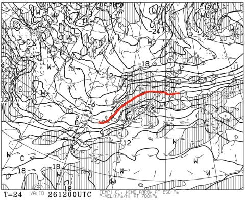

でも．

志賀高原は0℃線と+3℃線の間あたり．

うーむ．

昼間だったらヤバいけど．

このくらいの気温だったら，地上付近が

冷える夜中なら．

もしかすると，ギリギリ雪になって

くれるかも…

そして．26日夜9時の地上天気図は．

一見，日本全国降水域に覆われてる

ようだけど．

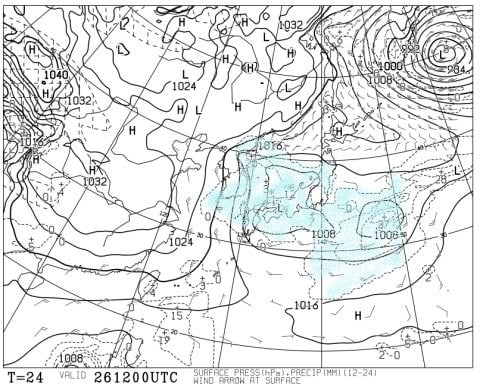

…やっぱり拡大すると，志賀高原は

降水域が無いエリアになってますね…

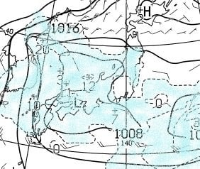

だもんで．

おそらく26日，夜まで志賀ではほとんど降らないと

信じています．

…そして，夜中の降り始め，麓近辺は

確かに雨になっちゃうかもしれないけど．

山頂付近は降りはじめから雪かも…！？？

そして．27日の金曜は…

赤い0℃線ははるか日本の南．

志賀高原は水色の-9℃線が

かかってます！！

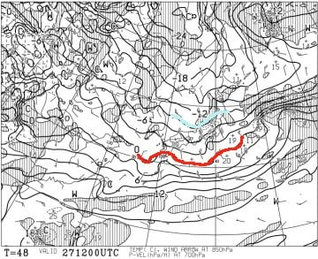

これはもう，27日の午後は昼間でも

-10℃近くまで冷えそうですね…

で．この日の地上天気図は，

見事に縦縞の冬型！

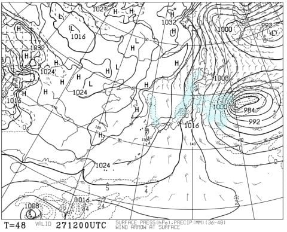

これは，降る．

27日朝から夜中まで．

降る．

そして，積もる！！

…その後は，28，29と穏やかな日が

続きそうなんだけど．

高温になるかもという予想だった，30日．

気温傾向グラフを見てみると…

なぬーーっ！？？

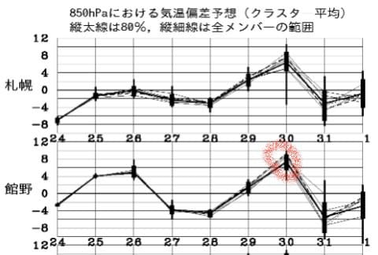

昨日の予想より，気温が上がる方向に

ずれてるんですけど…？（涙）

850hpa図を見ても，志賀には水色の

+6℃が近づくレベル．

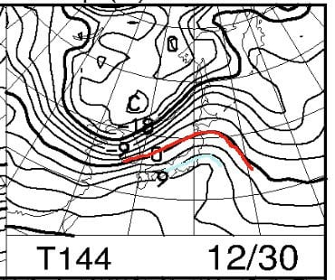

これは…降れば間違いなく液体で，

雪が解けてしまうパターン…

でも．

その次の日の，31日は．

今度は極端に冷えて，

水色の-12℃線が志賀に近づくレベル…

これは，朝の焼額山頂は-15℃クラス！？？

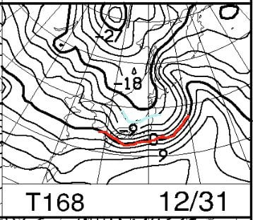

そして，地上天気図も，見事な冬型！！

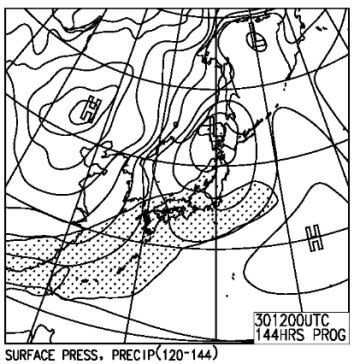

うむ．

31日は，やはり積もってくれそう…！！

この雪は，1日まで降り続けそう…！

…ようやく，年末年始は寒波らしきものが

やってきます…

とりあえず．

現時点では，

26日は雨が降らず．

27日にドサドサ冷え冷え雪が降ってくれて．

そして，年末年始休の28日から，

志賀高原全面オープンになってくれるよう．

祈りましょう…

ってなことで．

本題へ．

えー．

この夏に買ったスマートウォッチ，

Amazfit GTR．

こいつは，スマホアプリは日本語化されてるけど．

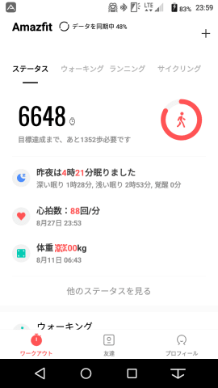

これまで，本体の表示が英語のみで．

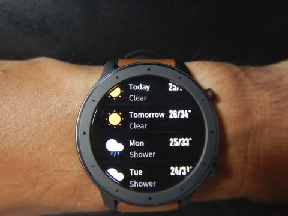

さらにメッセージの日本語もひらがなが

化けて，ちゃんと表示できない…

という問題がありました．

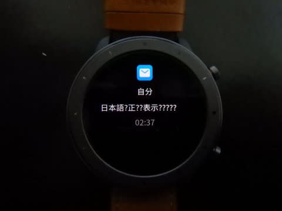

が．

先週水曜，いきなり本体にアップデートが

かかって．

知らぬ間に，本体が完全に日本語対応に

なってました～！！！

…いや，盤面は全く変わらないけど．

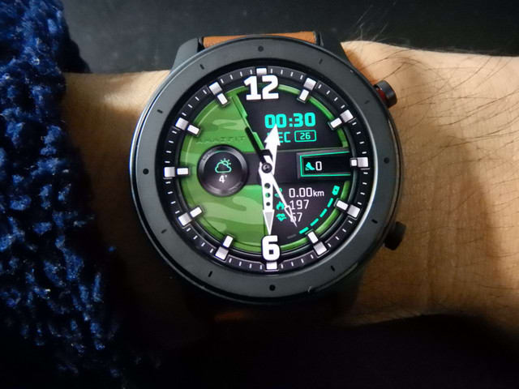

本体表示のメニュー，全部日本語化

されてるっ！！

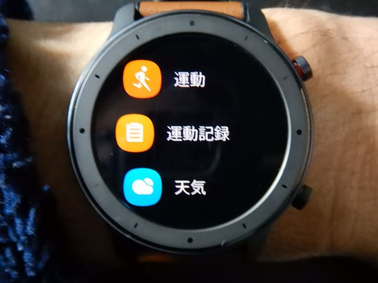

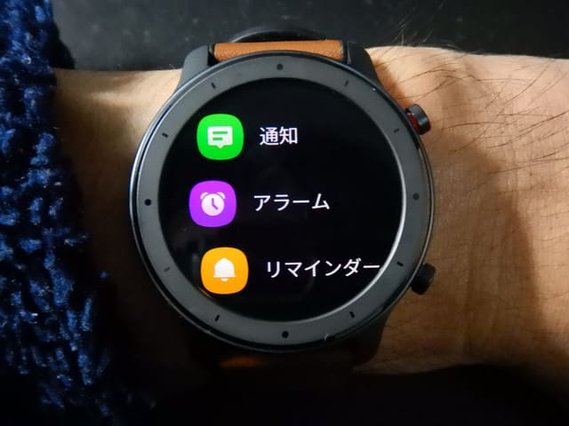

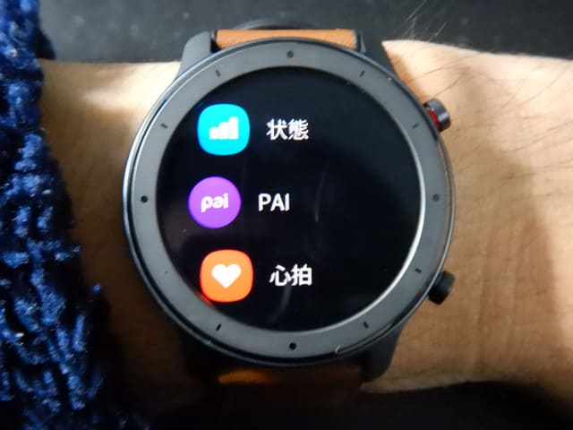

…そして．

注意書きなんかも完全に日本語で

出てくるようになったし…

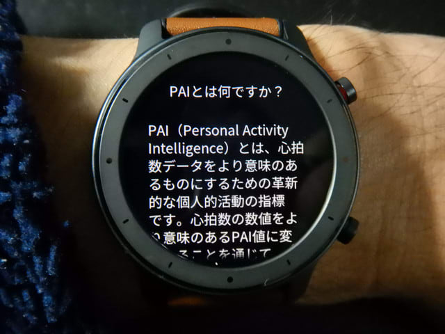

（ちなみに，アップデート前は

　こんな感じの英語表記）

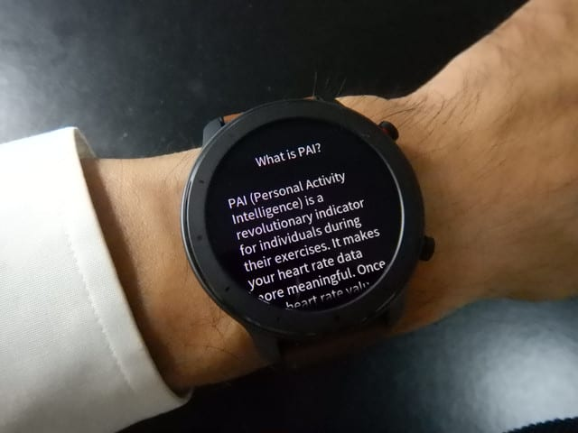

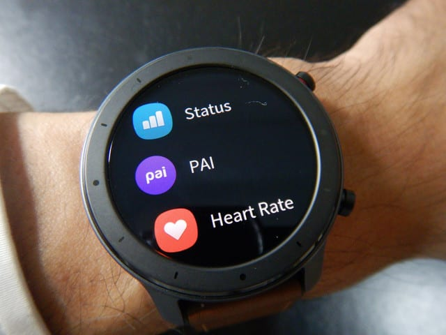

いやー．

メニュー自体は，英語のままでも

かっこよくて別に良かったんだけど．

ついに，メッセージ通知も，

LINEやGmail等の着信通知が，

日本語化けなく表示されるようになりました～！

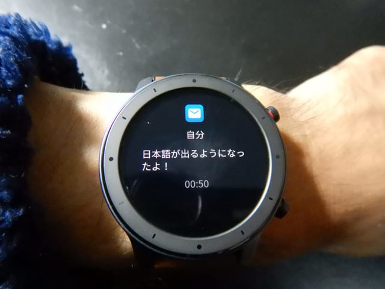

…これは，大きい．

Amazfit GTRの最大の欠点が，

ついに克服されました！

あー．

ちゃんとメッセージ文がスマホで全て確認

できるようになりましたよ…

天気のページも…

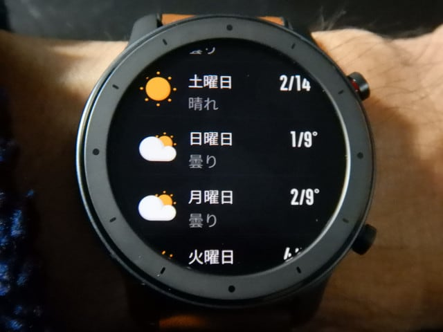

スキーログの確認のページも…

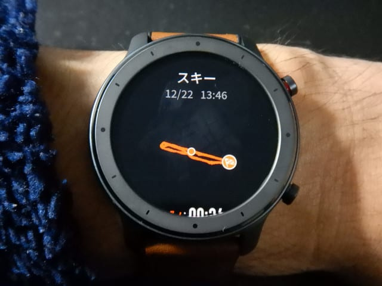

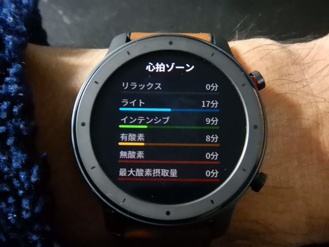

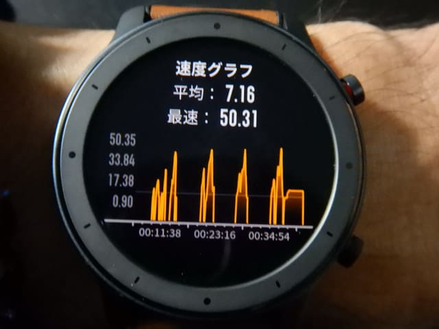

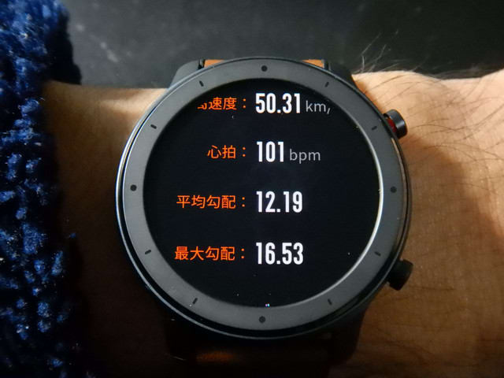

全部日本語化されましたよ～！

多少，日本語が怪しいところもあるけど…

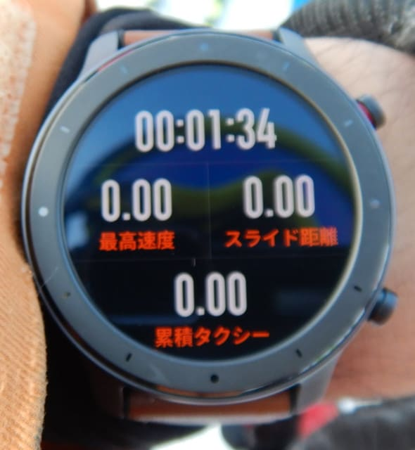

まぁ，1万5000円くらいのスマートウォッチで，

これだけできたら十分かな…！

## 💬 コメント一覧

### 💬 コメント by (なるなる)
**タイトル**: Unknown
**投稿日**: 2019-12-26 21:17:45

この時計、すごく気になってます。

iSKI等使っているのですが、電池の消耗が激しいんで。

物欲に負けて、もうポッチっとしちゃう寸前ですw

明日から雪降りそうですか。

久々の良い予報に、状況次第では日曜日に志賀高原へ日帰りも有りかと考えてしまいます。

しかし、一人で志賀高原まで日帰りは、体力的にも、お財布的にも厳しいか…

### 💬 コメント by (やっさん)
**タイトル**: Unknown
**投稿日**: 2019-12-27 00:41:14

いつも楽しく拝見させて頂いております。

年末年始は志賀高原で過ごしている関西人です。

今年は久しぶりに雪が心配で、毎日何度も天気図の説明を見させて頂いてます😁

明日の晩からの出発ですが、まだなかなかエリアは広がってないみたいですね！

しかし、明日１日の積雪が楽しみです！

今年こそ、焼額山で雄姿を拝見させて頂きたいと思います❗️

### 💬 コメント by (やっさん)
**タイトル**: Unknown
**投稿日**: 2019-12-27 00:48:02

あ❕   あと🎵

フレフレダンスと寒いギャグ😁

ありがとうございました😁

私も死ぬほどしましたが、

徒然スキーヤー様の威力があってこそ

明日の積雪があるのだと思います🙇  😁

### 💬 コメント by (Skier_S)
**タイトル**: 積もる！27日は積もるはず！
**投稿日**: 2019-12-27 02:28:41

＞なるなるさま

いや．使ってみた感じ，この時計，結構遊べますよ．

ただ，SKIモードにすると，画面をスワイプしないと

時間が確認できなくなるので，

時間を確認するための時計が別にあった方がいいです…

おそらく，27日はコンディションいいと思いますよ！（今シーズン比）

29日日曜は晴れそうですが，土曜は雪が降らなさそうなので，

一部コースは雪が剥げてきてるかも．

ホントは土曜がお勧めです．

＞やっさんさま

コメントありがとうございます～！！

私も28日は日帰り志賀高原，30日から4日までは連続志賀高原の予定．

おそらくひたすら焼額滑ってますので，見かけたら声を

かけてください～！

28日のゲレンデコンディションは27日の積雪で

かなりいいと思うので，

私に感謝してください←違うから

### 💬 コメント by (tio)
**タイトル**: Unknown
**投稿日**: 2020-01-02 17:03:20

はじめまして。検索でただりつき初めて訪問しました。

amazfit gtrを購入検討していますが調べてもわからないことがあり、可能なら教えて下さい。

gmailの本文（全文）をスマートウォッチで読めますでしょうか？

日本語化できない→できるようになった！

の記述以上の情報を探せず購入の直前で悩んでます。。

追伸

レヴォーグかっこいいですね。

欲しくて欲しくて格闘したのですが家族の反対で

レヴォーグをあきらめ、先月に某ファミリーワゴンを買いました。

走りよりも家族の居住空間を優先させられました（笑）

次は絶対レヴォーグ買いたいと思ってます！

### 💬 コメント by (Skier_S)
**タイトル**: ＞tioさま
**投稿日**: 2020-01-02 22:27:26

初めまして～！

ようこそ，この駄文置き場へ…

質問に回答しますと，Amazfit GTRでは，Gmailは差出人と件名のみ確認できます．

本文は残念ですが読めません．

LINEだとメッセージの中身まで表示されるのですが…．

ちなみに，LEVORGですが．

スキーに行くには雪道も速いし，アイサイトツーリングアシストで

スキー場までの長距離もらくだし，ハンドルを握る人には

最高の車ですが．

後ろ座席はそんなに広くないので，妻からは不評です（涙）

### 💬 コメント by (tio)
**タイトル**: Unknown
**投稿日**: 2020-01-03 15:31:37

返信くださりありがとうございます。

カキコミ以降もいろいろ検索しました。

Notify & Fitness for Amazfitの有料版をインストールした上でk9もしくはbluemailのメールアプリだとメールの本文が表示できるかもしれないです。

ただ長文の最後まで表示されるのかがやってみないとわからないかもです。

ビジネスメールを読もうとしているので

本文の冒頭部分だけだと内容把握が難しそうで。

社名とか宛先とか挨拶文だけで終わっちゃいそうで。

そもそもが割と安い時計なので買って試そうか悩むところです。

お亡くなりになったPebble2が使いやすすぎて難民化してます（笑）

片道550キロの高速帰省でのほぼ自動運転の楽チンさ、アイサイトの予防安全、パワー、何よりも見た目のかっこよさなどなど欲しくて欲しくてだったのですが後席の足元空間、リクライニングの角度で妻に却下されてレヴォーグを買えませんでした。。

スバルには妻を3回連れて行ってゴネたんですけど（笑）。

ありがとうございました。

### 💬 コメント by (Skier_S)
**タイトル**: ＞tioさま
**投稿日**: 2020-01-03 23:38:22

標準のままだと，サブジェクトしか出ないのでビジネスメールはつらいかと．

しかし，片道550㎞の高速帰省ですか！！

それは，運転手にとってはLEORGが楽ですね…

でも，後ろ座席に乗ってる人物にとっては，同様に550㎞狭い後部座席に閉じ込められるより，

広い方がいいので，奥さんの言い分もわかる気がします…

### 💬 コメント by (tio)
**タイトル**: Unknown
**投稿日**: 2020-01-04 22:53:38

妻の反対で抵抗も、まずはレヴォーグを諦めたんですけど、アイサイトなど欲しさに後部座席がちょい広いフォレスター買いたい！！と再度ゴネてみたんですけど結局負けました（笑）

次こそはスバリストになりたいです！

### 💬 コメント by (Skier_S)
**タイトル**: ＞tioさま
**投稿日**: 2020-01-05 06:12:56

フォレスターもいい車ですよね～…

ぜひ次こそスバル車に乗ってみてください．

雪道が圧倒的に速いです(笑)

### 💬 コメント by (tio)
**タイトル**: Unknown
**投稿日**: 2020-01-05 21:23:32

そうなんです。

フォレスターに試乗したらものすごく欲しくなったんですよね。

スキーも学校卒業後、数えるほどしか行ってないのですが

フォレスター買えたら子供をスキーに連れていくから！

と説得してみたんですけど（笑）。

学生のときは毎年、斑尾高原のホテルに配膳などのバイトに行っててスキーも楽しんでましたが、恐ろしく前の話しですね（笑）

### 💬 コメント by (Skier_S)
**タイトル**: ＞tioさま
**投稿日**: 2020-01-07 02:41:24

あら．

以前にスキー場バイトしてまで滑っていらっしゃったんなら，

ぜひスキー場に復活してください…

