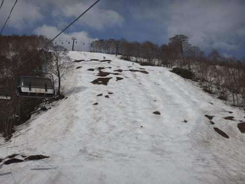

# 5月5日，GW4連休3日目のかぐらスキー場は…雪はたっぷり！でもちょっと混んでたよ

📅 投稿日時: 2018-05-06 00:19:35

🏷️ カテゴリ: [2018スキー滑走日記](c11b88dc181f34079ab41db74a3587646.md)

ってなわけで．

本日朝（というか，昨晩深夜？）に関西某所を出発し．

500km以上を突っ走って，今朝からかぐらで

滑ってました～！

…そして．

今，K奈川県の自宅に戻ってますが．

もう深夜で死にそうなので，取り急ぎ

本日のかぐらの状況，速報をば…

えー．

本日は田代スタートにしましたが．

田代もまだ結構雪がありますね～！

午前の早いうちから滑りの悪い雪になりますが，

朝イチはそこそこ板が走って気持ち良かった…

田代だけでも，志賀よりかなり

マシだったかも…

と思えるレベルです．

ってか，このGWの志賀はひどすぎた…（涙）

で．

かぐらメインゲレンデも，まだ幅いっぱい

滑れます．

結構楽しめますよ！

ただ，パノラマコースは終わってるし…

テクニカルもほぼ終わりかけ（泣）

ジャイアントコースも…

残念なことに，結構土が出てきてます（涙）

でも，まだメインバーンが十分滑れるだけ

シアワセですね～！

ただ，いつもの通り，昼を過ぎると結構な

コブ斜面化しましたし…

リフト待ちも5～10分くらいあったし…

そして，ゲレンデもすごい人口密度でしたが…

でも，メインバーンはコブ溝もまだ土が出てきてないし．

志賀の悲惨な状況と比べれば，

100億倍くらいシアワセな感じです…

とりあえず．

また明日，詳細レポートします…

すみません．コメント回答も，また明日に

させてください…（謝）

もう寝ます．

おやすみなさい…

## 💬 コメント一覧

### 💬 コメント by (もりや)
**タイトル**: 今日も、かぐらですか？
**投稿日**: 2018-05-06 13:27:51

昨日は大変お世話になりました。一日滑ってから駐車場で子供達3人で遊んだ事も楽しかったらしく、別れるのが寂しかったみたいです。関西から6時間半掛けて、かぐらまで来て朝一からリフトストップまで9時間半滑って、渋滞を避けるため一般道で6時間掛けて自宅へ帰って、もしかして今日も、朝からかぐらですか？私は今日から仕事7連勤ですので、また今週末かぐらでお会いしましょう。

### 💬 コメント by (Skier_S)
**タイトル**: もりやさま
**投稿日**: 2018-05-07 00:13:13

こちらこそ，大変お世話になりました~！

娘もものすごい楽しかったみたいです．

また滑りたいと言ってました…

次の週末，娘が参戦できないのが残念です．

ちなみに，昨日は渋滞が思ったほどひどくなく，

渋滞20km＆1時間だったので，高速を使って帰りました．

予想では2時間以上の渋滞だったので，

予想よりかなりマシでした．

でも，途中で食事や仮眠したりして，帰宅に

やっぱり6時間かかりましたが…（涙）．

今日もかぐらに行ってきましたが，

さすがに朝イチロープウェーに間に合い

ませんでした（泣）．

完全な睡眠不足で，午前中はかなりしんどくて

ヘロヘロでした…

また，今週末よろしくお願いします！

