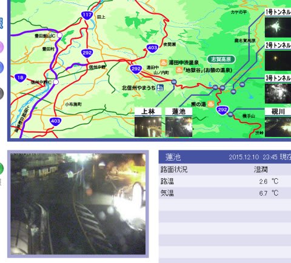
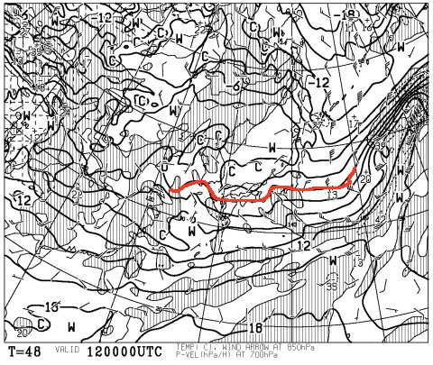
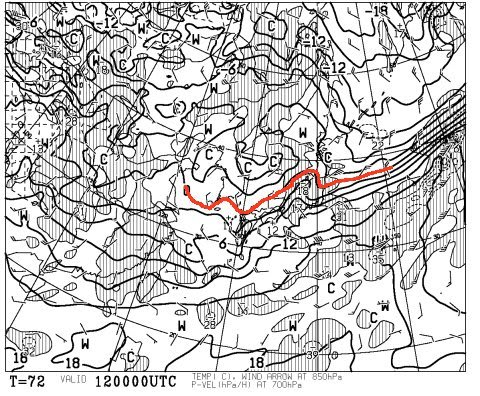
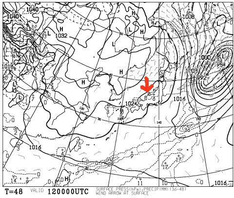
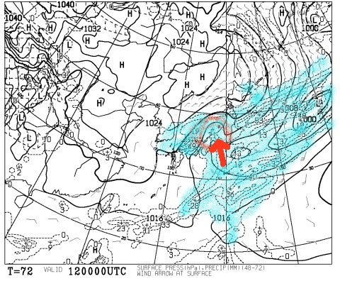
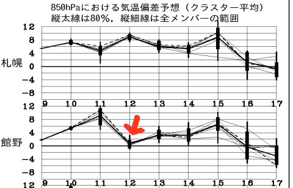
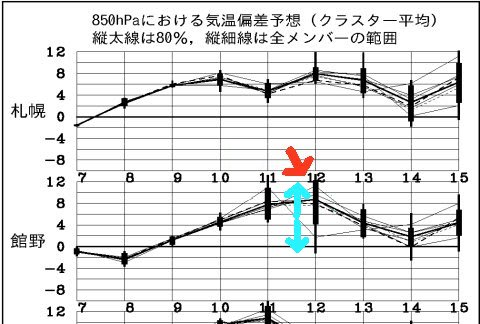

# 緊急速報！土曜12日の天気図激変！土曜は…小雪⇒晴れ？

📅 投稿日時: 2015-12-11 01:06:43

えー．

予想通り，現在．

志賀高原でも異常に気温が上がり，

雨が降っているようです…（涙）．

蓮池で，12月の深夜12時に，

気温+6.7℃って…

何よ，それ！？？

とりあえず．

この雨は，金曜の夜まで降り続けるんですが…

でも．

あれ？

12日土曜の予想天気図…

昨日の予想と，全く変わってるよ！？？

これが，今日の段階での，12日土曜朝9時の予想図．

あれれ？0℃線は，日本の南に下がり，

志賀高原には-3℃線が近づいてるよ！？？

…これなら．

金曜夜から土曜にかけては．

雪です．

雪になります．

天然雪が積もります．

…そして，人工降雪機も動かせる可能性，大！

昨日の段階では，12日土曜朝9時の予想図はこんなで，

志賀高原よりかなり北に0℃線があったというのに…

今日になったら，土曜の地上天気図もこんな感じになり…

これだったら，矢印で示したように北風が入り，

気温もそんなに上がらない感じ．

午前は雪～曇り，午後は時々晴れ間も，って

感じなんですが…

いや，昨日の予想では．

土曜の天気図って，こんなだったんですが？？

なんか，矢印で示した部分にあるプチ低気圧に

向かってかなり南風が入りそうな感じで，

このプチ低気圧のおかげで，終日雨が降りそうだったんですが…

そして．

今日の段階の，12日の予想850hpa気温は，矢印に

示したようにほぼ平年並み．

昨日の段階では．

こんな感じで，平年比+8度くらい上がりそうだったんですけど…

まぁ，確かに．

予想ばらつきが，水色の矢印で示すようにかなり広く．

一番低い温度の予想は，平年並みではあったのですが．

ってことで．

土曜の天気．

当初予想より，ずっと良くなりそうですっ！！

いやーーー．一安心…

とりあえず．

いい方向にずれたので．

土曜の天気予想，訂正です！

土曜：朝のうちは雪がちらつく．朝の志賀高原に登る道路は，

　氷の上にうっすら積雪という，かなり運転が難しい道かも…

　金曜までの雨で溶けた雪が冷えて固まった，固い下地の上に，

　うっすら人工雪＋天然雪．

　天気は朝は小雪～曇り，徐々に回復し，午後には雲の合間に晴れ間も．

　気温は終日マイナスをキープしてくれそうかな？

　雪はたぶん，固いだろうなぁ…

日曜：…微妙．うーん．謎のプチ低気圧が発生するかしないか…

　これによって大きく天気は変わります．

　プチ低気圧が発生すれば…

　…

　…日曜が，雨になるかも．

　でも．今のところ，「終日曇り，気温は高め，土曜からの人工雪や

　自然降雪は期待できず」というところで…

とりあえず．

土曜は当初予想より良くなりそうで，一安心…

日曜がまだ微妙ですが…

明日また，最終予想します…

…しかし．あれだ．

今回．土曜の天気がありえないくらいに劇的に改善したのは．

そうです．これはきっと，

ふははははは！

私の祈りが通じたということで…（ドスっ）←読者からの怒りの鉄拳に殺られた音
