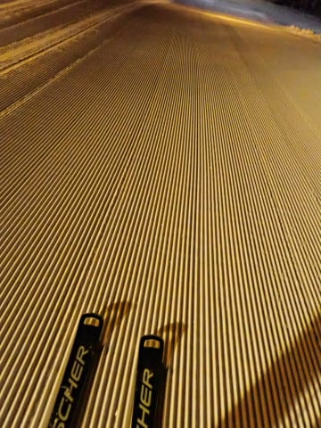

# 2024/1/27(土)の志賀高原焼額山スキー場は…超冷え冷え，雪が降ったりやんだりの最高雪質の1日だけど，夕方になって晴れ

📅 投稿日時: 2024-01-28 00:31:15

ということで．

本日も志賀高原へやってきました～！

いやーー．

先週は雨でひどかったけど．

今週はようやくトップシーズンの志賀高原を

滑れた感じです…！

良かった．

今日はよかった…

まず．

あさイチは，今日も第1ゴンドラ営業開始の8時半を

狙いますが…

3分遅刻（泣）

ちょうど，あさイチに並んでいた列がはけるのと

同時にゲートイン．

>

今日の天気は，中野市街は晴れていたけど…

志賀高原は雪降り．

…でも，積雪はほとんどなく．

昨晩からの積雪は，せいぜい3-5㎝くらいかな？？

山頂の気温は-11℃と，この時期としては平均的

だけど，ここしばらくの高温を考えると，かなりの

冷え冷え！

あさイチのバーンは…

シマシマ圧雪の上にすごい軽い新雪が1-2㎝

積もった，トップシーズンらしい，冷え冷え

最上級雪室バーン！！

これで晴れてくれれば最高なんだけど…

でも，雪降りの天気でも，ここしばらく

なかった冷え冷え最高雪を滑れる

幸せ…っ！！

天気は，午前中はこんな感じで，曇ったり

雪が降ったりで，ちょっと雪面が見にく

かったりするタイミングがあったのが

惜しい感じだけど．

視界が悪いタイミング以外は，意外とクリアに

見えたし．

そこまでひどい天気ではなかったですよ～！

>

ただ，朝9時半ごろに一瞬コース上の

人口密度が高くなり…

第2高速や第2ゴンドラの待ちが長くなることも

あったけど．

今日から第3高速リフトが故障運休から

復活して．

第3高速に逃げれば，待ちは短かったし…

混んだのもなぜか一瞬で済み．

10時半には第2高速の待ちも短くなったし…

>

11時では第1ゴンドラの待ちもゲートの

中に納まっていて，11時半には搬器数台待ち

程度のガラガラ状態で，午後もゲートの外まで

列は伸びず，拍子抜けするくらいの

ガラガラで待ちなしの一日！！

これで，雪質最高とくれば…

もう，「シアワセ」の一言じゃないですか…っ！！

…で．

今日は，今シーズンから新オープンのコース

ヤケビバレーの記念すべきオープン日！！

ヤケビマニアとしては，行かないわけに

いかない…！！

と，さっそくチャレンジしてきました…

…ふーん．超上級者コースですか…

ちなみに，オープン前までは入り口や

その周辺にパトロールが数人立って，

入り口から入れないように防いでいて．

オープン判断とともに，立ち入りが許可

されます！

入った先は…

確かに非圧雪の，広めのバーンが広がって

いるけど…

うーん．

硬めの下地の上に，柔らかいのは10～20㎝程度．

板が潜るようなパウダーではなく，

ぼこぼこのこぶの上に10㎝の新雪が

乗っている感じ．

残念ながら，今日はちょっと楽しめる雪じゃ

ない感じ…（涙）

とはいえ，志賀高原では珍しい，この周りの

木々の隙間を縫って好きに滑っていいっていう

コースができたのは歓迎したいところ…

かなり広い範囲がコース設定されていて，

見渡す範囲の木々の間を勝手に滑っていいので，

本当にディープな新雪がつもったら

楽しそうな感じ…！

次は，こちらも非圧雪のSGSコースも

滑りましたが…

こちらもおおむね踏まれちゃって，美味しい

新雪は残ってない感じ．

ってな感じで．

昼からはひたすら整地コースを滑ってましたが…

午後は人も減って，それでいて雪もよく…

いや，最高なんじゃないですか？

今日は人が少なかったので，雪はトップシーズンの

雪のわりには午後になっても全くゲレンデが荒れず．

夕方になっても，大回り板で好き放題大回り可能！！

さらには，午後3時を過ぎると，日も差してきて…

いや．

完全に晴れたんですけど？？

こんないい雪質で，雪もそれほど荒れず．

そして，日が差す中滑れるって…

これ，シアワセすぎるんですけど！

ってな感じで．

先週の雨の残念な感じとはうって変わって．

雪よし，混雑も朝の一瞬のみであとはガラガラ，

最後は日も差す…という，恵まれた

コンディションで．

今日も日が傾く，リフトストップの16:15まで，

いつも通り昼休みも取らず，ひたすら滑り倒した

のでした…

いやーー．

良かった．

雨降りの残念な先週と比較にならないくらい．

強いて比べれば，1億6700万倍くらい良かった！！

…

ってなことなので．

こんな日には．

そうです．

当然ナイターへ繰り出すのだ！！

最高雪質の圧雪かけたてシマシマバーンを

楽しめる，ナイターへ行かないともったい

ないのだ！！

特に今日は，壊れいていた第3高速が直り．

やっと念願の第3高速ナイターで滑れるのだ…！！

…

…

…（言葉を失う快感と悦楽）

…

シアワセ…

もう，こんな最高雪質のシマシマバーンを，

誰も人がないから，4本滑っても5本滑っても

シマシマが残るシマシマバーンを，

ガラガラ貸し切りに近い状態で滑れて

いいんですか？

ラストになっても全然荒れず，まだところ

どころシマシマが残る，こんな極上バーンを

2時間味わい続けられて，いいんですか？？

という，ここ数シーズンでも最高レベルの

ナイターを午後6時の営業スタートから

午後8時の営業終了までひたすら滑り倒し．

昼間からナイターまで，おなか一杯いい雪質を

堪能して，すごい満足な一日だったのでした…

いやーーー．

良かった．

明日も冷えてよさそうな感じ…

これで終日日が差す天気になったらいいんだけど…

明日もだいたい今日と同じ天気になりそうです．

とりあえず，明日もいい雪質を楽しんできます～！！

## 💬 コメント一覧

### 💬 コメント by (ねも)
**タイトル**: Unknown
**投稿日**: 2024-01-28 19:22:43

Ｓさん

日曜は土曜以上に、シアワセの一言だったのでは？

ずっと焼額山で滑りました。どこかですれ違っていたかも。

ピステンばっちり混雑なく、昼すぎまで穏やかな晴天☀

志賀高原でこんなシアワセはウン年ぶり!?

高価なリフト料金が納得できました(苦笑)

### 💬 コメント by (Skier_S)
**タイトル**: >ねもさま
**投稿日**: 2024-01-29 02:47:16

いやーーーー！！

日曜は最高でした…！！！

間違いなく今シーズンぶっちぎりの最高．

毎日こうだったらいいな…って思いました…！

