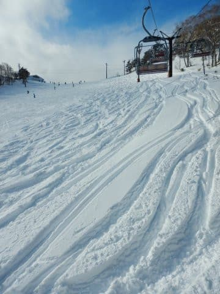

# そして，本日志賀高原ラストデー…コロナウイルスが憎い（涙）．そして，志賀高原のスタッフの皆さんありがとう

📅 投稿日時: 2020-04-20 04:32:19

🏷️ カテゴリ: [日記](cc4b5682fb7b8b144980957a978653fb0.md)

ということで．

残念ながら，志賀高原の営業ラストデーとなる本日．

（運がよければGW後に横手山は再開のはずですが…）

本日の朝は，霧雨でのスタートだったようです…

ただ，ゴンドラなんかには水滴がついてますが．

雨粒が空から滴り落ちるような雨ではなく．

まさに霧みたいな，しっとり濡れる感じ

だったようで…

そして，朝の天気は霧雨ながら．

山頂付近ではあさイチの気温は

マイナスだったので．

この冷え込みのおかげで，夜の間は，

山頂付近は雪だったようで…

木々の上に雪が乗ってます…！

うーん．

今日の天気は完全に雨だと予想していたのに．

この時期にまだこれだけ雪が積もるとは…っ！

やっぱり今年の4月は，奇跡の4月だわ…

ただ，雪は積もったものの，午前11時ごろまでは

霧雨～ガスっぽい感じで，雪が水を吸って

かなり重めだったみたいですが…

それでも朝は，比較的滑りいい雪だったようです…！

でも．

やっぱり昼に向かってちょっと気温が上がり，

+7℃とかなり高温になったので…

昼ごろから張り付く滑りの悪い雪に

なっちゃったようです(涙)

で…

なんと，午後3時ごろには晴れたようです！

…ただ，雪はザクザクで滑りにくかったようですが…

ってなことで．

予想と実態の比較をしてみると…

　この日の明け方まで雨が残るか…　←外れ．明け方まで雪

　リフト営業開始のころに止みそう．←外れてる…朝から午前いっぱい霧雨

　朝から気温はプラスで，　←いや，朝イチはマイナスだったし

　昨日の雨を吸って，ところどころ

　水たまりのようになった湿った雪．←水を吸って重めだったのは当たってるけど，水たまりにはなってない

　天気は終日曇り空．←午後3時くらいから晴れましたよ！？？

…

…今日は，予想外したようだな…(小声でひっそりと)

まぁ，水曜の段階からちょっと予想が

低い方に変わったみたいで．

予想より気温が1-2℃低い方向に

ズレたようです…（泣）

とりあえず．

予想が外れて気温が低くなり，

雨が雪になってくれたおかげで．

壊滅的に雪が解けることなく，

まだまだ雪がたっぷりの志賀高原．

これで終わりとは，超残念な感じです…（激涙）

とはいえ．

泣いても笑っても，雪がいっぱい残っていても，

本日がラストデー(泣)

もったいないお化けの大群に襲われそうですが．

これで志賀高原，終わっちゃいました…

…しかし．

志賀高原の全山券が使える最終日．

そして，

焼額のラストデーに私が志賀高原に行かなかった

というのは，実に何年ぶりのこと

でしょうか…（涙）

あぁ．悔しい．

ラストデーに滑れず．

お世話になったスタッフや常連さんに

挨拶できずに終わってしまったのは，

私としては超残念な終わり方です…

志賀に行けず，直接言えなかったので．

ここに記しますが．

志賀高原のスタッフの皆さん，お疲れ様でした！

GWまでコースをもたせるべく，数日前まで必死に

雪出ししてくれていたのに，それが無駄に

なってしまったり，

そのほかにも，こんな状況の中なので

いろいろ言われたり大変だったと思いますが．

いろいろな状況がありながらも，

最大限配慮しつつ営業してくれた

志賀高原，そして焼額のスタッフに感謝！！！

(ヤケビ♡）

そして．

志賀高原に集うみなさんも．

お疲れ様でした！

想定外の状況で終わってしまったのは残念だったけど．

このシーズンもいろんな出会いや，

楽しい出来事がたくさんありました．

まさに私も，この焼額スタッフの方のメッセージの，

最後の一文と同じ気持ちでいます…

皆さん，また来シーズン志賀高原でお会いしましょう！

…志賀高原よ，今シーズンもありがとう！

　

　

　

　

## 💬 コメント一覧

### 💬 コメント by (なっちゃん)
**タイトル**: Unknown
**投稿日**: 2020-04-20 06:04:39

今年もありがとうございました。

来年は、私も挑戦できるように、夏に鍛えます！

### 💬 コメント by (いー)
**タイトル**: Unknown
**投稿日**: 2020-04-20 19:39:45

お久しぶりにコメントします。

今年も、シーズン券を買いましたが病気でスキーに行けず、シーズンか終わってしまいました…

病気で行けないのにブログで行った気分にさせてもらいました!

完治して来シーズンは復活するぞ!

ありがとうございます

### 💬 コメント by (musi)
**タイトル**: Unknown
**投稿日**: 2020-04-20 22:22:40

今シーズン後半は子供にスキー同行を振られ続け、

相変わらず小さなコブでも発射し続け

上手くなりませんでしたが、毎日、熊の湯スキー場と

ホテル銀嶺のブログ、焼額山のFB、道路のライブカメラ

そして、なによりも、徒然スキーを見て次の休みの計画をワクワクして考えてました。天気予報に、特派員情報ありがとうございました。コロナ騒ぎでは、人の嫌な面も見えて凹みますが、制限されると、スキーって楽しいなぁ、やっぱり好きだなぁと再認識させられました。

ゲレンデや宿の皆様、必ず国からの支援も入ると思います、なんとか乗り切ってほしいです、1年じゃあ戻れないかもしれませんが、再開後はsさん達がジャブジャブ資金を投下して物欲の花を、志賀高原でも咲かせてくれるでしょう。私も微力ですが必ず参上します。早くこの疫病が治まりますように。

### 💬 コメント by (ほっぽ)
**タイトル**: 今シーズン終了
**投稿日**: 2020-04-20 23:45:43

Ｓさん

最終週末は天気も良くなかったようで、私も諦めがつきました。

小雪でＧＷまで営業できないかも、と思っていたのに

奇跡の４月で雪はタップリ残っていたのに残念ですが、

頭を切り替えて次のシーズンを楽しみに待つことにします。

NEWモデル展示会も無いし、10月のイエティまでスキー関係はお預けです。

心配なのは、コロナが終息していなくてイエティもOPENできなかった、

なんてことも想定しておかないといけません。

無事に来シーズンが迎えられることを祈って、

ＧＷは車の手入れしたり自宅の大掃除したり、スキーグッズを片付けて過ごすことにします。

また、来シーズンもイエティからお会いできれば幸いです。

### 💬 コメント by (Skier_S)
**タイトル**: 志賀高原は終わったけど…
**投稿日**: 2020-04-21 00:09:13

＞なっちゃんさま

私もしばらく滑ってないどころか，ここ2週間以上，

家から外にもほとんど出てないので，体がなまりまくってます…

このなつ，必死に鍛えないと！！

＞いーさま

お久しぶりです～！

…って，病気ですかっ！？？？

シーズン券買って滑れないってのはさぞ悔しかったかと…

完治祈ってますので，来シーズンは志賀高原でお会いしましょう！！！

＞musiさま

ホントにスキー業界が元通りになってくれるかが心配です…

コロナ騒ぎが収まっても，ほとんどの人が収入減に

なりそうなので，

スキーに行く余裕がなくなる人が増えそうな感じ(涙)

私はどれだけ収入減があっても，他の費用を削ってスキーに

注ぎ込むからいいですが，

やっぱり来シーズンもスキー業界の運営は辛そうな感じですね…(泣)

＞ほっぽさま

この週末は，家でじっとしておくのが吉だったと思います．

奇跡の4月だっただけに，ちょっと惜しい感じですが…

とりあえず，今は早期の事態収束を願うばかりです！

