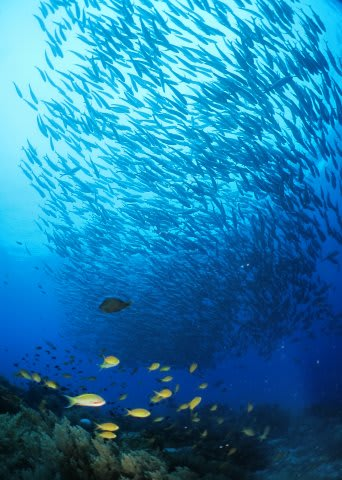

# よくわからないネタ…究極の選択　その2

📅 投稿日時: 2014-08-22 01:27:36

🏷️ カテゴリ: [日記](cc4b5682fb7b8b144980957a978653fb0.md)

ということで．

今日もフィリピンに滞在中です…

本日は，バリカサグ方面へ遠征してきました～

まぁ，ダイビングレポートは．

日本に戻ってから，詳細濃厚にやるとして．

今日は，[昨日に](e31cde5e1983839aa8696f8307fcf9ac2.md)引き続き．

わけのわからないネタ，

その2に行くのだ．

----

司「…では，続きまして究極の選択．次の問題です．

　『生活にあまり支障の無い程度の軽い足首の捻挫と，手骨折で手術・1週間

　入院，どっちがいい？』」

某「これは…足首の捻挫は，スキーができる程度ですか？

　下半身の怪我は絶対にしないように気を使っているので，

　捻挫ってしたことないんですよ…」

司「スキーブーツが履けないから，数週間はスキーはできないでしょう」

某「じゃ，全く迷うことなく骨折ですね」

司「え？捻挫って，生活に支障が無い程度の軽い捻挫ですが…」

某「でも，スキーできないんですよね？」

司「ええ」

某「手の骨折なら，スキー出来ますから．」

司「え？」

某「手を骨折して，プレート埋め込み手術して5日ほど入院したこと

　ありますけど，退院した翌週末から腕を固定したまま

　滑ってましたから」

司「え？」

某「手の骨折ならスキー出来ますから」

司「…医者には止められなかったんですか？」

某「退院したときに，スキーしちゃだめと言われなかったんで，

　いいかな～，って思ってたんですけど．

　退院後一ヶ月は骨折部を固定してて，そのあと1～2ヶ月かけて

　リハビリ予定だったんですが，リハビリ終了時に，

　『これで運動して大丈夫ですよ！』って言われたときに，初めて

　『いままで運動しちゃダメだったのかっ！』って気づきました…」

司「…普通，腕を固定しているときに運動するバカはいないから，

　医者もあえてスキー禁止と言わなかったのかと…」

　

某「今から考えると，プレート埋め込んでいるときに再骨折すると

　後々まで障害が残って危なかったらしいんですが．まぁ，

　ケガしてるから気をつけて滑ってましたし，再骨折しなかったから

　結果オーライということで」

司「そういう問題じゃないんじゃないかと…

　…とりあえず．気を取り直して次の問題にいきましょう．

　えーっと．

　なんか，ぜんぜん究極の問題じゃないですね．次の問題は．

　『あらゆる権力・財力を身につけて望むことは何でもかない，美人に

　囲まれた世界一の超リッチマンだけどスキーだけは出来ない生活と，

　必要最小限の狭い賃貸ボロアパートで赤貧生活だけどスキーは

　出来る生活，するならどっち？』」

某「これは全く悩みませんよね～」

司「悩みませんよねー．これは，普通」

某「ですよね～．

　　スキーが出来る生活に決まってるじゃないですか．普通は（きっぱり）」

司「そ，そっちですかっ！！！！！！普通じゃないですから，それ！！」

某「え？だって，どんな金持ちになっても，スキーできなかったら

　死んじゃうじゃないですか．普通」

司「…だからそれ，普通じゃないですから…

　　とりあえず，気を取り直して最後の問題です．

　　『スキーと妻，取るならどっち？』」

某「はっはっは．これも悩みませんよね．スキーに決まって…うわっ！うぎゃぁっ！」

（ボカドカッ！バキッ！）

司「おおーっと！なんでしょうか！いきなりスタジオに何者かが乱入してきましたっ！

　某スキーヤーをめった打ちに！タコ殴りに殴っていますっ！」

--血だらけになって倒れこむ某スキーヤー---

某スキーヤーの妻「あなたの望みどおり，血だるまにしてあげたわよっ！」

某（薄れゆく意識の中で）『火だるま選んでたら，火つけられてたのか…』

#この物語はフィクションであり，実在の人物とは関係ありません（強く主張）

## 💬 コメント一覧

### 💬 コメント by (たむらぱん)
**タイトル**: Unknown
**投稿日**: 2014-08-22 12:04:10

納得の展開とオチｗ

### 💬 コメント by (Skier_S＠フィリピン)
**タイトル**: Unknown
**投稿日**: 2014-08-22 18:43:54

期待通り（予想通り？）の展開です（笑)

### 💬 コメント by (ひろちやん)
**タイトル**: 夏もたのしんでますね
**投稿日**: 2014-08-22 22:42:52

いつも、楽しいネタありがとう、究極選択、うけますね、ハッハッ、昨年12月手首骨折で、ギブスしたが、使わないからと、頼み込み4週間を、2週間で、外し、ビクビク辛かったが、スキー出来ない捻挫も究極だね、さて、室内スキー場スノーバも、楽しいですよ

### 💬 コメント by (Skier_S)
**タイトル**: ひろちゃんさま
**投稿日**: 2014-08-24 21:48:33

無事帰国しました～

レスおそくなって申し訳ないです．

さっき，長旅を終えて帰宅しました…

いやー．

手首骨折．

スキーjに関係ないと思いながら，

ストック突くと痛いですよね…

コブ斜面，滑れませんよね…

でも，2週間で外しますか？普通（笑）．

こちらは，ダイビングでスキー禁断症状を

緩和中です（笑）

