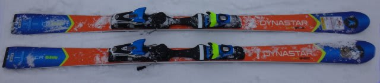
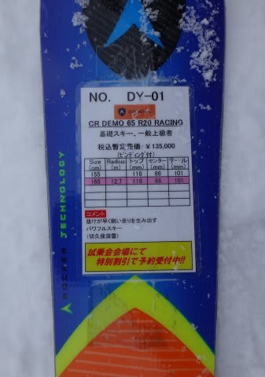
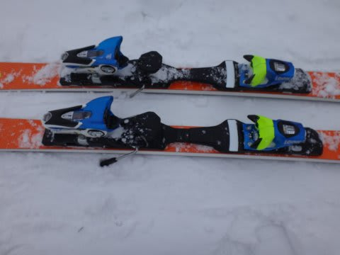

# 2015シーズンモデルのスキー試乗レポート23…Dynastar編

📅 投稿日時: 2014-05-30 01:26:00

🏷️ カテゴリ: [スキー板試乗](c0bd8048615710cee890e403a36cc9a2b.md)

あー…

今日も帰宅が遅かったよ…（涙）

だもんで．

今回の試乗インプレッション，一機種のみで．

ディナスターの基礎モデルです．

では，どうぞ～

----

DYNASTAR CR DEMO 65 R20 RACING 165cm

基礎小回り用．

ROSSIGNOLのDEMO ALPHA R20と中身は同じでは…？

と，思っていたのですが．

ビンディング＆プレートは，こんな感じで…

DEMO ALPHA R20と同じ，R20プレートが入ってますが．

サイドカーブが異なり，板自体は別物のようです．

で．

履いてみたところ．

R20プレートらしい，ずっしりと，重い感じ．

ただ，この重さが安定感を生み出してます．

グリップはかなりしっかり強く，

スピードレンジ高いですね～．

板は結構張りが強いですが，たわみを出しにくい

硬さというより，たわみのエネルギーがかなり

強烈に溜まる感じの強さ．

で，この溜まったたわみの返りはすごく速く，

かなり強いです．

板が遠くまで飛んでいく感じがします．

重いけど，その重さで，荒れた雪でもOK.

板のエッジが，トップからテールまでしっかり長く

グリップしている感じを受けます．

エッジがトップまで比較的効いてます．

けど，テール側に働きかけても何も起こらない感じ．

荷重ポイントは違うけど，板の重さ，安定感，

強さ，高速安定性は，X-Raceの165cmに近いものを

感じました…

テール荷重よりセンター荷重を好む人は，

こっちがいいかも．

## 💬 コメント一覧

### 💬 コメント by (komu)
**タイトル**: 今期スキー板は…
**投稿日**: 2014-05-31 01:02:29

何をお買上げになるか…

なかなか予想が難しいですな~(・・？））

まあ時間がありますのでゆっくり考えましょう

### 💬 コメント by (Skier_S)
**タイトル**: komuさま
**投稿日**: 2014-05-31 05:52:08

いやいやいやいや～

今シーズンは板を買わない（はず）ですから～っ！！！

…まぁ，時間がありますので心変わり

するかもですが．

