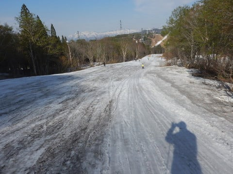

# 2019/5/11(土)のかぐらスキー場へ行ってきたよ！速報モード…朝から晴天．雪たっぷり！混雑したもののリフト待ち平均1-2分と例年より快適！

📅 投稿日時: 2019-05-12 00:51:09

ということで．

本日は予告通り，日帰りでかぐらへ

行ってきました～！！

だもんで．

本日のかぐらスキー場レポート，

速報モードにて，行ってみよう！

まず．

今朝7:30の駐車場は7割くらいの入り．

GW明けの週末にしては，車は少なめでしたね～．

そこからロープウェーに乗り，

みつまたエリアにやってくると．

…さすがに，みつまたエリアは

もう結構雪が解けてますね…

でも，そこからゴンドラに乗り，

かぐらエリアにやってくると…

ををを！！

まだかぐらメインバーン，全面に雪が

着いてますよ！

…GW翌週で，まだコース幅

全面行けるとは…

今年は結構雪が多いよ！！

あさイチメインバーンは，

雪は朝から緩め（ちょい涙）

だけど，フラットでいい感じ！

そして，

まだテクニカルコースも．

上部も，

下部も，

まだ全面コブラインに

土が出ることなく滑れてますし…

さらに，ジャイアントコースも…

ををを！

まだ全面大丈夫じゃないですか！

コブはちょいと浅めでしたが．

コブ溝にまだ土は出てきてないし…

いつもはヤバくなるジャイアントコース

下の方も，全然大丈夫！！

さらに，4ロマのパノラマコースも．

雪は滑りが悪いものの，まだまだ

滑れるじゃないですか！！！

…今シーズンのかぐら，

雪が多くて，いいですね～！！

ただ．

GW後，営業しているスキー場が

一気に減るこの時期．

白い粉の禁断症状に苦しむ，

多くのスキー中毒患者が

かぐらに集まるため…

…混むよね（涙）

…で．

大勢のスキーヤーの掘削作業を

受けたゲレンデは…

そうです．

コブコブになっていきます…

で．

朝10時過ぎに．

リフト待ちが5分越え…（涙）

…いつもなら，ここからもっともっと

人が増えていくので．

最大15分待ちくらいに

なるんだろうなぁ…

と，思っていたところ．

あれ？？

なぜ？

逆に，待ち時間が短くなって

いくんですけど？？

昼ごろになると，飛び乗りになる

タイミングも！

…いつものGW明けの週では

ありえないリフト待ちの少なさ！

GW10連休でみんな疲れちゃったのかな？？

…でも．

夕方になると．

大勢のスキーヤーによる掘削作業の結果．

いつも通り，全面コブ斜面に

なってきました…

ただ．

営業終了時でこの程度だったので．

いつものこの時期の，

狂気のコブ祭りバーンに比べれば．

コブは浅かったですね～…

ってことで．

最後に下山するわけですが．

ゴンドラコースも

まだ幅広く滑れますし…

みつまたもまだ雪の上を滑って

下りられます…！！

という感じで．

この時期にしては，多くのコースが

ほぼ全面滑れますし．

みつまたロープウェーまでまだ

滑って降りられますし．

意外と混んでなかったし．

かなり楽しめた本日でした～！

いや，かぐら．

まだまだいけますね～！

## 💬 コメント一覧

### 💬 コメント by (葛飾のS)
**タイトル**: Unknown
**投稿日**: 2019-05-12 05:14:03

GW明けに滑るなんてと思っていたんですが、

かぐら行っちゃいました(^^)

途中見覚えのあるウェア着たSさんを発見(^o^)

結構暑かったんですが、

フル装備でしたね。

私は混雑していて午前で終わりにしました。

かぐら、凄いです。小山がたくさんできてました。

ちなみにお昼過に駐車場は満車になっていました。

### 💬 コメント by (Goku)
**タイトル**: Unknown
**投稿日**: 2019-05-12 10:22:16

バンクじゃない、昔ながらのこういうコブを滑りたい‼

それにしても、雪ありますね🎵

### 💬 コメント by (Skier_S)
**タイトル**: 今週のかぐらは良かったよ！
**投稿日**: 2019-05-13 02:15:48

＞葛飾のSさま

あら？？

かぐらにいらしてたんですね．

寒さに弱い私は，念のためウェアのジャケットを

着て行ったのですが…

さすがに暑すぎました(笑)．

午後はリフトは空いてて良かったですよ～！

次の週末も楽しめそうですね～！

＞Gokuさま

かぐらはいつもいい感じの春コブができますよ！

…でも，今週はいつもよりコブが浅かったですが…

再来週まで営業しますよ～！

…しかし，膝を怪我してますから，来シーズンあたりは

コブを控えた方が良いのかもしれませんが…

