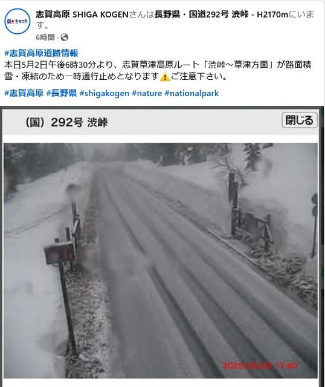
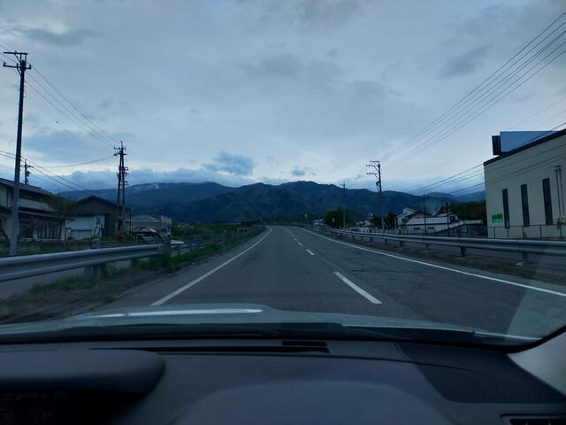
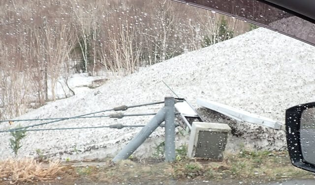
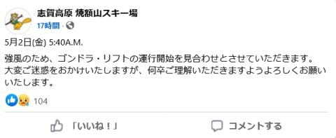
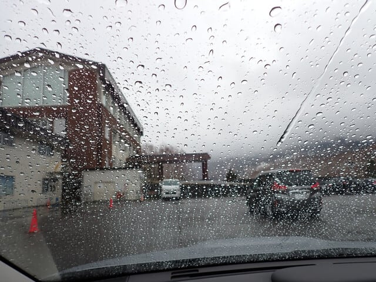
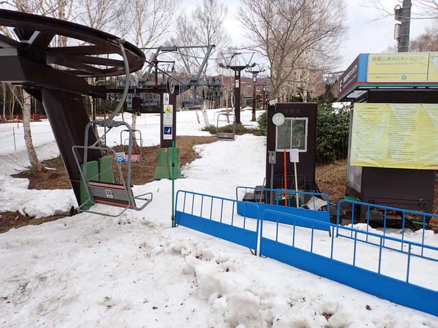
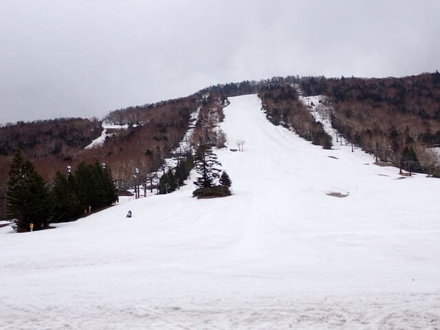
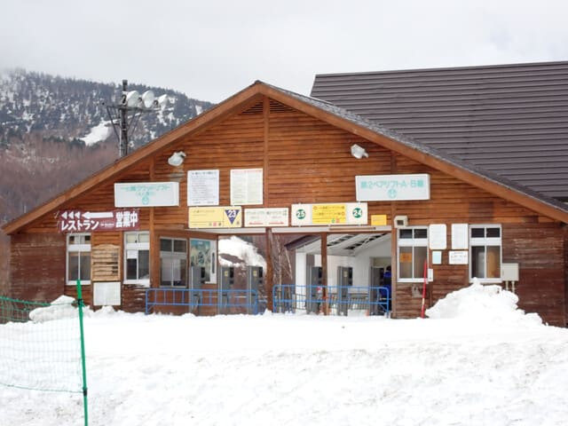
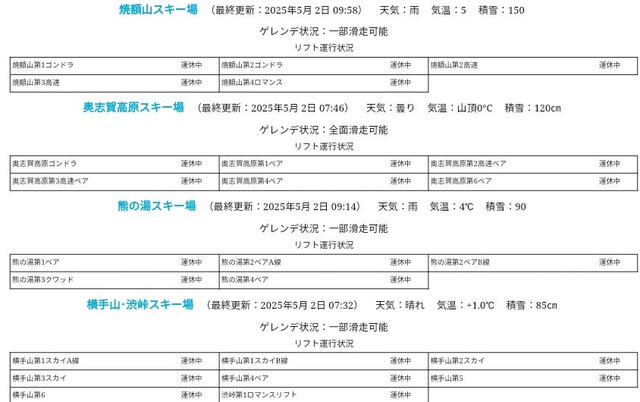

# 2025/5/2(金)，GW4連休前日の志賀高原スキー場は…強風でリフト・ゴンドラ全滅．滑らずに帰宅（泣）

📅 投稿日時: 2025-05-03 01:15:00

🏷️ カテゴリ: [日記](cc4b5682fb7b8b144980957a978653fb0.md)

えー．

明日から4連休ということで，明日，志賀高原へ

向かう方もいると思いますが．草津越えの，

草津～万座間はまだ雪崩のため

通行止めが継続してますし．

今晩の積雪で，5/2(金)18:30から，

渋峠～万座間も通行止めになりました！！

（[志賀高原Facebook](https://www.facebook.com/shigakogen/posts/pfbid02FG4DMsAZ5vu2JhhiyurWR78mgcgug6PzVXxT4LsZJzLec7RoXLj3ajieYn1Knu55l)より）

渋川伊香保とか軽井沢方面から，

万座ハイウェイ経由でも渋峠に行けなくなって

いるのでご注意を！！！

…ということで，本題へ．

4/28から5/2の本日まで，5日間連続で

志賀高原に滞在するという，かなり強引な

休みを取って，強行プランを実行した

このGWだったんですが…

5日連続の最終日の本日．

今日も焼額の早朝オープンの6時を狙って

志賀高原へ向かったわけですが…

朝5時ごろの中野市街はまだ空も

明るかったのに．

志賀高原への上り坂を走っていると，

かなり風が強く，路上にいっぱい木の枝の

切れ端が飛ばされてきていたり，バス停が

倒れているくらいなので．

これはヤバいかも…と思いつつ．

まぁ，第1ゴンドラは確実に動かないよね，と．

第4ロマンスが動くことにかけて，

第2ゴンドラ駅舎に到着すると…

案の定，第1ゴンドラどころか，第4ロマンスも

営業見合わせですか…

やっぱりだめですか…（泣）

（[焼額山スキー場Facebook](https://www.facebook.com/yakebitaiyama/posts/pfbid028Qe8mbKnawbhTKKbAH332gVHXXK4ANXnp9LdcdysZhymyYqbwwuoXjKTBxDTbL65l)より）

あぁ…

昨日の記事で，

ゴンドラが動かないかもしれないし．

ヘタするとリフトもヤバいけど…

とは書いたけど．

悪い予想は当たらなくてもいいじゃん…（激泣）

まぁ，その可能性は限りなく0に近いとはいえ，

しばらく待ったら動く可能性も完全に0ではない

ので，駅舎前でしばらく待つと…

車がユサユサ揺さぶられるほどの強風で，

さらに7時ごろには雨がかなりの勢いで降り

出すという，悲しいおまけつき（泣）

山頂では風速30mということですが…

外に出るとホントにすごい風で，

これはリフトを動かしても，リフトが

振り子みたいに揺られて空中ブランコ

気分を楽しむアトラクションになるだけ

ですね…

志賀高原の他のスキー場も，ほとんどが

運転見合わせの中．

朝8時過ぎの段階で，一ノ瀬ファミリーペアが

運転準備している！！！

という情報で，急ぎ一ノ瀬へ移動！！

確かにスタッフは乗り場に雪を入れたり，

オープン準備をしていましたが．

8:30を過ぎてもリフトが回り始める気配は

なく…

じきに山頂駅のスタッフもスノーモービルで

下りてきて．

「営業見合わせです～」

と一言（激泣）

ということで．この時点で，

志賀高原のすべてのリフトが運転見合わせ（止まらない涙）

リフト運行表には，虚しくすべてのリフトに

運休中の文字が並びます…

（[志賀高原索道協会リフト運行情報ページ](https://shigakogen-ski.or.jp/print.html)より）

惜しい…

リフト1本でも動いていれば，[いつぞやのように
なんとか楽しむ](eb2d7305e285fa8a79404b54fcf97662d.md)ことができるのに．

ということで．

ここであきらめて私は帰宅しましたが．

実際，10時ごろには志賀高原のすべての

リフトが，本日は終日運休するという

ことがアナウンスされたようです…

しかし．

せっかく無理やり休んだ平日というのに．まさか

リフト1本も動かない悪天候の日に当たるとは…（泣）

持ってる．自分はなにか持っているに違いない…！←いい運じゃなく，

かなり悪い運をもっているよね

と，泣きながら帰路についたのでした…

ということで．4連休初日の明日は，

残念ながら家で用事のため，私は滑れ

ませんが（泣）

4連休初日の明日，3日は朝は冷え込み，

昼間は晴れそうなので．午後は雪が緩んで

荒れるかもしれないけど，午前中くらいは

結構いい感じで楽しめると思います…

4連休の初日に滑る方は，私の代わりに

思う存分滑ってきてください…（にじみ出る無念感）

PS1.こんな状況でも，焼額常連さんが

　そこそこの人数集まって来たことに，

　「こんな天気でも，みんな上がって

　くるんだ…」と，自分のことを棚に上げて

　関心していたのでした…

PS2．そして，こんな状況の中で．

　スキー場スタッフに許可を取って

　ハイクアップで滑っていた人がいたことに

　驚きというか，一般人の理解を激しく越えた人

　スキーにすごい情熱を持っている人が

　いるんだと，目を疑った感動したのでした…

## 💬 コメント一覧

### 💬 コメント by (アツシ)
**タイトル**: Unknown
**投稿日**: 2025-05-03 08:24:40

せっかくの平日スキーなのに、残念でしたね。ご愁傷様です。それはそうと、あれ？また入れ違いですか？私は今日から４日間滑ります。

### 💬 コメント by (愛読者)
**タイトル**: Unknown
**投稿日**: 2025-05-03 14:51:33

転んでもただでは起きないSさんのことだから、このあとエキップさんに寄って物欲選手権を行ったのではないですか？

