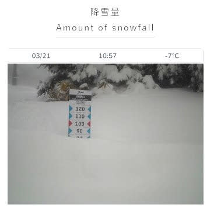
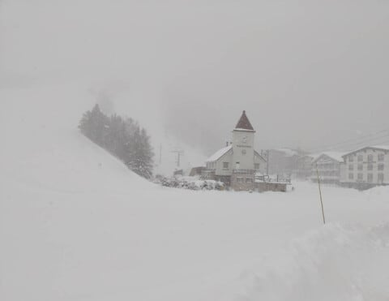
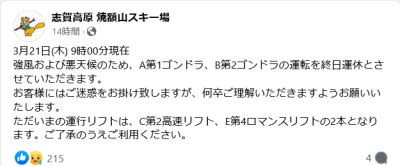
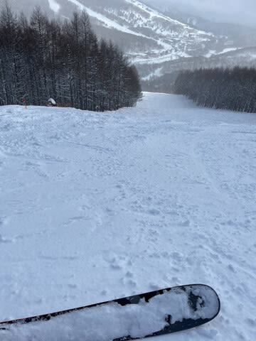
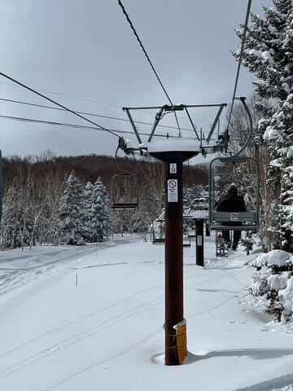
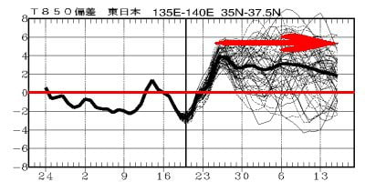
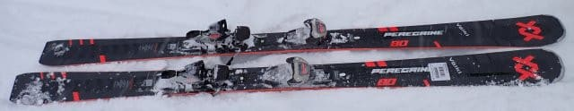
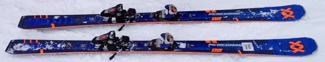
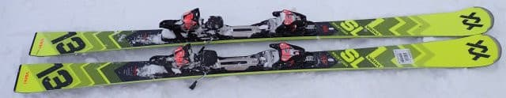
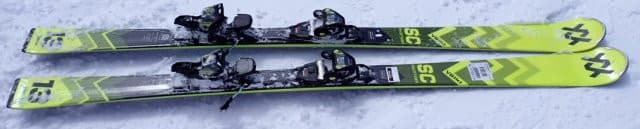

# 2025シーズンモデルのスキー板の試乗レポート速報…VOLKL編その1

📅 投稿日時: 2024-03-22 01:24:39

えー．

本日も，志賀高原の特派員からいろいろ

写真が送られてきましたが…

今朝はかなりガン降りで，朝もかなり強く

雪が降り続け．

ライブカメラを見ると，

朝10時の段階で，昨晩からの積雪が80cm！！

いやーーー！

積もりましたね～…

今シーズン一番の積雪だったのでは？？

（[焼額山スキー場ライブカメラページ](https://www.princehotels.co.jp/ski/shiga/livecamera/)より）

ただ，特派員によると．

朝から風が強く，リフト・ゴンドラの多くが

動かないほどの猛烈吹雪で…

焼額も，本日は営業開始が遅れ，

9時から2高と4ロマ，

そして10時からやっと3高だけが動く

状態で．

終日ゴンドラは運休となったようです…

（[焼額山スキー場ホームページ](https://www.princehotels.co.jp/ski/shiga/winter/)より）

ただ，昼前には雪も弱まり．

荒れた天気だったので人も少なく，

そして，午後には日も射すように

なってきたみたいです…！！

いやーー．

かなり積もりましたね…！！！

明日は午前中は雲が残るかもしれないけど，

天気は回復しそうだし．

気温もそんなに上がらないし…

明日の金曜は絶対ねらい目です！！

…だのに．

週末は気温が上がり，液体が降るかも…（泣）

うーん．今のところ山頂は雪，

ゴンドラ乗り場近辺は液体…

という微妙なものが土曜の昼過ぎ

からしばらく降りそう（涙）

そして．

今日は木曜で，1か月予想が出ましたが…

…

…

…

…ダメな感じです（泣）

4月13まで，ひたすら平年比+2～4℃の高温が

続き，かなり残念な4月上旬になりそう（激泣）

あぁ…3月は奇跡の3月だったのに．

せっかく雪がいっぱい積もってくれたのに…

とりあえず．

繰り返しますが．

今週土曜午前が，今シーズンラストの

冷え冷え雪で滑れるチャンスになりそうです（泣）

その後はずっと高温が続き，来週は何度か雨に

やられそうです…（激涙）

ってなことで，本題へ．

〇VOLKL PEREGRINE 80 177cm

私がかなり気に入っているVOLKLのDeaconの

後継機になるらしいPEREGRINEシリーズ．

Deaconのセンター80mm台のセミファットは

80と84の2種類でしたが…

PEREGRINEは80と82になるらしく．

細いほうの80です．

履いてみた感じ，やっぱりDeaconに近い．

メタルが入ってないDeacon80に近い感じかな．

軽さを感じるのにエッジグリップがしっかり目で，

軽快さを感じ．

縦目に落とそうと思えばまっすぐ走るし，

踏んでいけばしっかり曲がる，玄人好みの板．

回転弧の自由度が高いので，普通の

ゲレンデならほぼずらしを入れなくても

滑れるオールラウンド性の高さがあり，

新雪，ハードパック，圧雪，硬めのバーン

など，どんなゲレンデ状況でも気楽に

行けて，そこそこ本格的に滑れる万能板．

〇VOLKL PEREGRINE 82 177cm

PEREGRINE80から，トップ-センター-テールとも

全て2mmずつ太くしただけの板で，

サイドカーブは全く同じ．

PEREGRINE80と幅がわずか2mm違うだけか？

と思ったら，82のほうはかなりしっかりした

メタルフレームが入っているらしく．

82のほうがフレックスと張り，返りが

結構強めになってます！

というか…私の普段履きのFISCHER 

RC4 RC PROと変わらないくらいの

張りの強さ．

ゲレンデでは大回りメインで，かなりの

ハイスピードでがっつりエッジグリップして，

セミファットと思えないGS板のような

高速大回りができます！

それでいて，幅の広さによる悪雪の

踏破能力もあります…

かなりのハイスピードでがっつりエッジグリップ

させた大回りクルーズがしたい人で，

それでいて春の雪や新雪が蹴散らされたところの

走破性も欲しい人にはお勧め！

〇VOLKL RACETIGER SL 165cm

昨年からのキャリーオーバーで，表面コスメ

だけが変わったみたいですが…

滑ってみるとやはりかなり旋回力が強く，

ググっとたわんで小回りに入っていく，

小回り強制マシン．

エッジグリップが強く，スピードを出しても

しっかりグリップしてギューンとたわんで

いくので，気持ちよく深いカービング

小回りができます．

カービング小回り専用機です．

大回り板が他にあり，小回り特化機が欲しい

ならこいつがおススメ．

でも，お値段19万300円か…

〇VOLKL RACETIGER SC

お値段16万5000円と，RACETIGER SLより

ちょっとグレードが落ちるこの板．

キャップ構造だし，板も薄っぺらいし

中級者向けの板かな…？

と思ったら．意外とこいつがしっかり

グリップして，キレキレカービングが

できる！

RACETIGER SLほど返りが早くないけど，

むしろそっちの方が小回り強制マシンに

ならなくていいかも．

グリップ強めでカービングができ，

小回りベースだけとある程度オールラウンドに

使う板が欲しい…という人は，候補に

入れていい板．
