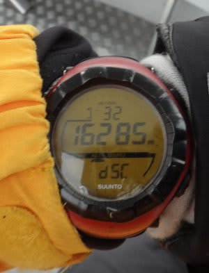
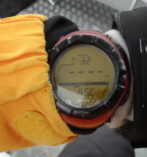
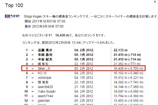
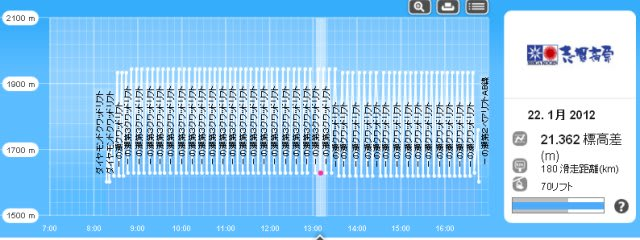

# むちゃくちゃ滑ったこの週末

📅 投稿日時: 2012-02-09 01:01:27

っつーことで．

超強引に休みを取り，平日スキーに行ったこの週末ですが．

いやーーーー．滑った．

滑走標高差を計っている私の[Suunto Altimax](e764f37b2c20923a0b722f930137c0e5e.md).

こいつが[測定上限16340m](e74c0e5c5efc536143ddd2bdec14c5824.md)を超えて振り切りましたなぁ．

特に記録を狙ってるわけじゃなかったけど，何しろすいてたから

気持ちよく滑っていたら，かなり滑っちゃってました．

…とりあえず，[志賀高原の滑走標高差ランキング](eb2a0029115b8205c8168295e2d9d49ef.md)も5位に復帰．

…しかし．

私より上位を滑っている人って，軒並み20000m越えなんだけどなぁ．

一体，どんな滑りをしてるんじゃいな．

と，見てみたところ…

な，なんだこれは．

…リフトスタートからストップまで，昼ごはんも食べずにひたすら

3分ペースで一の瀬クワッド滑り続けてる…

1位から4位まで，みんな同じパターンだよ…

この人たち，ホントに人間か？

これと比べると…

ちゃんと昼休みをとって，お昼ごはんを食べている私は，

まだ正常範囲内だなぁ…

と，改めて実感する今日この頃でした．
