# 3月23日の志賀高原詳細…最高っ！幸せっ！ハッピー！Goodコンディションな一日

📅 投稿日時: 2014-03-25 02:40:09

ということで．

昨日速報した，3連休最終日の志賀高原の．

ゲレンデコンディション詳細ですが…

とりあえず．

最終日は．

超幸せな一日でした．

3月上旬に，こんなコンディション良くていいの？？？

晴天なのに，こんな雪質よくていいの？

こんなに恵まれてていいの？？？

…これは．

もしかすると．

私の日々の祈りとスキーに費やした大量のお布施の効果が表れたのか？？

…って感じで．

大変素晴らしい一日でした…

朝イチにゲレンデに出てみると…

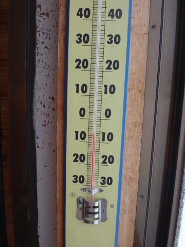

気温はマイナス7度と．

昨日よりは気温が高いけど，かなりの冷え込み！

朝イチは，ちょっと雲が出てたものの…

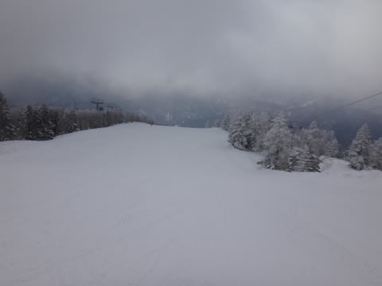

今日もシマシマがお出迎え！

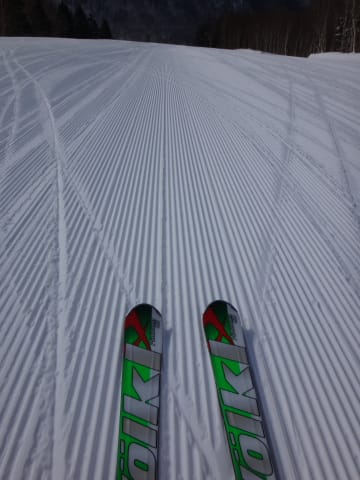

それも，柔らかすぎず，硬すぎず．

ちょうどよい，絶妙なエッジの食い込み具合を見せる，

極上の圧雪！！

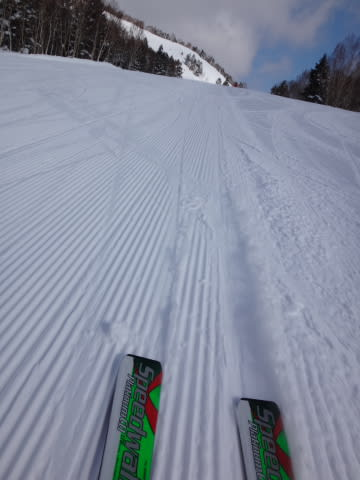

そして，1-2本滑ると太陽も顔を出し，

ピカピカ晴天の，最高快楽官能脳内麻薬出まくりの

大回りバーンに！

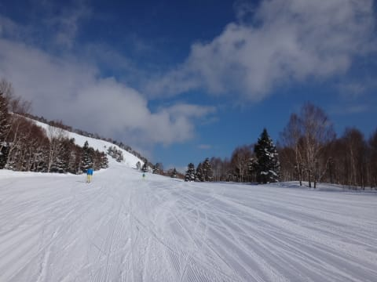

うははははは！

3月下旬に，こんなにコンディション良くていいのかっ！？？

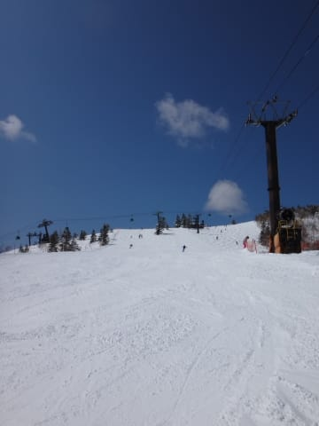

…と，サルのようにひたすらぐるぐる

快楽の大回りを続けてると．

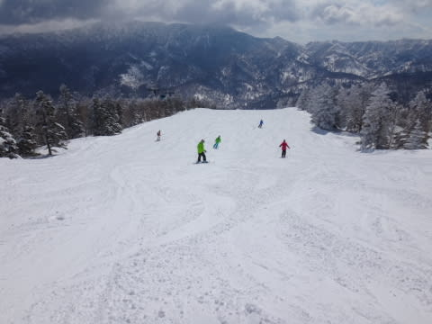

うむ？

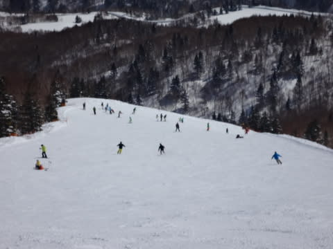

あらら…

やっぱり，10時ごろにはゲレンデに人が結構増えててしまい．

うーん．

トップスピード大回りは，無理になってきましたな～．

でも．今日はゴンドラ待ちも昨日ほどひどくなく．

ゴンドラ待ちは最大この程度で，2分程度の待ち時間．

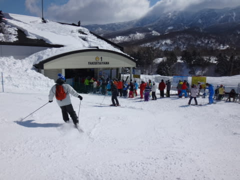

ほとんど待ちなしだったので，

小回り板にチェンジすれば，小回りを十分堪能できますな～．

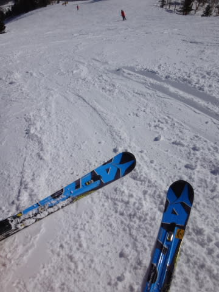

そして．

この日はスカッと天気が良かったのに．

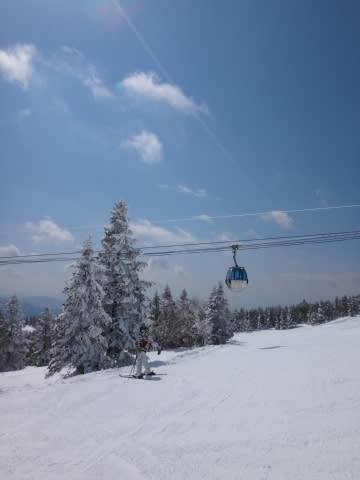

12時過ぎの気温がマイナス5度！

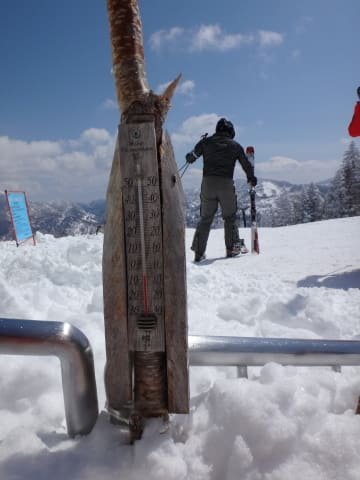

いい感じで冷え冷えなので．

午後になっても，雪質はそれほど緩まず．

気持ちよく滑れます…

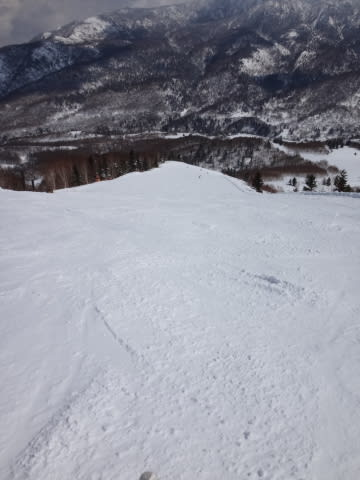

ただ，日が当たる斜面は，雪が一部ダマダマに固まるところも

ありましたけど…

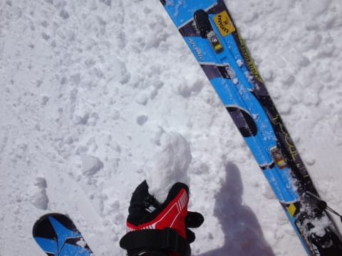

んでも．

日が当たらないところは結構いい雪質で．

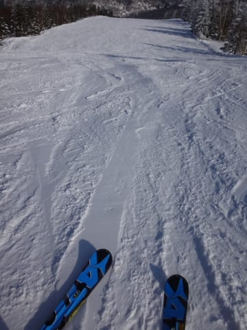

この時期としては，これ以上は望めないレベルのいい雪質！

そして．午後になると．

ゲレンデのひとも減り始め…

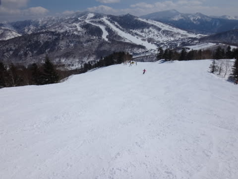

ガラガラなのに，フラットなコースを滑れるという．

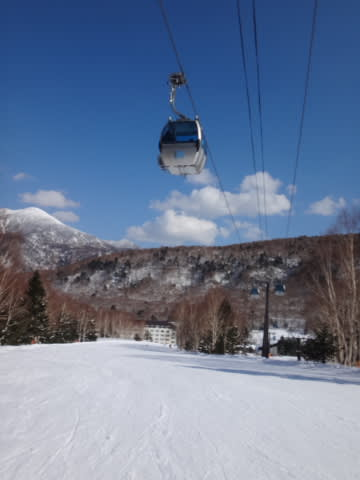

なんて恵まれたコンディションなんでしょう…

さすがに，夕方になるとちょっと硬くなるところもあったけど．

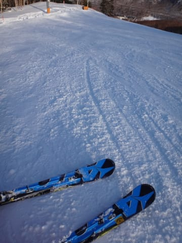

でも．

とても3月下旬とは思えない好コンディションのコースを．

今日も，リフトストップまで．

思いっきり堪能したのでした…

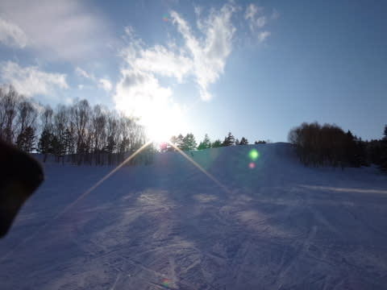

いやー．

この3連休．かなり恵まれた連休だったなぁ．

…これからも毎週ずっとずっと，こんな天気が続くと

いいんだけどな～！←この天気が7月や8月まで続いたら，それは何かの天変地異で問題だと思うぞ…

## 💬 コメント一覧

### 💬 コメント by (Goku)
**タイトル**: Unknown
**投稿日**: 2014-03-27 23:11:00

いや～日曜日は最高でしたね♪

それに雪も多いからＧＷまでしっかり楽しめそうですね。

今週末はＳさんと入れ替えでそちらに行ってきます。

### 💬 コメント by (Skier_S)
**タイトル**: Gokuさま
**投稿日**: 2014-03-27 23:27:01

あ，今週末はK奈川県ですか…

お疲れ様です．

私は今週末の日曜に予定があって，

志賀は土曜日帰りです…

1日しか滑れないなんて！

ナイターまで滑って帰りたいけど，

志賀ソロ日帰りでナイターまで滑ったら

帰り道に死ぬかな…

