# 2019/5/19(日)のかぐらスキー場，速報レポート！…結構混んだよ（涙）．終日晴天で，雪がかなり減ってしまったんだけど（泣）

📅 投稿日時: 2019-05-20 00:24:24

ということで．

今日もかぐらで滑ってきたわけですが．

…いつも通り，帰宅が遅く．

帰宅後にバタバタやっていると

もうこんな時間なので（涙）

本日のかぐらスキー場の情報，

日曜深夜定例，速報モードにて…

まず．

本日は．

終日晴天の一日でした～！

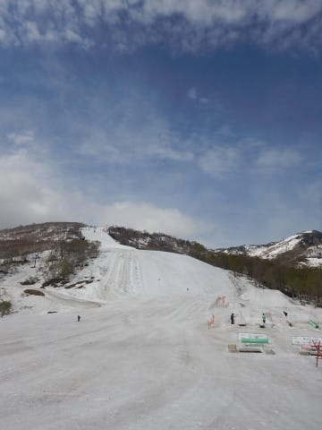

朝から気温は割と高く，

雪は緩めだったけど…

でも，朝イチはフラットバーン！

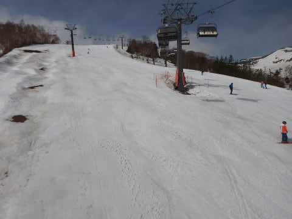

あさイチはちょっと風が強く，

ウェアを着ていた方が良かった

くらい肌寒く感じたけど．

昼ごろには強い日差しで，

ウェアだと暑い，いつものこの時期の

感じだったかな．

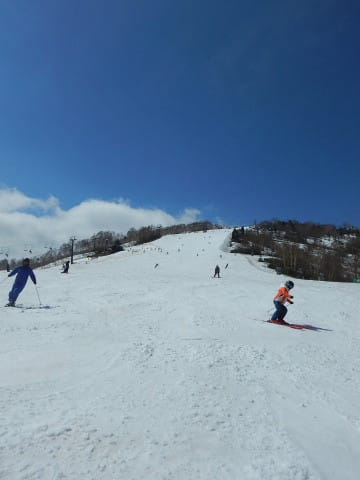

…で．

今日は．

土曜に比べて，かなり混みましたね…（涙）

高速リフトは，午前中はずっとこんな感じ．

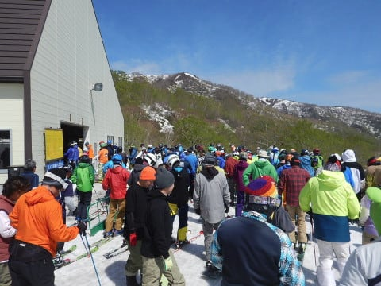

10分近い待ちです（泣）

当然ゲレンデも…

なんだかすごい感じになっています（泣）

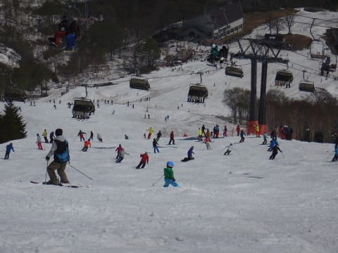

そして．

気温が高かった昨日，今日の二日間．

かなり雪が解けてしまいました…（激涙）

パノラマコースはコース中間が

完全に途切れてしまっていて，

今日はオープンしませんでした（涙）

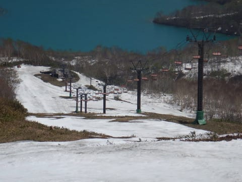

パノラマコース，昨日が

最後だったか…（残念）

ジャイアントコースは…

昨日は全く問題なかったのに．

今日はコブ溝に土が出てきた

ところがポツポツあって．

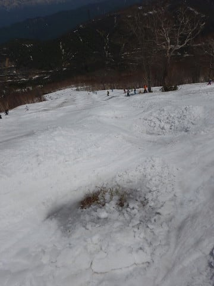

そして，いつもヤバくなる

最後の部分．

一気に土が出始めてきました…（泣）

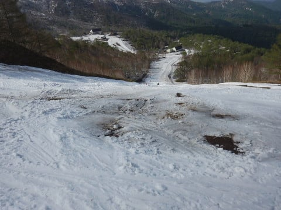

これは…

ジャイアントコース．

次の週末までもたない可能性が

高いですね（涙）

テクニカルも下半分は

完全に死亡です（チーン）

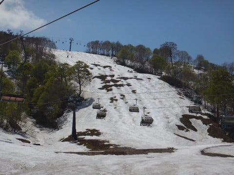

そして，和田小屋から

高速リフトに下りる部分も…

昨日の朝は全面真っ白だったのに．

一気に穴が広がりました（悲）

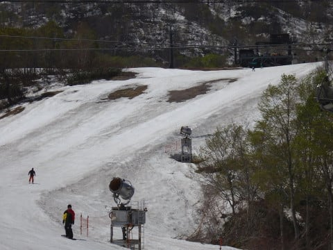

メインバーンはいつも通り

夕方にはかなりのコブになりましたが．

まだコブ溝に土が出てくるような

ことは無く，大丈夫な感じですね…

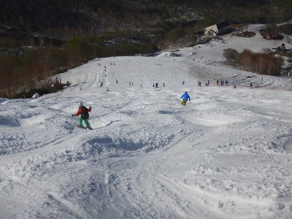

ただ．

メインバーン最後の落ち込み部分．

ちょっと雪が薄くなりつつあります…

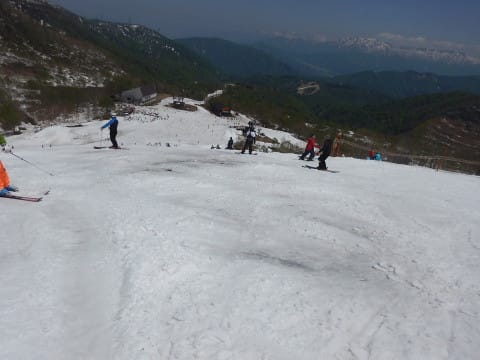

うーーん．

昨日まで全然問題なさそうだったのに．

今日になっていろんな部分が一気に

ヤバそうになってきちゃいました（涙）

そして．

下山のゴンドラコースもヤバそうな

感じのところが出てきましたし．

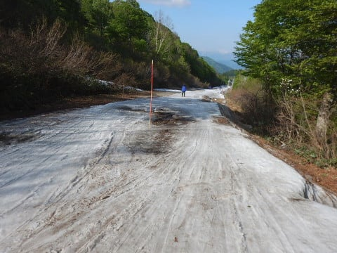

最後のみつまたコース．

昨日から完全な廊下状態でしたが…

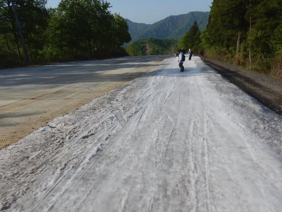

今日は廊下の真ん中に穴が

開いている部分が…（涙）

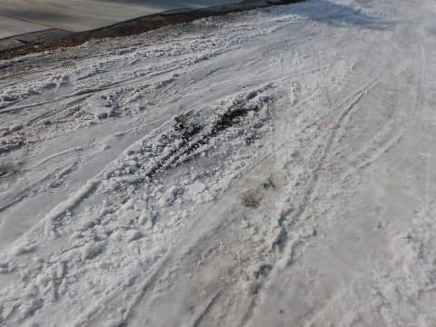

…これは．

21，22日はかなりの雨が降りそう

ってのもあって．

ファイナルとなる次の週末は．

ゴンドラコース，みつまたコースは

確実にアウトっぽいです（涙）

そして．

テクニカル下部，ジャイアントも

アウトかな…

メインバーン下部も，一部土が

出てそうです（泣）

…でも．

ファイナルデーまで，メインバーンは

問題なく滑れるでしょうから．

土だらけの廊下バーンだった

去年に比べれば，まだ1億2764倍くらい

マシですね．

ってなことで．

明日また，詳細レポートやります～！
