# 年末年始の休みまでに，スキー場の雪は積もるのか？27日は雨になるのか？…を，予想してみた

📅 投稿日時: 2016-12-27 03:53:51

どうしたわけか．

今日もご無体時間に記事を書いている，Skier_Sです．

…こんな深夜なのに，時間をかけて必死に

天気図を読み解くなんて…

なんて偉いんだろう！←別に偉くないから．自分が気になるから天気図見てるだけでしょ

ということで．

[昨日の記事](e51f0de6058eb8190da48126af5e02c26.md)で．

27日午前中まで，雨が降るかも…？？

と，予告しましたが．

…

なんだか．

27日午前3時現在の，志賀高原の蓮池が…

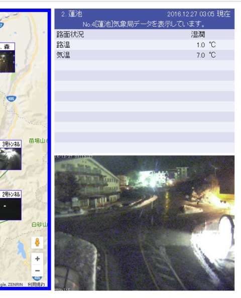

（[北信建設事務所道路気象情報ページ](http://www.q0.ws302.smilestart.ne.jp/index.htm)より）

えええええ！！

気温，プラス7℃？？？

いや，マイナスの間違いじゃないよね…

プラス7℃！！！

そして，現在．

西からひたひたと低気圧が近づいています．

…これは．

マズい．

マズいぞ～！！！

…で．

27日朝9時の，850hpa図を見ると．

うむ．赤くマークした0℃線，志賀より北ですね（涙）．

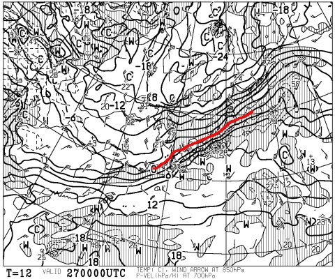

見にくいので拡大すると…

志賀高原は，水色の+3℃線が横切ってそうですね．

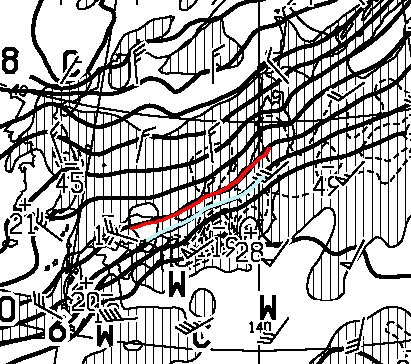

そして，地上天気図を見ると．

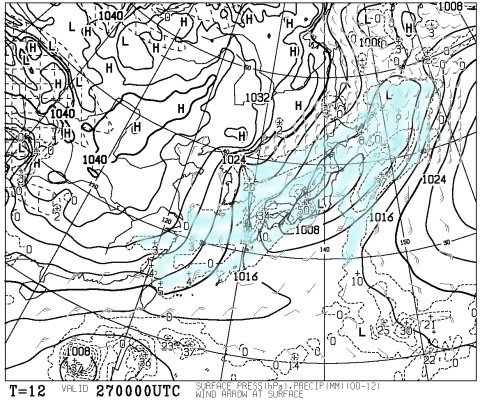

どかーーん！！

日本全国，水色で塗った降水域が覆ってます…

…これは．

27日早朝から午前中にかけて．

やっぱり，雨になりそうです（涙）．

それも．

かなり強い，激しい雨が降りそうです…（激涙）

雪が…雪が解けてしまう…（泣）．

ただ．

安心するのだ，みなのもの．

27日の夜9時の850hpa図は…

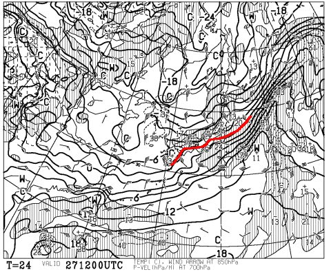

ふむ．

ちょっとわかりにくいので拡大すると…

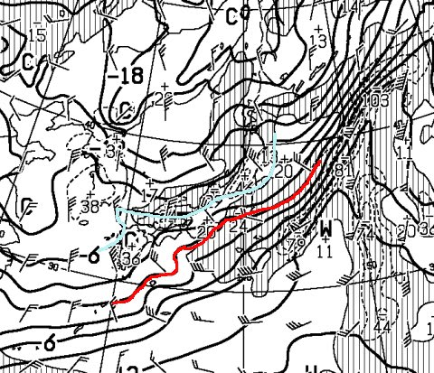

をを！

赤くマークした0℃線は日本よりかなり南に下がり．

志賀高原は，水色の-6℃線が！

ってことで．

27日のどこかの段階で，前線が通過し気温が一気に下がります！

そして，地上天気図を見ると…

夜9時には，こんな感じで縦縞の，見事な冬型になります！

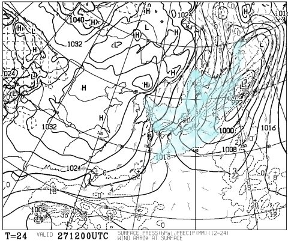

日本海側，寒気の吹き出しの雲による降水域が

見えますね～！

これは，27日の夜にかけて，結構な雪が降りそう…

で．

次に28日朝9時の850hpa図を見ると，だ．

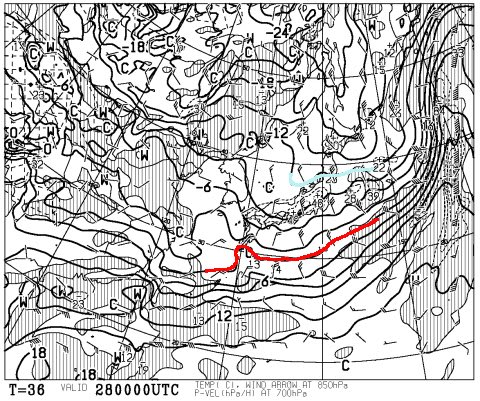

ふおおおお！

これは…

これは，すごいよ！

赤い0℃線は日本よりはるか南だし．

それどころか，水色にマークした-12℃線が

新潟近辺にまで近づいてるという．

これは，志賀の朝イチはマイナス15℃くらいに

冷えるってことですが…！？？？

そして，地上天気図を見ると．

日本海側に，水色の降水域がうっすらと

かかっています！

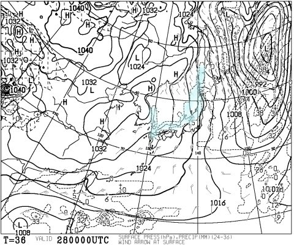

これは，28日の朝．

量はそれほどじゃないけど，

超冷え冷えパウダーが積もってるってことだな！！！

そして．

29日も850hpa気温を見ると…

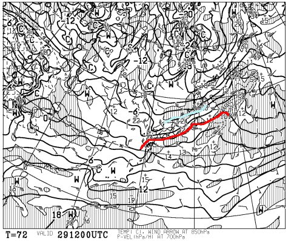

うむ．

志賀は水色の-6℃線がかかっていて，

29日ほどじゃないにしろ，冷え込みは継続！

地上天気図も，見事冬型で，

日本海側に降水域がかかっているので．

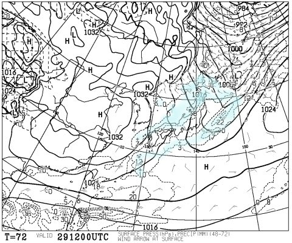

29日も雪が降り続く一日かな～．

そのあとはこんな感じで，

平年並みの気温が続くので…

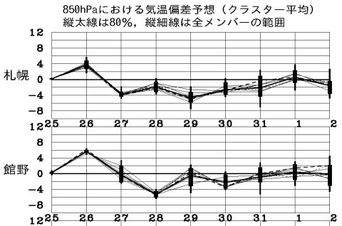

少なくともこの時期，平年並みの気温なら

雨の心配はいりません

繰り返します．

この年末年始休み，雨の心配はありません

…これが当たり前なのに，

なんだかこのことが，すごくありがたく感じるのは，

なぜだろう…

30日以降の天気は，まだ良くわかりませんが．

とりあえず冷えて，雪が降ったりやんだり．

31日と2日あたり，ちょっと積もりそうですが．

ドサドサ大雪にはならないかな～，というところ．

とりあえず．

これから年末年始休みまでの天気を

まとめると．

27日：早朝から雨．かなりザーザー降り（涙）．

　朝まで強く降り，午前中しばらく雨が続くか…

　昼前後のタイミングで雨は雪に変わり，一気に

　冷え込む．そのあとはかなり強い雪が降る．

　夜までにそこそこ積もる．

28日：激冷えの朝．山頂の気温は-15度程度まで冷え込む！

　朝まで雪が降り続け，朝イチは30cmほど積もってるか…

　パウダーデーの予感！！

　この日，昼間は雪がほとんど降らず．

　時折太陽も顔をのぞかせるかも？？

　この日滑れば，かなり最高の一日になりそう…

　ただ，夕方はかなりモサモサ雪の荒れ荒れバーンに．

　一部急斜面は下地のアイスバーンがわずかに出てくるかも．

29日：朝は曇り．運が良ければ晴れ．

　昨晩からの積雪はほとんどないけど，

　前日積もった雪がしっかり圧雪され，

　朝イチは冷え冷え雪の最高圧雪バーン！

　この日は終日気温も寒く，

　午後に雪が降り出す．

…といった感じでしょうか…

うむ．

27日の雨の影響は，28日朝までには回復しそう．

年末休みは最高のバーン状況で迎えられそうです！

年末年始休期間の予想は，また後日詳細に

やります…

いやー．

27日の雨はちょっと残念だけど．

年末休みまでには何とかなりそうで．

年末年始も，雨の心配はなさそうだし．

とりあえず，良かった…！←いや，これが普通だから．去年がひどすぎただけだから

## 💬 コメント一覧

### 💬 コメント by (Goku)
**タイトル**: ズバリ！
**投稿日**: 2016-12-27 19:03:45

今日の予想、ズバリ的中でしたね。

長野は朝から土砂降り・・・

でもお昼前から志賀では雪になったようで、夕方には長野県北部に大雪警報が出ました～♪（警報に♪マークを付ける私はおかしい？？？）

これで年末は一安心ですね。

### 💬 コメント by (Skier_S)
**タイトル**: Gokuさま
**投稿日**: 2016-12-27 23:14:06

ふははははは！！！

私の予想の精度はかなり高いのですっ！！！（自慢）．

そんじょそこらの天気予報サイトよりは，

よっぽどあてになるかと…（ただし志賀高原限定）．

でも，かなり積もってるようですね～．

明日の朝が楽しみです！

