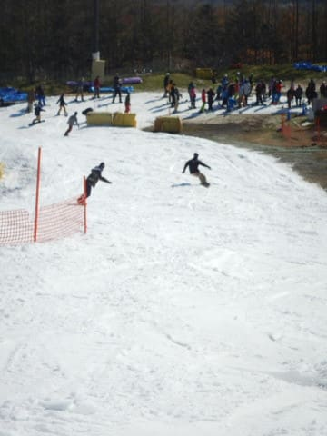

# 2019/11/10(日)のイエティ，速報モード！…今日はコース動画を取り急ぎ

📅 投稿日時: 2019-11-10 23:01:38

🏷️ カテゴリ: [2020スキー滑走日記](c282e9230de179e245c7334eabeb0a3b3.md)

ということで．

某国のホテルを金曜朝7時に発ち．

ブレックファーストミーティングから，

夕方まで打合せの後．

そのまま空港へ移動，夜の飛行機に

飛び乗ったわけですが．

前回の記事に書いたように，深夜に

某空港で日本行きの飛行機に乗り換え．

…そしてそこから12時間弱のフライトで，

本日早朝4時半過ぎ，無事日本に帰りつきました…

金曜の朝にホテルを出て，

ほぼ丸一日の打ち合わせ⇒空港へ移動⇒

某国国内線⇒12時間フライトの国際線⇒

空港から自宅へ…

と，約30時間．

ようやく我が家にたどり着いたわけですが．

…疲れ果てて我が家に到着したのは，

日曜朝7時．

大変いやらしいことに，これから一日が

始まる朝なわけで…

疲れたからと言って，朝からこのまま

寝てしまっては，

ひどい時差ボケになってしまうこと必至

そんなことでは，明日からの仕事に差し支えます．←普段からいつも

時差ボケのように，昼間いつも眠そうで半分寝てる気がするけど…？

…なので．

これから長い昼間．ここは意地でも，

太陽が照っている間は．

眠たくても我慢して起きてなくてはならなりません

（だから，朝現地着とか，朝帰国とかはすごく避けたいんだけど…）

…起きていなくてはならないけど…

たぶん，家にいたら間違いなく寝ちゃう．

うーーむ…

…

…

そうだ！！！

今日は天気もいいし．

まだ朝だから，今からYetiに行けばいいんだ！！

と．

帰宅してスーツを脱いで，30時間ぶりの

シャワーを浴びたら．

直ちにスキーウェアに着替え，

我が家滞在30分で直ちに出発，

Yetiに行ってきました～！！

いやー．

今日は天気もいいし，絶好のスキー日和！

某国⇒空港⇒自宅⇒Yetiという

ご無体プランのため，←ご無体プランというのとは，なにか違う…

あさイチには間に合わなかったけど．

自宅滞在時間を最短で抑えたので，

なんとか9時過ぎにはゲレンデに到着！

朝のうちはゲレンデも人が少なく…

リフト待ちも少なくて良かったかな！

でも．

やっぱりコース幅はまだ廊下だし，

コースの人口密度も高め．

午後1時半ごろのコース状況の動画を

載せておきます…

ってなことで．

今日はさすがに疲れていたので，

ナイターはやめて．

おとなしく，コース整備のためにクローズになる

16時に切り上げました…←いや，この状態で9時から16時まで滑り続けるのは無謀じゃないか？

ということで．

昼間はたっぷり太陽を浴び，

運動したので．

これで時差ボケは解消したはず！！←やり方がかなり強引

…帰りの東名が渋滞して，帰宅に3時間かかって

死にそうになったけど…

ってなことで．

今日はさすがにもう眠いので．

約48時間ぶりに，ゆっくり布団に入って寝ます．

Yeti詳細は，明日根性があったら書く予定…

おやすみなさい…

## 💬 コメント一覧

### 💬 コメント by (ほっぽ)
**タイトル**: イエティ
**投稿日**: 2019-11-11 06:30:30

Ｓさん

何と！ナイターではなく朝から滑っていたんですね。

これは想定外でした。(^^;

Ｓさんの並外れたスキー愛からすれば、

早朝に帰国したらそのままイエティというのが普通でしたね。

私は雨が止めば今夜イエティの予定です。

http://www2.tokai.or.jp/nana_hoppo/

### 💬 コメント by (ほっぽ)
**タイトル**: 11/11　イエティナイター
**投稿日**: 2019-11-11 23:54:27

Ｓさん

夕方雷雨があってリフトも一時運休していましたが、

ナイター営業開始を電話確認して行ってきました。

こんな天気だったので来場者も少なく、時折ゲレンデ独り占め状態で快適でした。

次回は明後日水曜ナイターの予定です。

http://www2.tokai.or.jp/nana_hoppo/

### 💬 コメント by (しんちゃん)
**タイトル**: ゆっくり休んでください
**投稿日**: 2019-11-12 00:06:09

帰国後30分とは。すごすぎます。

天気も良く、富士山もよく見えて、癒されたことでしょう。

ゆっくり休んでくださいね。

おからだお大事に。

### 💬 コメント by (musi)
**タイトル**: Unknown
**投稿日**: 2019-11-12 06:39:10

予想していた人も少なくないと思いますが、やはり滑りに出掛けられた訳で。お疲れ様です。出張慣れていらっしゃるので、機内で爆睡かとは思いますが、1人の身体では無いので（天気予報無くなると困りますw）お気をつけて。既報かもしれませんが、カグラ？も台風の影響で今シーズン下山コース？クローズだそうですね。カグラ行ったこと無いので、たどたどしくてすいません。波乱の19-20シーズンになりそうな予感が……か。もしかして大雪？（前向き）

### 💬 コメント by (Skier_S)
**タイトル**: コメント遅れてごめんなさい
**投稿日**: 2019-11-13 02:11:50

＞ほっぽさま

朝から滑ってました～！

もう，意地でも昼間起きてないと時差ボケでひどい目にあうので，

なんとか必死に起きてました～！

月曜ナイターは空いててよかったみたいですね…

一度でいいから，平日ナイターやってみたいです．

＞しんちゃんさま

かなりストレスフルな海外出張で，帰国後のスキーだけを

心の支えに乗り越えてきたので，滑れてよかった～…って感じでした．

ゆっくり休みたいのですが，体を休めると今度は精神が休まらないので(笑)

困ったものです．

＞musiさま

え？かぐら下山コースもクローズですか！？？

うーむ．

まぁ，ここは滑っても楽しくないコースで，ロープウェーで

降りた方がマシなくらいですが．

帰りがロープウェーしかなくなると，かなり混みそうな予感…

なんだかボロボロなスタートの今シーズン．

せめて雪だけはたっぷりで，シーズン初めから終わりまで

フルで滑れるシーズンになってほしいところです…

