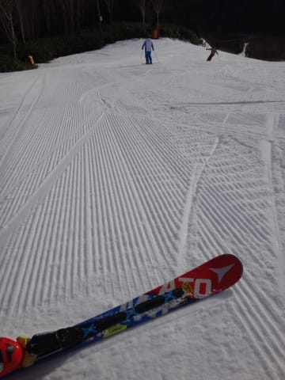
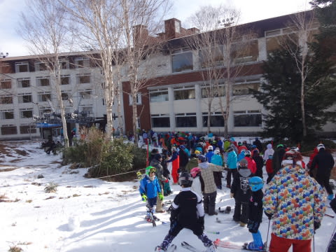
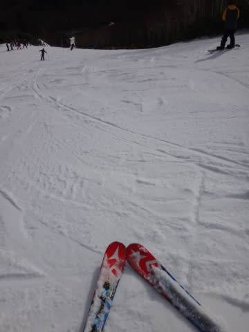
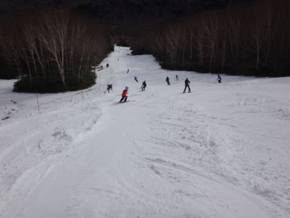
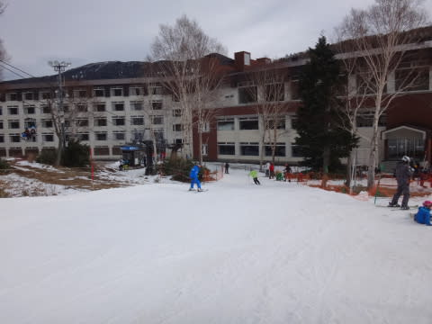
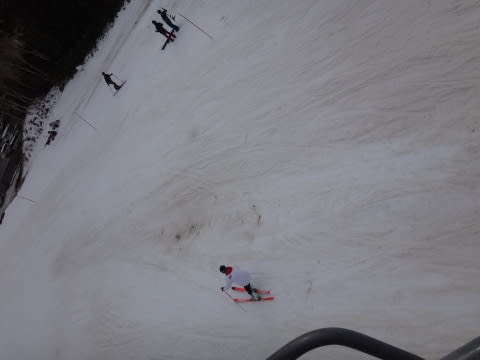

# 12月4日（日），焼額山スキー場オープンの週末の状況速報モード…結構混みました

📅 投稿日時: 2016-12-04 23:46:55

🏷️ カテゴリ: [2017スキー滑走日記](c7d777cecfc91bdf0fa464ad62c6d49ab.md)

ということで．

この週末にオープンしたわがホームゲレンデ，

焼額から先ほど帰宅して．

たった今，帰宅後の板の手入れが終わりました…

今日は帰宅が深夜になった…というわけでは

ないけれど．

これから長いレポートを書く気力がないので．

日曜のゲレンデ状況，速報モードです…

えー．

本日は．

昨日に引き続き，晴天で始まりました～！

…気温が高く人工降雪機が動かせなかったので．

リフトは相変わらず第4ロマンス1本しか

動いてませんが…（泣）．

でも．

8:30スタートの，朝イチゲレンデは…

今日もシマシマです！

結構締まった，スピードが出る気持ちいい

固めの圧雪で今日もスタート！

と，思ったら…

ありゃりゃりゃ．

今日もあっという間に混み始め．

9時過ぎには，リフト待ちも5分を突破（涙）

昨日より混んでるんですが…？？？

リフト待ちは11:30までは5分程度の待ちが

続きました…

そして．

今日の昼間，気温は上がったものの．

昼ごろには雲も増え，うす曇りになってきたので，

雪は昨日のように緩んでしまうことは

無かったんだけど…

でも．

その代り．

昼には表面の雪がはがされ，下地の

かたーーーーーーーいアイスバーンがお目見え…（涙）．

アイスバーンと，それが削られたモサモサ雪が

盛り上がった部分が入り混じる，なかなか

エキサイティングバーン（泣）．

でも．

その代り，昼からのリフト待ちは短くなりました！

とはいえ，運が悪いと時折2-3分待つタイミングも…

さらに．

リフト乗り場近辺は，せっかくの人口雪が削られていき．

うーむ．

浮き石が多いよ…（涙）．

と，嘆きつつも．

幸い，夕方まで天気は雨になることなく，

もってくれたので．

ツルツルアイスバーンにやられながらも，

リフトストップまでひたすら，

1本だけ動いている第4ロマンスリフトを

ぐるぐる滑り続けたのでした…

うーむ．

今週は火曜以降，結構冷えるので．

10，11の週末は第2高速が動くはず…！

運が良ければ，ゴンドラも動くはず…！

そして．

アイスバーンには悩まされないはず…っ！！

また，明日．

詳細レポートします～！

## 💬 コメント一覧

### 💬 コメント by (群馬県民)
**タイトル**: Unknown
**投稿日**: 2016-12-05 06:51:55

初めまして！通りすがりです。

焼額は好きでよく行ってました！

相変わらず雰囲気の良さが写真からでも伝わってきます。

しかし志賀高原でその降雪とは...

ちょっとショックですね(；´Д｀)

今週末にどこか繰り出そうとしていただけに笑

いやーどうしましょう…？笑

少し延期しようかな...(--;)

氷河期にでもなればいいのに( ´Д`)y━･~~

### 💬 コメント by (Skier_S)
**タイトル**: 群馬県民さま
**投稿日**: 2016-12-06 03:12:10

初コメントありがとうございます～！！

いやー．

今シーズンも，出だしは雪不足の昨シーズン並み．

…いや，12月の第1週で比較すると，

昨シーズンより少ない積雪でした（涙）．

今週末は積もると思います．

第2高速＆第4ロマンスの2本は動くと

思いますが…

ゴンドラは厳しいかなぁ…

氷河期と言わないまでも，

もう少し冷えてほしいですね…（懇願）

