# え？…２/19(日) の志賀高原スキー場の天気予想が悪化(涙)．朝から雨．強風で夕方まで雨が降り続ける最悪の一日になりそうなんですが…！！！！！

📅 投稿日時: 2023-02-17 02:25:11

なんということだ

今週末は，実に3週間ぶりに，1泊2日で

志賀高原に行ける週末なので，

すごい楽しみにしていたのに…

非常事態宣言も出ていないのに，

トップシーズンにスキーに行かない週末を

過ごしてしまい．

その前も日帰りでしか行けてないという，

私の人生にとって最悪級の我慢の時期を

乗り越えて．

やっと今週末．

ようやく土日泊りで滑りに行ける…！！

と，すごい心待ちにしていたというのに．

本日，仕事から深夜に帰宅した時．

さて．冷え冷え踊りが効いて，日曜の天気は

いい方に変わってるんじゃないかな～…

と期待して，いつもの日課の天気図を見たわけですが．

19日日曜の朝9時の850hpa気温図は…

えええ！！？？

なんじゃこりゃ！！！？？

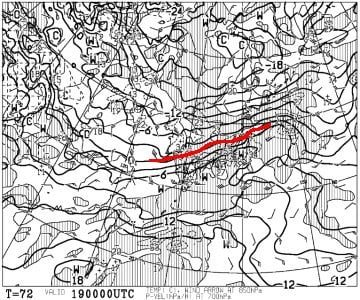

拡大すると…

赤い0℃線が志賀高原より北に行ってる

どころか，志賀高原には+3℃線が

かかってるじゃないか！！！

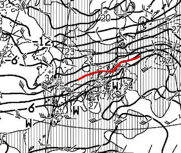

これは…

降れば確実に液体なのだが！？？

果たして，降るのか降らないのか…？？

地上天気図は…

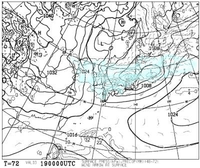

…

…

…ダメだ…

ダメです．

これはダメだ…（崩れ落ちるSkier_S）

19日…というより，18日深夜からかなりの

雨が降ります．

それも，50って数字も見えるので…

所によっては24時間で50mm降るような

強い雨をもたらす低気圧で，

志賀高原も結構強く降りそうです（激泣）

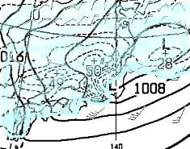

ちなみに，前日18日，土曜の夜9時の850hpa

気温は…

既に0℃線は志賀よりはるか北．

志賀高原には+3℃線が近づいていて．

志賀でも標高が低いところは確実に

雨の気温になってるので．

おそらく18日の深夜からひたすら

液体が降り続けそうです…（激しい涙）

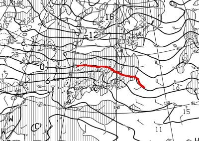

さらに，赤で括った部分の風速は…

50ノット．風速25mですね（泣）

ヘタすると，日曜は強風でゴンドラ

ヤバいかも．

まぁ，原則になっても運休にはならないと

信じてますが…

しかし．

2月のトップシーズンのど真ん中に雨とは！！

あぁ…

なぜ．

なぜ，私がようやっと滑りに行ける週末に

限って，こんなひどい仕打ちを…←あなたの日ごろの行いが悪いからでしょ

しかし．

また20日以降は冷えて，21日にかけて

かなり冷えた雪になりそうです．

って，

15日に平年比-6℃，18日に平年比+6℃，

そして21日に平年比-8℃って…

その差14度．

極端なんだよ…（泣）

極端じゃなくていい．

平均がいいんだけど…

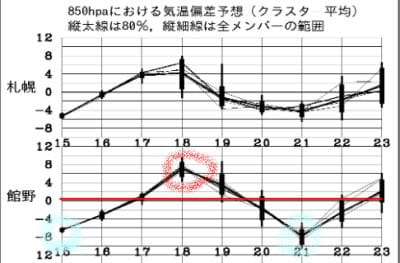

とりあえず．

がっくりニュースのあとで，

今日の志賀高原の特派員情報を見てみると…

今朝は朝まで雪が残り，朝の積雪は意外と

あったみたいで，10~15cmのブーツパフ

だったようです…！

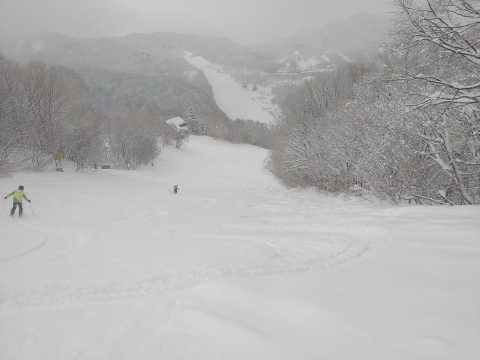

そして，気温も-7℃と冷え冷え！

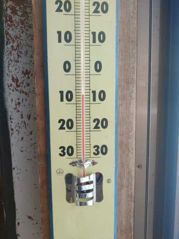

コース全面圧雪の柔らか雪がうっすら

乗ったバーンで…

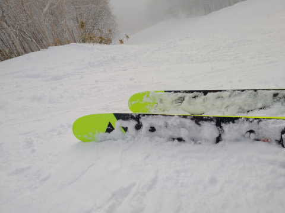

さらに午前10時ごろには，予想通りに

晴れて来たようです！

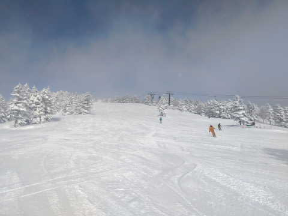

そして，ヤケビウォールもいい感じの

新雪だったようで…うらやましい…

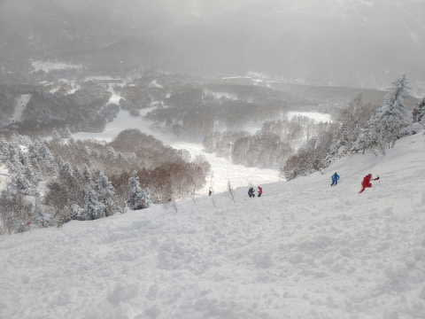

昼間は晴れても気温が上がらず．

この日はどこに行っても，冷え冷え

最高雪の，ガラガラバーンだった

みたいです…

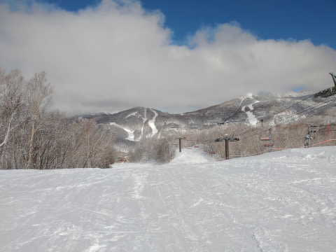

…いいなぁ…

こんな最高の雪なのに．

私が滑る19日には雨でやられちゃうとは…

あまりにも残念すぎる…（あふれ出る涙）

とりあえず．

今のところ，18日は多少気温が上がるものの，

朝は天気は良さそうだし．

午後は曇るかもしれないけど，液体が降る

心配はなさそうだし．

土曜に思う存分楽しもう…

あぁ…

私が行けなかった先週なら，

雨でもミサイルでも降ってくれていいのに．

なぜ，今週末に限って…

それも狙ったように週末だけ気温が上がる

かな～…

どうやら，「冷え冷え踊りが足りない」と神様が

仰せのようなので．

これから週末まで．

真剣に全力で，神にささげる冷え冷え踊りを

狂ったように踊り続けます…

## 💬 コメント一覧

### 💬 コメント by (富山県民)
**タイトル**: Unknown
**投稿日**: 2023-02-17 18:44:20

今週末の日曜日は雨だそうですね。

平日ばかり晴れて週末に雨だと腹が立ちますね。

今日は一日中晴れてスキー日和だったそうですね。

先週の日曜日は晴れたもののかなり暖かくて春のような雪質でさした。

今シーズンは平日ばかり良い日があって週末に雨や高温という意地悪な天気まわりが多いです。

私は明日は新潟県のキューピットバレイに行きます。

早割を一枚でも消化したいです。

今日だったら最高だったのに残念です。

### 💬 コメント by (レインボー75)
**タイトル**: Unknown
**投稿日**: 2023-02-17 20:52:57

金曜日の志賀高原情報

朝の上林-7℃　蓮池-11℃。寒いはずだけど、寒さ慣れして寒くない。天気晴朗。

白樺も唐松もオリンピックも膝に優しい快楽バーン。GSは固めでコロコロもある。

奥志賀は、大会でエキスパートの下部が規制され、私は第三でカービングの練習。ダウンヒルは満員で楽しくなかったです。

バスで今年初の寺子屋に参上。「身の上に心配あるゆえに参上」とは、球の体積の公式の覚え方。

ところがレストランは休業。私が「このままサンバレーまで行こうか？」

隊員「腹へって疲れてのたれ死にしそう」

結局環境抜群の寺子屋をひたすら堪能してから、ブナのいこい荘でラーメン。あとはレインボー(２時)に間に合うため、西舘→高天→タンネ→ダイヤ→やけびで、見事に２時きっかりで終了。

遅れたら局中法度の士道不覚悟で切腹を免れないところでした。

### 💬 コメント by (Skier_S)
**タイトル**: 日曜はダメです…
**投稿日**: 2023-02-17 22:44:06

＞富山県民さま

ダメです．

今週も日曜は終日雨です(涙)

ホントに狙ったように週末に降りますね…(激涙)

＞レインボー75さま

今日滑れるのはうらやましい…

今日は士道不覚悟で切腹してもいいコンディションだったんじゃないでしょうか(笑)．

でも，土曜はそれほど悪くなさそうなのでちょっと期待．

日曜は壊滅的な天気になりそうです…

