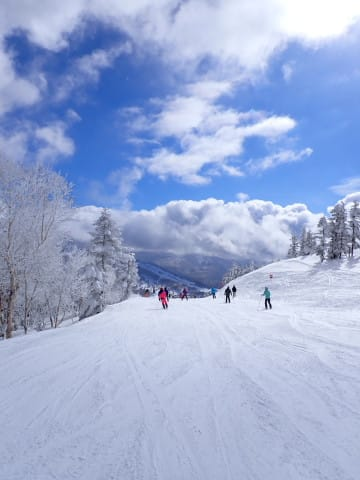

# 2024/2/11(日)3連休中日の志賀高原焼額山スキー場は…ゲレンデの人は多かったけどゴンドラ・リフトはそこまで混まず．小雪のち曇りのち晴れで冷え冷え！

📅 投稿日時: 2024-02-12 00:53:43

ってなことで．

３連休初日はスキーに行けない，悲しい

一日を過ごしましたが…

本日，志賀高原に舞い戻ってきました！！

いやー．

３連休中日だから，人は多かったけど…

ゴンドラやリフトは昔の連休ほど混まず，

思った以上に滑れました…！

まず．

あさイチの8:30の営業開始前．

第1ゴンドラ前は駐車場近くまで列が伸び…

これ，今シーズン最長の列ですね．

今日は混みそう…（恐怖）

で．

あさイチで山頂に上がると…

私が滑れなかった昨日はいい天気

だったというのに，今日は雪が舞う

天気（涙）

ただ．

昨晩から10㎝ほど積雪があり．

気温は-10℃と低いので，雪質は

いいですよ…！

ってなことで．

あさイチのバーンコンディションは，

圧雪の上に3－5㎝程度の軽い新雪が

乗った，トップシーズンらしい冷え冷え

コンディション！

減速感が少ない，軽い感じの雪を蹴散らして

滑っていけます！

ここしばらく，冷えても降らなかったり，

降ったら重い雪だったりして…

こんな軽めの雪が圧雪の上に

乗ってるのを滑るのは久しぶり…！

雪はいいけど．

雪降りで視界が悪めなのは惜しいなぁ…

と思っていたら．

営業開始30分くらいで雪は止み．

晴れてはいないけど，空も明るく，

雪面も見やすくなってきました…！

いや…

これだけ見えて，雪はいいので．

結構楽しめるな…！！

だもんで．

夕方圧雪で昨晩から積もった新雪が10㎝

ほど積もっている，オリンピックコースへ

行ってみますが…

一見，新雪を巻き上げて滑っているように

見えるんですけど．

実際に滑ってみると，下地の圧雪はちょっと

硬めで，その上に新雪がところどころ固まった

ようになっている，ちょっと快感度が低めの

バーンでした（ちょい涙）

ってな感じで滑っていると…

9時半を過ぎたころには，ゲレンデの

人口密度が早くも上がり始めて

きましたよ…！！

そして．

午前10時には…

うげげげ．

第1ゴンドラの列が，かなりのびて

きました…（涙）

これは，今シーズン最大の待ち時間では…？？

と思ったけど．

ゴンドラ待ちがこのくらいあったのは，

10時から11時までの1時間だけ．

さらに今は，混雑してくるとなるべく

8人フル乗車で乗せるよう，係員が

コントロールするので…待ち時間は

最大で5－7分程度．

11時を過ぎると，待ち時間はせいぜい

この程度．

第2高速も，私が見た待ちのピークで

この程度．

時折このくらい並ぶことがあったけど，

午後は大体ゲートの中に納まるくらいの

待ち時間．

で．

混んだ第1ゴンドラのほうも，

午前11時以降は，一日中ゲートの外まで

並ぶかどうか…という待ち時間で

済んだので．

3連休中日と考えれば，昔はゴンドラ

15分待ちとかあったので．

予想よりずっと待ち時間が短かった

感じでした…！

ただ…

ゴンドラはそこまで混まないものの．

コース上の人口密度はあんまり低くなる

ことはなく．

終日こんな感じ…

でも．

12時前には雲が切れ始め…

青空がのぞき始めてきました！！

ふはははは．

本来は曇り～雪の天気の予想だったのに．

昨日滑れなかった私を，神様がかわいそうに

思って，晴れにしてくれたんだ！！

やっぱり，お日様の下で滑るスキーは

いいなぁ…！！

晴れて日が射しても，最高気温は-5℃程度と

低かったので．

雪が緩むことはなく…

雪質はトップシーズンのいい雪質のまま！

ただ．

コース上の人口密度はかなり高い状態が

続いたので．

GSコースやサウスコースなどは，

結構コースが荒れてきて．

人工雪を打っているコースは，

凸凹の間に，下地の硬いのが出てきている

部分も…

そして，オリンピックコースは，

エッジが立ててあればエッジが食いつくけど，

結構硬めの下地が出てきて，その上に

コブコブが乗ってる形で，おそらく

ほとんどの人は手ごわいと感じる

バーンコンディション（涙）

でも．

バーンはボコボコになってきたけど…

でも，今日は晴れない予想だったのが

いい方向に外れてすっきり晴れてくれたし．

コースは混んでるけど，リフトや

ゴンドラはそこまで混まなかったし．

まぁ，予想よりはいい3連休中日

だったかな…

と．

昨日は晴れてそんなに混まずに最高だった

という焼額メンバーの言葉は聞こえない

ふりをして．

今日も日がかげる営業終了の16:15まで，

いつも通り昼休みも取らずひたすら

滑り続けたのでした…

で．

当然まだ終わらない．

昨日滑れなかった恨みはまだ

解消していない．

…ってなことで．

当然，今日もまだまだ滑り足りないので．

お約束のナイターへ出撃です！

午後6時スタートで，圧雪をかけなおして

くれる焼額ナイター．

今日は最高雪質のシマシマでしょ！！

これを滑らずして死ねるか…！！

ふははははははははっはは！！

見よ！！

ほかのスキー場に比べると圧倒的に

品質が高い，まったく継ぎ目がない

この焼額クオリティの圧雪を！！

昼間は人が多かったけど．

ほとんど人がいないガラガラナイターで，

このシマシマを思う存分堪能するのだ…！！

…いや…

最高…

最高だよ…

この最高圧雪の焼額ナイターを滑らずに

いる人は，人生の半分は損している…

と．

ラストになってもまだところどころに

シマシマが残る，最高のナイターを

堪能しまくったのでした…

3連休中日の今日はちょっと人が

多かったけど．

おそらく明日はここまで混まないはず…

そして，明日も朝は曇ってるかもしれないけど．

午後に向かって晴れていくはず…！！

また明日も志賀高原滑ってます～！！

## 💬 コメント一覧

### 💬 コメント by (1kamakura)
**タイトル**: Unknown
**投稿日**: 2024-02-12 06:06:21

江戸の秋

楽しく滑れてよかったですね👍

昨晩、youtubeで90年代の苗場スキー場をやっていました。

すごい人、人、人‼️

芋洗いか⁈

ってくらいの混みようでしたよ〜。

それに比べると今のスキー場はすいてるなと思います。

### 💬 コメント by (Skier_S)
**タイトル**: ＞江戸の秋さま
**投稿日**: 2024-02-13 02:47:13

90年代の苗場ですか…バブル真っ最中ですね！

スキー場までの道路もゲレンデも，何もかも混雑するすごい時代でしたよね…

今だとリフト待ち5分が我慢できないのに，あの頃はリフト30分待ちが普通でしたから．

みんな，我慢づよかったんだろうなぁ…

今はスキー場の経営的には厳しいかもしれないけど，そこまで混まないので

快適です…

