# プロジェクトX2第2章…LEVORG E型にKENWOODナビ取り付け…無事，ナビ取り付けが完全に完了っ！

📅 投稿日時: 2018-08-29 00:43:03

🏷️ カテゴリ: [車](cba0e8330b3f2ded7c1addfacc75d4547.md)

ということで．

本日，座間味ダイビング最終日で．

今日もいろいろ楽しんできました～！

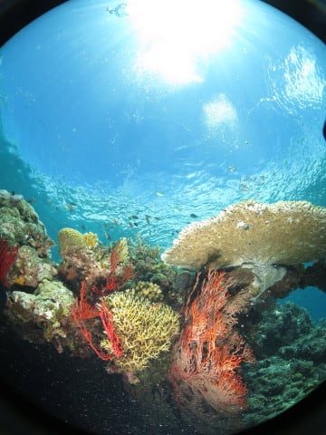

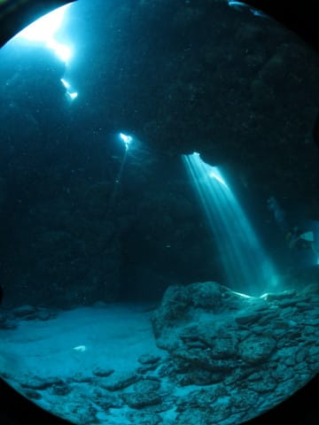

…とりあえず．

本日は記事を書く時間がないので．

書きためておいたナビ取り付け記事．

長きにわたった記事でしたが．

ついに今回がラストです…！

では，どうぞ～！

----

ってな感じで．

苦心惨憺だったリアカメラ取り付けが終了し．

無事動作したわけで．

…だもんで．

実に1週間ぶりに，リアゲートの内装を

取り付けます…

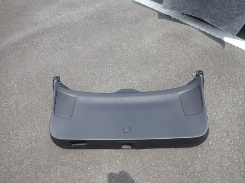

メインの内装を押し込んではめ込んで．

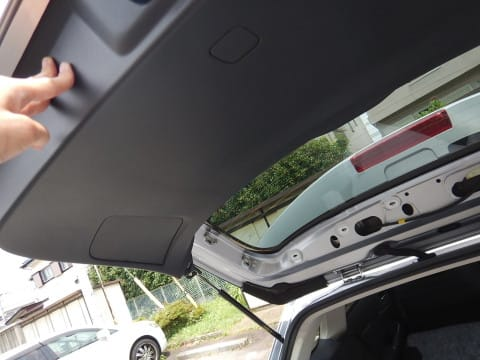

この左右のクリップ2か所と…

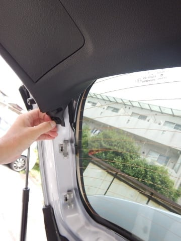

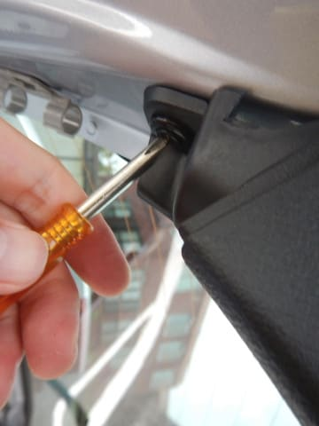

取っ手を取り付けて．

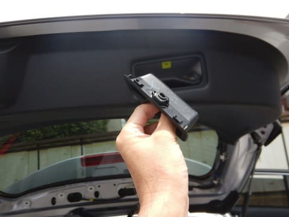

取っ手内側のネジを…

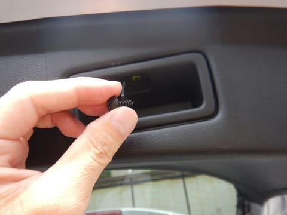

固定します．

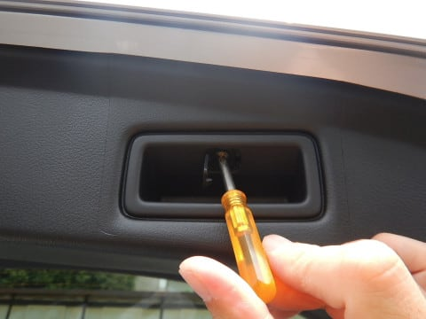

これで，ゲート内側の内装が着いたので．

あとはリアガラス周りの内装パーツを

嵌めていきます．

リアガラス左右のこのパーツ．

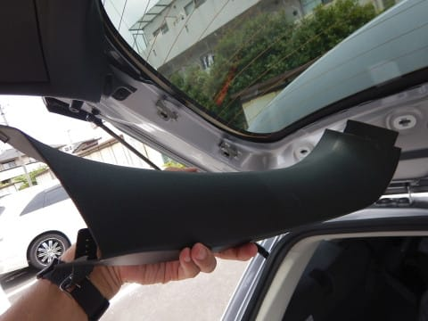

押し込んで嵌めて．

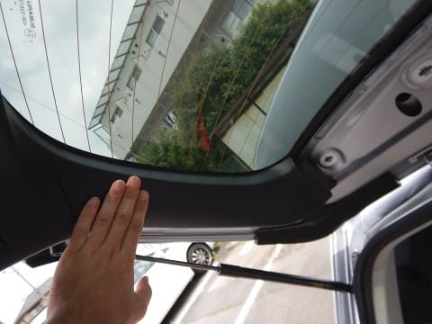

反対側も嵌めたら．

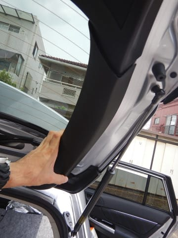

ガラス上のこのパーツ．

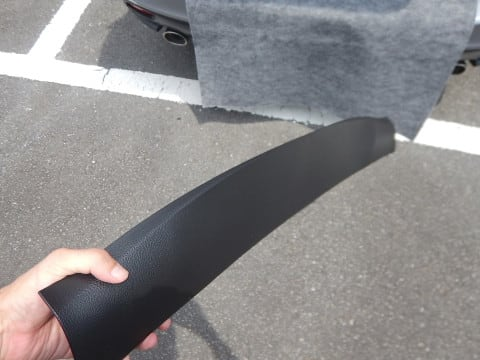

こいつも押し込むだけで嵌ります．

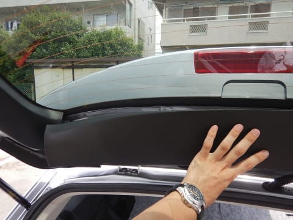

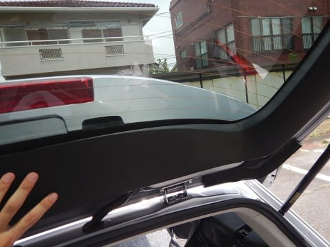

…これで，1週間ぶりにリアゲートに内装が

つきました～！

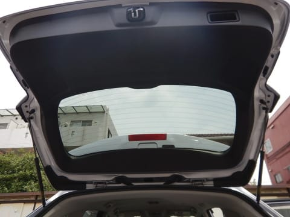

で．最後はナビの本固定ですね．

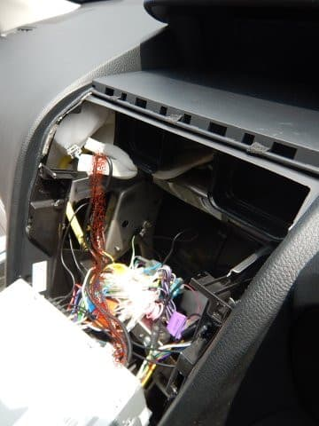

ナビ本体の後ろから，赤で薄く印した，

USBコネクタケーブルが2本出ているのですが．

こいつはナビスペース横の隙間から，

グローブボックスに落とし込みました．

グローブボックスのここからUSB

ケーブルが出てきてます．

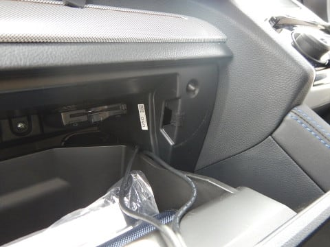

この写真だと，ETC車載器がどうついているか

良く分かりますね…

そして，ナビ後ろのケーブルをきれいに束ねて…

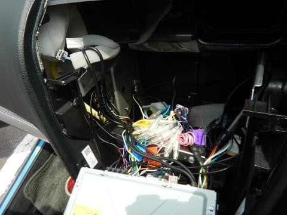

ナビ本体をはめ込んで，ネジで固定します．

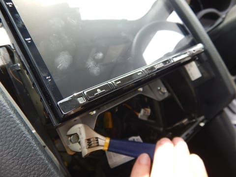

ナビの下から見ると．

後ろの配線はこんな感じになってます．

ナビの下に結構空間があるので，

かなりのボリュームがあるケーブルも

ここに収まります．

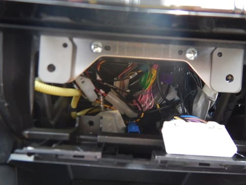

で．

残るは，センタークラスターパネル取り付けのみ！

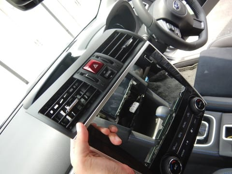

取り外しと逆の手順で，まずは下側のエアコン

コントロールケーブルのコネクタを取り付けて…

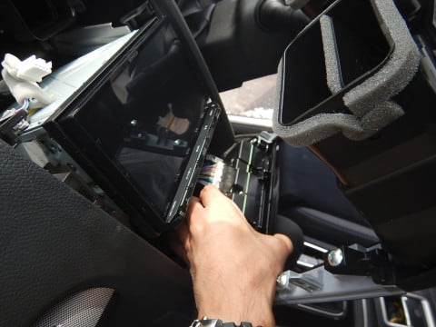

次は上側のマルチインフォメーションディスプレイ

切り替えスイッチと，ハザードのコネクタを

差し込みます．

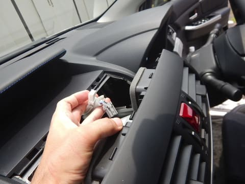

そしたら，あとは正しい位置にはめ込んで…

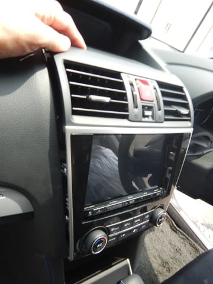

グッと抑えて行けば，パチンパチンと

嵌っていきます．

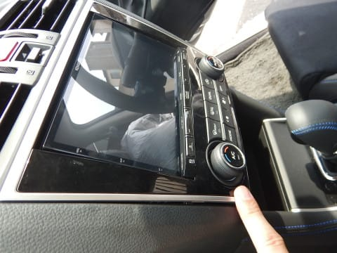

…ってな感じで．

ナビの取り付け，無事完了です！！

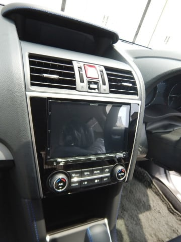

そうそう．

バッテリーを一度取り外してるので．

パワーウインドーのリセットが必要です．

リセットしないと，

運転席側のパワーウインドースイッチで，

他のドアのパワーウインドーが操作できないし．

ワンタッチでの全開，全閉動作ができないように

なっています．

各ドアのパワーウインドースイッチで，

窓を一旦ちょっと開けて．

その後，窓を全閉じにして，そのまま

スイッチを5秒ほど引き上げたままにしておく…

という作業を，全ドアで行いましょう．

これで，パワーウインドーがリセットされます．

ってことで．

作業はすべて完了ですが．

いやーー．

8インチナビ．

きれいにはまってますね…

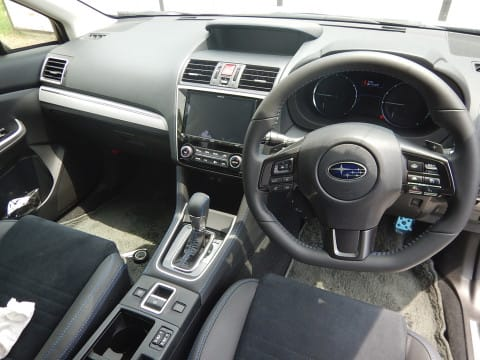

うむ．

かなり苦労したけど．

これで取りつけ料金3万5000円ほどを浮かすことが

できたし．

自分のお好みでアンテナとかもきれいに隠して

取り付けられたし．

満足かな！！

…しかし．

これ，やっぱりプロに頼んだら．

3万円くらい取られても仕方がない作業量だよな…

皆さん．

ナビ取り付け業者に

「なんでこんなにお金がかかるの？」

「なんで取り付けにこんなに時間がかかるの？」

と思うかもしれませんが．

そこは許してあげましょう…

と思った，Skier_Sだったのでし

## 💬 コメント一覧

### 💬 コメント by (Goku)
**タイトル**: さすがです
**投稿日**: 2018-08-29 19:15:52

長きに渡りナビ取り付けレポートお疲れ様でした。

それにしても、ここまで自分で出来る人はそうはいないと思いますよ。

工賃35,000円は普通にカプラをパチンパチンと繋げてナビ・バックカメラ・ＥＴＣを付けた場合の値段ですので、コレだけ配線をあーだこーだした場合、断られるか、標準工賃の倍は取られるかもしれませんね。

で、浮いたお金で何をポチるんですか(笑)

### 💬 コメント by (しんちゃん)
**タイトル**: スゴイっす!!
**投稿日**: 2018-08-29 22:00:17

ここまで新車の状態でばらして組付けられる人はそう居ないですね。取り付け費用と時間が高いわけが良くわかりました。

### 💬 コメント by (まいる)
**タイトル**: お疲れ様です
**投稿日**: 2018-08-30 12:44:56

ナビ取り付けレビューお疲れ様です。

アウトバックは、社外ナビにするとアイサイト他の安全装備がなくなってしまうため、純正の高いダイアトーンナビとなりました。

### 💬 コメント by (Skier_S)
**タイトル**: 無事にナビ着きました…
**投稿日**: 2018-08-31 01:59:20

＞Gokuさま

いやーー．無事着きましたよ…

一筋縄でいかず，いろいろ苦労しました(笑)．

まさかマイナーチェンジでここまで仕様が変わっているとは！！

で，浮いたお金！

その発想は無かった．

偉い高い車を購入してしまったので，少しでも安く上げようと思って

DIYをやったので…

ナビをDIY取り付けすれば支払総額20万くらい抑え

られるので，1.6じゃなく2Lでもなんとか買えるかも…

という発想でした．

これからスタッドレスも買わないといけないし．

うーむ．

買わない．

スキー板なんて，買わないぞ！

＞しんちゃんさま

おそらく，ナビ取り付けにここまでいろいろばらさなきゃ

ならないってことは，やってみないと分からないと思います…

うちの嫁さんは，乗って帰った翌日にバラバラにされてしまった

新車を見て，かなり引いてました…(笑)．

「そこまでバラバラにしないと，ナビつかないの？」

って．

＞まいるさま

カタログを再確認しましたが，ディーラーオプションの

ダイアトーンナビを着けないと，自動後退ブレーキやサイドビューモニタが着かないんですね…

これは，自分で好きなナビを着けられませんね…確かに．

私にとっては，かなり辛い仕様です…

