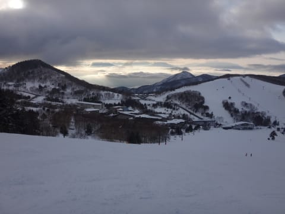

# 3月8日の志賀高原詳細モード…天気もイマイチで，完全春の雪（涙）

📅 投稿日時: 2015-03-10 01:02:16

🏷️ カテゴリ: [2015スキー滑走日記](c09ea645cfc085f86dfcd80f49599dd89.md)

えー．

この週末は．

気温が上がり，雪も完全に春の雪になっちゃってたわけですが．

…明日からの天気図を見ると…

10日も．

11日も．

そして12日まで…

なんだ．

なんなんだ，この3日間は．

完全に真冬の，激冷え爆弾低気圧じゃないか．

台風並みの爆弾低気圧が3日も停滞するとはっ！！

当然，この期間．

気温も，トップシーズン並みに低く…

いつもの850hpa図は…

0℃線ははるか南…

志賀高原の朝の気温は，-10℃を大きく

割り込む感じになりそうで．

これは．

再び，冷え冷え真冬が戻ってきますね～！

…でも．

西風が続くので，志賀はドサドサ積もるほどの感じでは

無いですが…

とりあえず．

木曜までは冷え冷えで，そこそこの雪が降りますので．

今週末のゲレンデ状況は回復するんじゃないかな～

…って，期待が膨らむ今日この頃．

みなさま，いかがお過ごしでしょうか．

…という，時候の挨拶が終わったところで．

昨日速報した，志賀高原の詳細レポートをば…

さてさて．

曇り空で始まった日曜でしたが．

土曜の夜から日曜の朝にかけて，ちょっと雪が積もりましたね～．

うーむ．積雪は，5cmほどかな？？

んで．ゲレンデに出ると…

…山頂は，ちょっとガスっぽい感じ…

そして，朝イチの山頂の気温は，マイナス2度ですか…

うーむ．

朝イチでこの気温は，暖かすぎる…

4月並みですよ（涙）．

しかし．

ゲレンデは，シマシマですね～！

では，シマシマゲレンデを，いただきまーーーーーす！

前日のひどい雪のストレスを晴らすのだ！

…と，シマシマバーンに飛び込んだのですが…

あう？

なんだ，こりは！？？

げ，ゲレンデに，

「氷コロコロばらまき妖怪」によって，

大量にばらまかれた氷のコロコロがあふれているんですがっ！！

コロコロに板が叩かれて，怖いんですがっ！

こんな状況では，気持ちよく飛ばせないのですが…（涙）．

あうーーーん．

そして．

ゲレンデには人が増え…

だめだ．

コロコロ＆混雑のダブルパンチで，とても大回りどころではないよ…（泣）．

せめてもの救いは，ゴンドラ待ちができるほどの混雑では

なかったことでしょうか…

で．

氷コロコロバーンだったゲレンデは．

昼に向かって気温が上がると…

氷のコロコロは溶けていきましたが．

…でも．

その代り…

これはなんだ．

この，すごく重い雪は，なんだ．

4月の雪ではないかっ！？？

このモソモソした雪が，ゲレンデ全面を覆って…

ゆ，雪が，重いよ…

滑りにくいよ…（涙）．

そして．

天気は時折雪が舞ったり，ガスが下りてきたり…

ごく一瞬，午後に日が射しましたが．

雪が…ホントに重いよ．

午後は人が少な目だったので，ボコボココブにはならなかったけど．

でも，しっとりと水を吸った感じの重い雪が，

午後に向かって荒れていき…

…滑りにくいよ…（泣）．

そして．

昼間に溶けた雪は．

夕方，日が陰ってくると…

うむ．

全面，固まってしまったんですが（涙）．

こんな感じの氷で全面覆われたゲレンデを．

カラカラと金属音を立てつつ滑る状況に…

…これは…

た，楽しくない…（激涙）．

ダメだ～！

今日は，ちょっと残念な一日だったよ～っ！！！

と，嘆きつつ．

やっぱり，4:50のリフトストップまで滑ってしまった

Skier_Sなのだった…←だったら早く帰れよ

うーむ．

今週末は．

冷え冷えのいい雪で滑れると，いいな！
