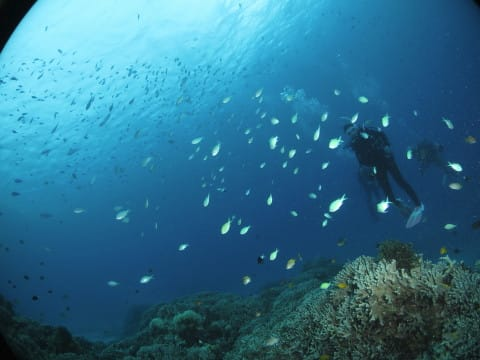
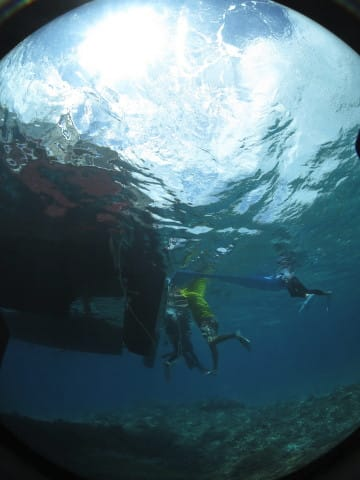

# 2019年8月，座間味で小6の娘と親子ダイビング！その13…ダイビング3日目，2本目

📅 投稿日時: 2020-07-04 00:27:18

🏷️ カテゴリ: [ダイビング日記](ce3a7a8d424d112fce83ee85c81a0e344.md)

えー．

私の許可がないまま，早くも7月に入ってしまって

いる今年ですが．

7月になっても，月山はいまだに

上のTバーが滑れるようですね…！！

（[月山観光開発ホームページ](https://blog.goo.ne.jp/admin/editentry/?eid=cebc06838585d0f7c21d0569d6f9bafb&sc=c2VhcmNoX3R5cGU9MCZsaW1pdD0xMDAmc29ydD1kZXNjJmNhdGVnb3J5X2lkPSZ5bWQ9JnA9MQ==)より）

…でも，これって．

滑れるのは，この緑色で描いた線の

部分だけですよね…！？？

…滑れる距離はかなり短そうですが．

でも，まだ滑れるだけマシなのかな？？

まぁ，

雪が多い年は，7月2日でもこのくらい雪があって…

（2016年7月）

そして，7月というのに，まだ大斜面が滑れて．

リフトグルグルできるシーズンもあったことを

考えると．

それほどすごい雪ってわけではないけど…

でも，今年の12月～3月にかけての，

異常なほどの雪不足を考えれば．

7月になってもまだ滑れていることは

奇跡と言ってもいいレベルかも…

ってことで．

スキーBlogらしい，スキーネタを（義務的に）頭に突っ込んだあとは．

夏モードの定番，ダイビング日記です！

ーー

ってなことで．

1本目のダイビングが終わり．

タンクの付け替えをしている間に…

ボートは2本目のポイントへ移動開始！

ホントに今日はいい天気で．

きれいな慶良間の海を眺めながらの

移動です…

で．

2本目のポイントへ到着しましたが．

ポイントは「阿真エダサンゴ」

ポイントについてから，休憩時間を20分ほど

取って，2本目のブリーフィングが始まり

ますが…

うむ．

このポイントは全体的に浅めのポイントで，

12m制限がある娘が行けないところが無い

ルート取りができるので，今回は

家族で1チームじゃないようです．

ってな感じで．

ブリーフィング後は，準備して…

いざ，エントリー！

…をを！いきなりデバスズメダイの

大群がお出迎えです…！

普通はデバスズメダイは，

ダイバーを恐れてすぐ引っ込みますが．

個々のデバスズメはダイバーに慣れてるのか．

あまり引っ込まないですね…！

しばらくデバスズメダイのいる

サンゴの群生を眺めたら…

見事な白砂の上を移動します…

いや～．

今日は透明度が高いですね～！

そして．

砂地の途中にぽつんとある根で，

ガイドが何かを見せているみたいですね…

うむ？

これは…

ニシキフウライウオ！

久しぶりに見たな…

ウミシダの横にぴったりくっついていると

分かりにくいけど．

これ，オスメスがペアになってますね…！

そして，次にガイドさんが指し示したのは…

これは…

見事に砂と一体化していた，カレイですね．

動き始めて，ようやく魚がいると気付きますが…

モンダルマガレイかな？

そのあとは，でっかいアザハタが

ついてる根を通り過ぎたりして…

また，ボートの下の珊瑚の群生に

戻ってきました…！

うん．

やっぱりこういうサンゴがきれいなところが，

いいね！！

ってなことで．

サンゴを満喫したら，

エグジット！

お昼の明るい日差しが真上から

降り注ぎ，

海の中も明るくて．

いい感じののんびりダイブだったのでした…

