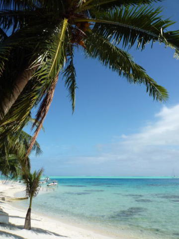
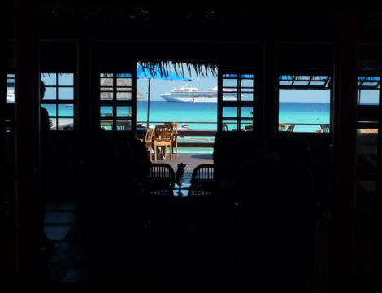
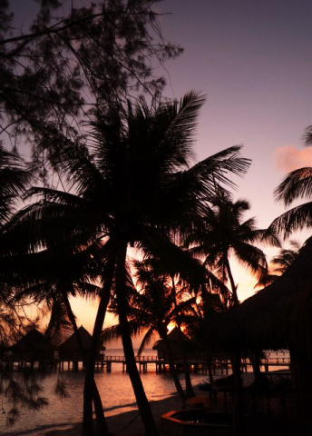
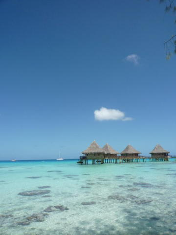

# 2009年　初の海外子連れダイビング旅行記　写真について

📅 投稿日時: 2012-10-04 00:34:31

🏷️ カテゴリ: [ダイビング日記](ce3a7a8d424d112fce83ee85c81a0e344.md)

エピローグが終わったのに．

実はまだ終わらない，タヒチ旅行のお話．

あー．この内容は，3年前のものです．

今ではこの記事に書かれているデジカメ，FX-35．

酷使しすぎて，すでにお亡くなりになってます…（合掌）．

------

さて．今回のタヒチ旅行からさかのぼること4年前…

初めてのタヒチから帰ってきた後．

その海の綺麗さ．

どこを撮っても絵になるすばらしさ．

…もし，もし次に来ることがあったら，絶対一眼レフをもって行って

いっぱい写真を撮りまくるんだ～っ！！！！！！

…と，思っていました．

でも，あれだけお金がかかったタヒチ旅行，次に行くのは20年後か，

30年後か…

しかし．

その機会は，意外と早くやってきて．

んで，今回の旅行の前．

「去年，デジタル一眼壊しちゃったし，娘の写真も撮りたいから，

新しい一眼，買おう！！！」

と思っていたのですが…

はっきり言おう．

「タヒチに行くのに金がかかるのに，カメラ買ってる金があるかぁ～っ！」

…冷静な事実が目の前に突きつけられたのでした．

というわけで．

今回の陸上写真．

いつも持ち歩いているふつーのコンパクトカメラ，

「LUMIX FX-35」で撮りました．

で，現地にて．

「あぁ…ここでもう少し広角があればっ！せめて20mm相当くらいっ！」

とか，

「デーライトシンクロで背景が飛ぶ！もう少しGNの大きなフラッシュがあれば…」

「シャッターラグが大きいっ！動く娘がフレームに納められないっ！！」

「背景がうるさいなぁ…絞り開放で背景をボカシたいなぁ…」

など，

「あああ…一眼レフがあれば…」

と感じるシチュエーションが次々と．

しかし．

コンパクトデジカメ．

軽くて小さい，ってのは便利．

子供抱えて，一眼のレンズ数本と巨大なボディを持ち歩くのは無理．

子供を抱えてても，ポケットからさっと取り出してすぐ撮れる．

この機動性が生きる場面も多かったです．

んで，帰宅後．

家で写真を見直してみて．

「…よく撮れてるじゃない…」

一眼レフで撮った海の写真は，そのままディスプレイで見ると

「眠い」写真になりがちです．

モードがいっぱいついてるような入門者用一眼なら別ですが，

普通の一眼は撮影者の意図した色温度，ISO感度，絞り，シャッター

スピードで撮った映像が，撮影者の操作そのままで記録された

「写真素材」の提供を目的としています．

で，デジカメの性能を生かすために，撮影者は見た目のきれいさより

「撮像素子のダイナミックレンジを最大限生かせるような」

明るさで撮影することが多いかと思います．

んで，撮影後に，RAW現像などに時間をかけて，

撮影者の意図する写真に仕上げていく，という感じかと…

しかし．

コンパクトデジカメの写真は．

撮影したシーンや顔認識の情報を元に，海と空は彩度を上げて，

コントラストははっきりとさせ，顔は明るく…

などと，カメラで勝手に加工しまくった絵が出来上がってきます．

厳密な見た目とは違うけど，普通の人が「きれい」と感じる写真に

なるようカメラが勝手に加工してくれ，そのままで

「綺麗に見える」

写真になってます．

カメラの撮影モード（ビーチとか夕日とか風景とか，

そういうモードセレクト）とフラッシュのOn/Off，露出補正だけを

ちょこちょこいじくれば，この程度の写真が撮れてしまいます．

（ちょっと演色が激しすぎる気もするけど…）

…最近のコンパクトデジカメの画像処理，すげー…

普通の人がディスプレイで見るなら，これで十分，って言う綺麗な

写真になってる…

2万5000円のカメラでこんな写真が撮れるんなら，一眼レフ

持ってく必要は無いんじゃないかなぁ…

（少なくとも，コンパクトカメラじゃなく一眼の方で，フォトレタッチなしで

普通の人を「きれい！！」と思わせるビーチの写真を撮れる人は少ないと思う…）

（参考）

今回撮影した枚数

陸上写真：1700枚（Lumix FX35)

水中写真：800枚（Olympus C-4040)

計2500枚．

フィルムのころでは考えられない枚数だなぁ…

＃この日記，またの題名を「酸っぱいブドウ日記」とも言う．
