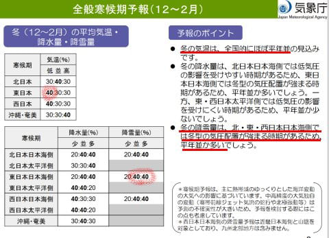
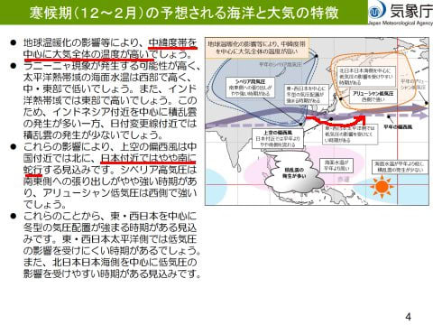
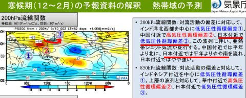
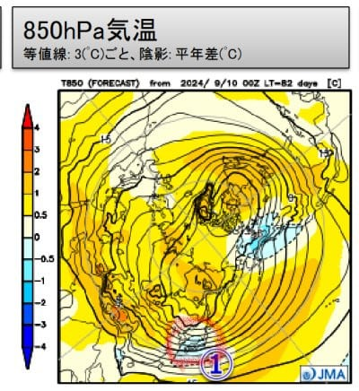
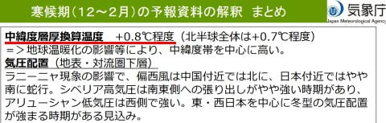
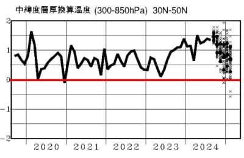

# 今度は12月~2月までの気象庁全般季節予報 寒候期予報を見てみる…12~2月は平年より冷える可能性が高い，スキー場にとって良い冬になりそうな予想！

📅 投稿日時: 2024-09-26 03:59:41

🏷️ カテゴリ: [スキー天気予想](c6554f5c3c106093b511a8daae23757e8.md)

えー．

今日も朝9時から夜10時まで，昼休みも

なく会議が続き，帰宅は深夜1時近く…（泣）

そして，まだ宿題が…（涙）

早く寝たい…

それでも今日も更新する！！えらい！！

…いつもより記事は短めですけど←それでも普通のブログよりは記事が長いよ

ということで．

昨日は10月～12月の3か月予報を解説

しましたが．

本日は3か月予報と同じ9月24日に発表された，

[12月～2月の寒候期予報](https://www.sunny-spot.net/chart/FCXX94.pdf)を見てみましょう…！

そうです．

スキーヤーにとって一番大事なトップシーズンの

時期を占う，ドキドキモノの予報です…！！

さて．

予想結果やいかに！？？

まず．

一番気になる気温と降雪量の予想ですが…

右側のポイントを読むと，気温自体は平年並み

とのことですが，左の表を見ると，

12月から2月は気温が低くなる可能性が40％と一番高く．

東日本日本海側の降雪量も，平年並みか

それより多そう…という予想になってます！！

12月も冬型の気圧配置が強くなるという予想

でしたが，その傾向が1，2月も続きそうです…！！

解説文を読んでみると．

やはり温暖化の影響で，大気全体の気温は

高いながらも．

昨日の12月の予想同様，偏西風が日本付近で

南に蛇行するおかげで，日本付近だけは

気温が低くなり，冬型が強まりそう…

という予想です！！！

200hPa流線関数を見てみると…

3か月予報では12月になってから

起きるとされていた，日本付近の

低気圧性循環．

12～2月までの3か月の平均でも，この

日本付近の③の低気圧性循環が持続し，

偏西風の日本付近での南への蛇行が続く

ようです…！！

そのおかげで．

3か月間の平均の850hPa気温．

日本付近だけ，見事に水色の平年比マイナス

になるエリアに覆われています…！！

ホントに日本付近だけすっぽり冷える

予想ですね…これ！！

ただ．

日本付近以外はみんな黄色から赤い領域で

あることからわかるように．

地球の中緯度層での温度は，+0.8℃程度と

全体的に高めです…

その中で，日本付近だけ冷えるんだけど．

それでもギリギリ平年並みか平年より

ちょい冷える程度…ということみたいです．

ただ．

中緯度層厚換算温度のグラフを見ても，

2023年後半から2024年にかけての+1℃を

越える高温が少しは収まっていきそうな

傾向も見えるので．

まぁ，全体多岐な予想としては．

今シーズンの12～2月は，昨シーズンよりはかなり

マシになりそう

ということでしょうか…

とりあえず，昨シーズンみたいな壊滅的な

ダメダメ予想じゃなかったことにかなり

安心しつつも．

この偏西風の蛇行が，予想位置からわずかにでも

西にずれるとヤバい

ということが分かっている自分にとっては，

この予報通りの位置で，予報通りの偏西風の

蛇行が起こるように．

スキーシーズンまで，日々祈らなくては

なるまい…

と思うのだった…

ホントにこの予報が当たりますように…！！（願）

PS.蛇行がこの予想から西にちょっとでもずれると，

　東日本は低温エリアから外れる可能性が高く，

　さらに東日本は北風エリアから西風エリアに

　ずれるので，志賀高原は冷えても雪が降らない

　パターンが続きます…
