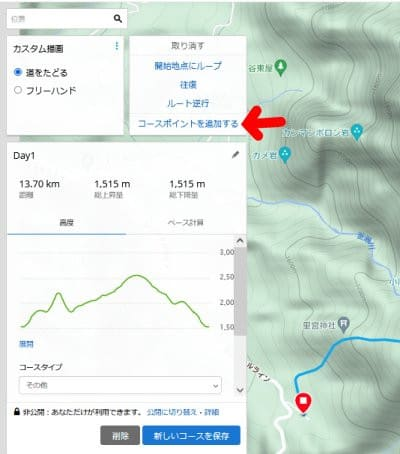

# 新しいスマートウォッチ，Garmin Fenix7Xを買ったよ！その15…PC版Garmin Connectを使って登山用ルートを作成，GPXファイルをウォッチへ転送！

📅 投稿日時: 2022-09-09 01:15:07

🏷️ カテゴリ: [PC,カメラ&小物](c0d8caed13e597efe97b661a8ae56bed0.md)

えー．

今日も朝5時半過ぎに家を出て，

新幹線に乗って出張で．

朝9時前に出張先の駅に到着，駅前の

レンタルスペースで，

9:00，9:30，10:00，10:30，11:00，12:00，13:00，14:00と

お昼休みも取らずに8件のWEB会議にぶっ続けで

参加して（また一部，ダブルで会議に参加…）．

その後に本来の目的の某社に移動，ヤバいエンドレス

打ち合わせに出席．

夜9:30に間に合うように話し合いを切り上げて

ホテルに戻り，夜10時過ぎまでWeb会議…

という怒涛の一日で．

さらに明日の早朝にまた次の出張地へ，

新幹線を2本乗り継いで移動しなくてはならない

という，ご無体を煮詰めたような一日だった本日．

皆様におかれましては，ご健勝のことと

お慶び申し上げます（時候の挨拶）

ってなわけで．

ご無体ながらも．

夜10時過ぎに仕事が終わって，宿題がないなら

私にとってはまだ平和かも…

ってなことで．

今日もGarmin の紹介記事の続きです～！！

（Garmin Fenix7Xのレポート全16回のもくじ

機能説明，登山用地図の作り方，登山で使ってみた…など

は[ここをクリック](e516b23a4874189de2e9208be87fa5184.md)）

…前回，山登りルートのGPXファイルを作ったわけですが．

GPXファイルができたら．

そいつをウォッチに送るため，

Garmin Connectに読ませます…

そのためには，この「トレーニング」メニューの

中の「コース」メニューを選びます…

そうすると，こんな地図画面が出てきますが…

この左下．

ここを拡大すると，こんな感じで「データのインポート」

ってのがあるので．

こいつを選びます．

すると．

こんな感じで

「ここにファイルをドロップするか，参照して選択します」

という表示が出てくるので．

ここに，先ほど作ったGPXファイルをドロップして

あげましょう！！

すると，さっき作ったルートが読み込まれ，

地図上にルートが表示されます！

…これだけで，もうウォッチに地図を転送

してもいいんですが．

これだと，途中の中継ポイントの情報が

何も入ってません！！

途中の目安になる，分岐点とか，小屋とか，

山頂とかのポイントを入力してやらないと，

「ゴールまでの距離」

しか出なくてちょっと不便です．

やっぱり，次の中継点がどこで，

それまでの距離がどのくらいか…というのが

分かった方がありがたいので，

途中のポイントをこの地図に追加してやるわけですね…

途中の中継点を追加するには，こいつ．

「コースポイントを追加する」を

クリックしてやります．

こいつをクリックしたあとに，例えば

ここの分岐点をポイントとして追加したければ…

ルート上のその地点をクリックしてやれば，

中継点として選択されます！

中継点を選択したら．

選択された中継点に，名前を入れて

あげましょう…

普通なら，地図にあるように

「小川山，瑞牆山分岐」

と名前だkを入れるところでしょうが…

ひとつ，コツとして．

中継ポイントの名前の最初に，

「そこの標高」をいれておくと便利です！！

マウスでポイントを選ぶと，そこの標高が

赤く囲ったように表示されるので，

その標高をポイント名に入れておきましょう！

そうすると．

実際にそのルートを歩いたときに，

時計には次のポイント名が出てきますが．

こんな感じで各ポイントの標高が分かるので…

現在地点との標高差が分かって便利です！！

ってなことで．

地図上に，自分の好きなポイントを

全て打ち込み終わったら…

ウォッチへ地図を転送します．

その際に，赤矢印で示した，

「転換通知」はOFFにするのがいいです．

これをONにすると，さっき打ち込んだポイント

意外でも，ルート上の向きを変えるポイントで

毎回通知されるので，ちょっと鬱陶しいです．

で，青矢印の「デバイスに送信」ボタンを

押せば，ウォッチへの送信準備は完了！

…ただ．

まだここでは，ウォッチへの送信は完了していません．

なぜかPCだけではウォッチへの送信は完了せず．

この後，スマホのGarmin Connectの

このボタンを押すことで，ウォッチと同期されて

ルートが転送されます！

ってなことで．

無事，ウォッチにルートが入れられたので．

次は，山登りで実際に使う使い方を

説明します…！

## 💬 コメント一覧

### 💬 コメント by (FCAMEL)
**タイトル**: Unknown
**投稿日**: 2022-09-15 21:59:08

>>皆様におかれましては，ご健勝のことと

お慶び申し上げます（時候の挨拶）

ここで吹いてしまいました。

大丈夫ですか？

またお会いできること楽しみにしてますので、無理しないでくださいね。笑

### 💬 コメント by (Skier_S)
**タイトル**: ＞FCAMELさま
**投稿日**: 2022-09-16 01:56:28

お久しぶりです～！

いや，最近はかなりご無体です．

いつになったらご無体から抜け出せるのか…

精神的プレッシャーはこれ以上の時もありましたが，作業量はおそらく会社人生で

最高レベルです…

まぁ，精神的プレッシャー最高の時みたいに，血尿が出たとかいうレベルには

なってないので，まだ大丈夫かな？←大丈夫のレベルがヤバい

