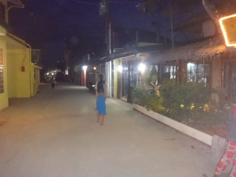
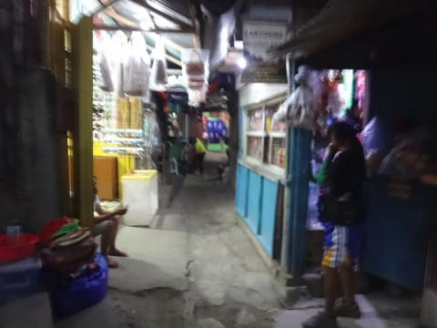
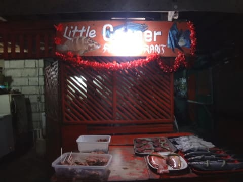
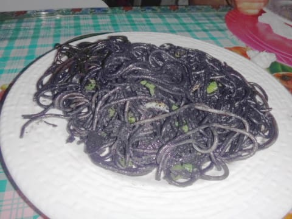
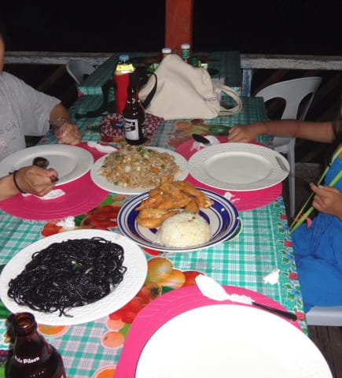
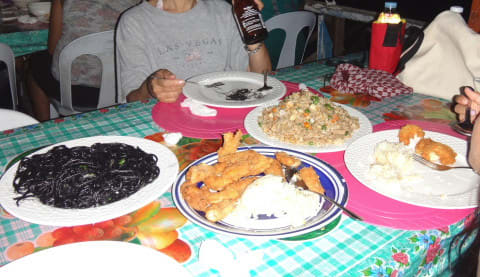

# 2016年8月　子連れで再訪！モアルボアル旅行記その10…1日目の夜ご飯

📅 投稿日時: 2017-08-26 02:29:20

ということで．

日が暮れる6時半までプールで泳ぎ続けた娘でしたが．

…さすがに暗くなってきたので．

娘をプールから引っ張り上げます…

娘もさすがに夜になり，おなかが減ってきたらしく．

娘「夜ご飯！すぐ夜ご飯に行こう！」

って感じで，プールから上がってきました．

うむ．

じゃ，夜ご飯食べに行くか…

とりあえず，部屋でシャワーを浴びてから，

夜のモアルボアルの町へ繰り出します．

モアルボアルの町は治安が良く．

夜も観光客がいっぱいで歩いてるので

安心です．

ちょっと怪しげな雰囲気の場所もある街ですが…

海外からのダイビング客が多く，経済的に

潤っている街なので，夜も安心して

出歩けます．

そして，そこかしこに観光客向けのレストランが

いっぱいあります．

ってことで．

本日やってきたのは，

ホテルから徒歩5分ちょい．

去年もお世話になった

「リトルコーナー」

シーフード料理のお店，ってことで，

店頭に出ている魚を料理してだして

くれるようですが…

今晩頼んだのは．

このお店の名物．

「イカスミスパゲッティ」

ここに来たら，これを頼まないと…！

このお店のイカスミスパゲティ，

ピリ辛で，イカスミたっぷりの

濃厚なねっとり感があって．

結構おいしいですよ…！

ってことで．

イカスミスパゲッティ以外も

いろいろ頼みましたが…

このお店，一皿の量がかなり多いと

来ています…

このチャーハンの量の多さ！

ビールも何本か飲んで，いい気持に

なったところで，ホテルへ戻りますが．

…フィリピンの食事は，お会計もリーズナブルなのが

嬉しいですね～．

これだけ飲んで食って2000円かかってないよ…

で．

ホテルに帰ると．

やはり，午前シュノーケリング，

昼と午後にたっぷりプールで泳いだ娘．

部屋に着いた途端，即落ちでした…
