# 2月25日(日)の志賀高原速報モード！…薄雲があるものの概ね晴れの一日．冷え冷えで雪も荒れず良かったよ！

📅 投稿日時: 2018-02-26 01:55:24

えー．

…低気圧が接近してくる本日．

早ければ昼前，遅くとも午後は曇り空になると思ったのに…

前日に

「一日中晴れ！すっきり晴れ！雪質最高！」

と書いたら．

午後になっても日が射しているのはなぜ？？

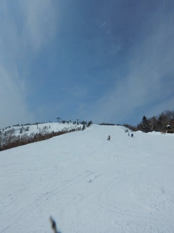

そして，冷え冷え雪質最高だし…

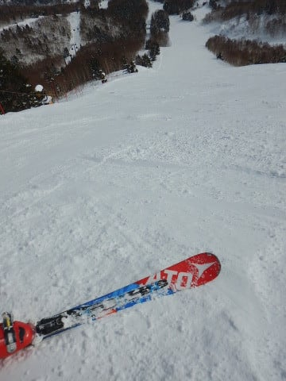

そうです．

結論が出ました．

志賀高原の天気を決めているのは私だったようです

…まさか，ホントに午後まで晴れるとは

思わなかった…

ってことなので．

今後の天気予想は，毎週必ず，

「すっきり晴天，最高の冷え冷え雪質の一日！」

と書き続けようと思います…（嘘）

ってことで．

本日はいつも通り，最終リフトまでしっかり滑り．

深夜帰宅だったので．

日曜深夜恒例，速報モードにて…

まず．

今日の朝イチは…

時折うっすら雲がかかるものの，

日が射す天気でスタート！

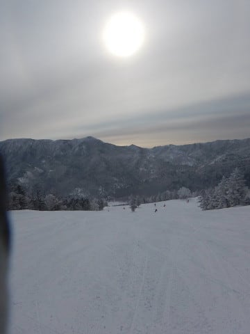

放射冷却のため，朝の気温は結構冷え冷えで．

ゲレンデは…

そうです！

最高冷え冷え圧雪の，脳内麻薬大量放出

快楽シマシマバーン！！

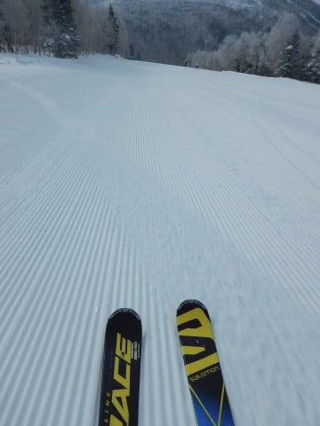

…ただし．

9時半を過ぎると．

あうーん．

今日もやっぱりゲレンデ人口密度は高くなってきたよ…

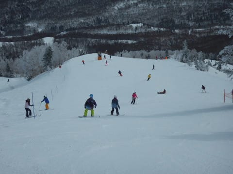

でも．

急斜面のオリンピックコースは人が少なくて．

タイミングによっては貸し切り状態！

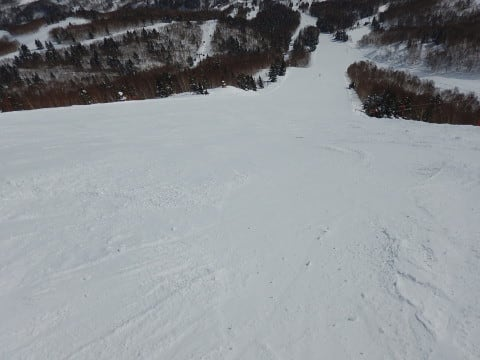

バーンがかなり締まった雪で，

かつエッジがしっかり効く，ほど良い固さの，

トップスピード自由落下バーン！

…ちょいと締まり気味の急斜面で，スピードコントロールが

難し目だったので，人が少なかったのかな？？

私にとってはかなりのご馳走バーンだったんですが…

ゴンドラ待ちも，第2ゴンドラや奥志賀ゴンドラは

混んだようですが．

第1ゴンドラはゲートの外に列がつくことが

何回かあったかな…という程度で．

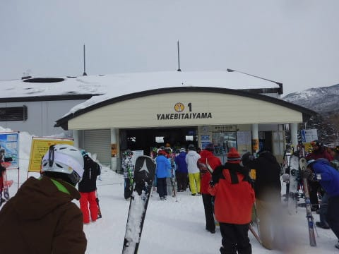

普段はゲートの外までは並ばず，

空席待ちに並べば搬器数台待ちで乗れる程度．

…いや，午後になると人も減って．

天気もいいのに，気温は冷え冷え…

雪も締まり気味なので，午後遅くになっても

バーンは荒れず，ほぼフラットのまま…

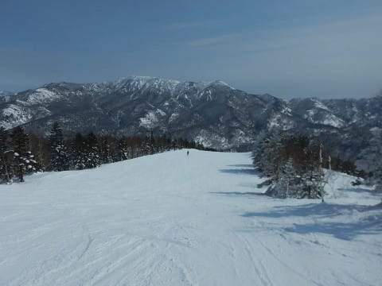

これは…

これは，かなりいいコンディションなのではっ！？？

午後4時を過ぎた，営業終了直前に．

ちょっと雲が増えてきましたけど．

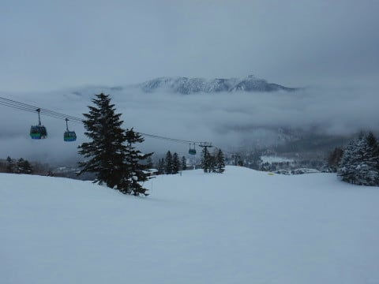

でも，日が暮れるリフトストップまで，

大きく天気が崩れることなく，

フラットな締まったバーンを気持ちよく

飛ばし続けられたのでした…

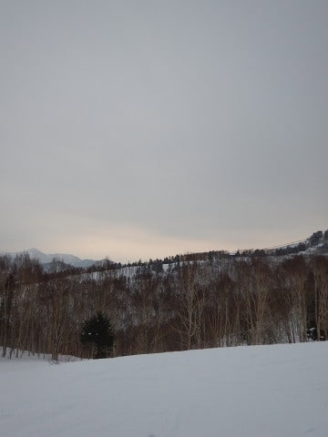

って感じで．

かなり良かった本日ですが．

…

今週水曜日，2月28日は…

え？

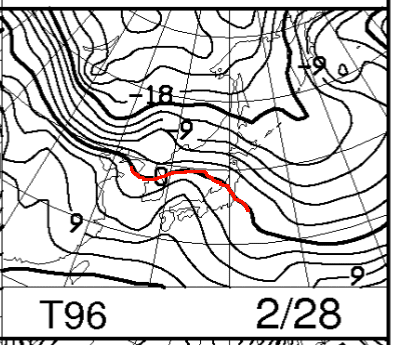

そして，3月3日土曜日も…

ええええ！！？？

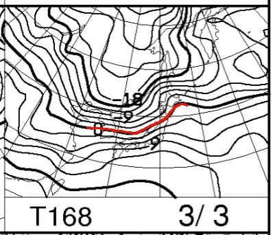

28日夜中から3月1日にかけて，何かが降りますが．

うーむ．

降り始めは雨かも…（涙）．

そして．

3月3日土曜も，今のままの天気図だと，

夜から降り始めそうな感じで…

降り始めは液体の可能性が…

いや！

そんなことはない！！

志賀高原の天気を決めているのは私だ…と分かったので．

「今週水曜から木曜にかけては雪！志賀高原はたっぷり雪！」

と書いておけば大丈夫なはず…

そして．

土曜の天気も．

恒例の水曜夜の予想時に

「土曜はすっきり晴天！日曜も最高雪質！」

と書いておくので．

たぶんきっと大丈夫なはず…！！←ホントにそうなったら，神か予言者かどっちかだな

## 💬 コメント一覧

### 💬 コメント by (まいる)
**タイトル**: 日曜日は
**投稿日**: 2018-02-26 03:22:53

Sさん、土曜日は少しでしたが一緒に滑れて良かったです。

日曜日は、ボードでしたが仲間の希望もあり、東館、西舘、寺子屋あたりで滑ってました。

ゲレンデコンディションは二日間とも良く、楽しく過ごせました。

### 💬 コメント by (ほっぽ)
**タイトル**: 昨日も、、、
**投稿日**: 2018-02-26 07:18:59

Sさん

昨日も一ゴン乗り場で相乗りレーンを「瞬・間・移動」するSさんを見かけましたが、私が後追いでは追い付くはずもなく、すれ違いでした。

GOKUさんにはご挨拶できたのですが。

20000m倶楽部の皆さんはゴンドラの乗り降りが異常に早いので、追い付かれることはあっても追い付けませんね。(^^;

一昨日昨日は友人のスキーヤーと二人でしたので、更に遅かったこともあります。

今週末は日曜日帰りでボーダー１人連れて志賀高原に出没しますので、捕捉されることを期待してます。(^^;

### 💬 コメント by (サトシ父)
**タイトル**: やっぱりSさんでしたね
**投稿日**: 2018-02-26 13:17:19

昨日は一ノ瀬と高天ヶ原で缶詰めでしたのでヤケビには行けませんでした。車で奥志賀に戻る途中、1ゴン乗り場でお声がけしようとしましたが 最終ゴンドラにタッチの差で間に合わず…

3月は検定三昧でほぼ毎週ジャイアントになりそうです。

### 💬 コメント by (michi)
**タイトル**: お疲れ様でした
**投稿日**: 2018-02-26 21:36:18

昨日の夜は関越の渋滞は大丈夫でしたか？私は1930に長野を出ましたが花園で渋滞に25分ほどハマりいつもより疲れました(-｡-;

木曜、めちゃくちゃ暖かそうですね。

志賀は雪になることを祈ります。天気を決めるSさんが雪と言えば大丈夫ですかね（爆）

### 💬 コメント by (Goku)
**タイトル**: Unknown
**投稿日**: 2018-02-26 22:35:08

週末はお疲れさまでした～♪

土曜日はチト残念な天気でしたが、日曜日はこのところの週末の呪いから解放され、ようやくお日さまの下で滑れて最高でした！

終盤のオリンピック集団爆走も楽しかったです。

ではまた週末お会いしましょう。

### 💬 コメント by (Skier_S)
**タイトル**: 3月1日はすごいよ…
**投稿日**: 2018-02-27 08:09:59

＞まいるさま

土曜はありがとうございました～！

この土日はコンディション良かったですね…

今週末はすごいことになりそうです（涙）．

＞ほっぽさま

あら…日曜もすれ違いですか．

もう，コンディションが良かったので

全力モードだったので，かなり急いで

ゴンドラ乗り降りしてました…

でも，私は20000mゴールドメンバーの中で

最も滑るのが遅い人間だと思ってます．

大体他のメンバーには置いて行かれるので…（笑）

みんな速すぎです．

＞サトシ父さま

日曜はヤケビにいらっしゃらなかったのですね…

3月は毎週ジャイアントですか！

検定受験されるのですか…？

がんばってください！

＞michiさま

こちらも渋滞にはまりました…

ただ，運転を代わってもらっていたので

熟睡中でした（笑）．

1日は…

踊っても歌っても嘆いても転んでも

雨になりそうです（涙）．

＞Gokuさま

土曜は天気が残念だったけど，雪はよかったですね！

…今週末は，この土日と対照的な

すごいゲレンデコンディション＆天気に

なりそうな予感…

あぁ…もう春なのか…

