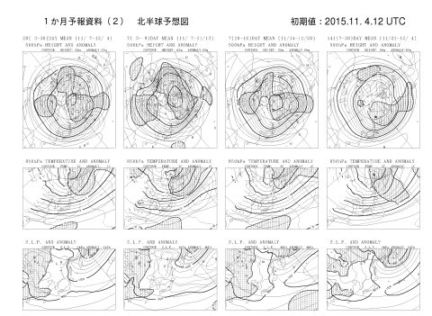
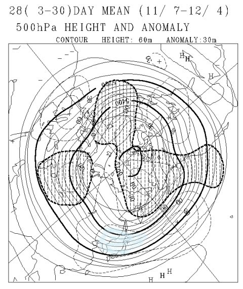
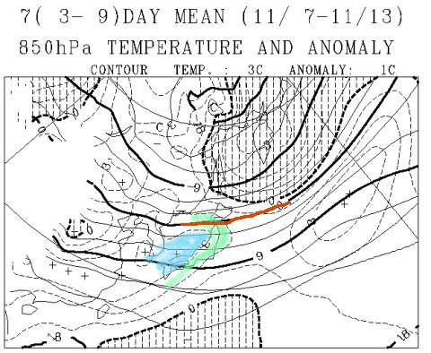
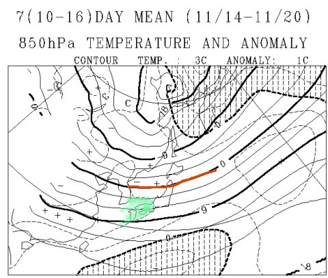
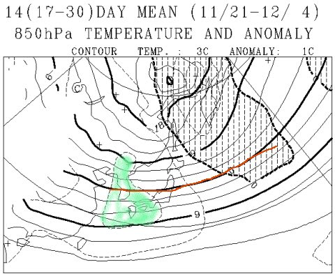
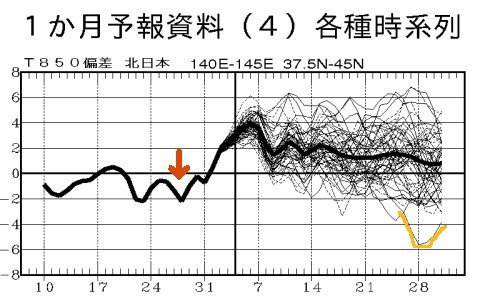

# この11月は冷えるのかっ…？スキーヤーが気になる，これから一か月の天気は？？

📅 投稿日時: 2015-11-06 02:58:52

🏷️ カテゴリ: [日記](cc4b5682fb7b8b144980957a978653fb0.md)

えー．

スキーヤーならこの時期，誰もが気になる，

一体，この冬は早くに雪が積もるのか？？

…というところですが．

それを明らかにすべく．

一か月予想天気図，FCVX12をもとに，読み解いてみましょうか…

FCVX12ってのは，こんな天気図ですが．

この天気図は，[このあたり](http://n-kishou.com/ee/exp/exp.html)から参照できます．

興味のある人は，原本を見てみてください…←そんな暇人あんまりいないでしょうけど

まぁ，この図にはいろんな情報があるわけですけど．

慣れている人が見ると．

この一番左上の一枚だけを取り出しても．

「これ，マズいだろっ！！」

って感じの図面なんです…（涙）

なんのこっちゃらわからんと思うのですが．

これから1か月，12月4日までの，500hpaの特定高度線の予想値平均．

思いっきり正偏差なんですけど…っ！

一か月平均が，60mの正偏差とは…っ！

細かい説明は省きますが．

…つまり，これは．

かなり暖かい11月になるってことなんです…（泣）．

…もう少しわかりやすい図面で見てみましょう．

11月7日～11月13日までの，一週間の850hpa気温と

平年差の図面が，こいつなんですけど．

えーっと．

赤で示した線が，私がいつも天気予想の図面で赤くマークする，

850hpaの0℃線．

こいつより北側になれば，0℃以下ってことで，

山沿いでは雪になる目安．

…こいつは，まだはるか北，北海道近辺にあり．

信州や新潟では，ぜんぜん雪が降る気配はありません．

…そして．

緑色で示したのが，平年より2度以上高くなる部分．

水色で示したのが，平年より3℃以上高くなる部分ですが…

なんだか．

日本全域，平年より2-3℃高くなるようで…

週平均気温が，2-3℃高いってのは，

異常高温と言っていいレベル（涙）

11月7～13日の一週間は，山沿いでも．

雪になる可能性は限りなく低そうな一週間です（涙）

そして，こちらが11月14日～20日の一週間の予想図ですが．

0℃線はまだ東北北部．

信州や北陸からは，まだ遠い…

そして．

西日本は平年比+2度の緑色領域に囲まれて．

信州・新潟も平年比1度以上高いです…

うむ．

この週も，「例年より冷え冷えっ！雪がたくさん降りそう！」

って感じではないよ…（涙）

11月3連休，あまり雪は期待できなさそう…（悲）．

こいつが，11月21日から12月4日までですが…

はうあっ！！

ダメだっ！

だめだよ！

12月上旬でも，0℃線はまだ信州まで下りてこない…

そして，西日本はまだ平年比+2度の緑エリアに覆われ．

信州近辺も，平年比2度近く高い感じかな…（泣）．

ダメです．

これは，ダメです．

12月上旬も，「いやー！冷え冷えだっ！12月第一週から，焼額ゴンドラ動くよ！」

なんてことは，期待薄です．

あまり，過大な期待を抱いてはいけない天気図です…（激泣）．

そして．

おまけに，FCVX14の850hpa偏差の時系列グラフも見てみると…

ああ．

この図の右側．

全期間で，全体的に線が0の軸より上の方に行ってます…

つまり，平年よりあったかい日々がずっと続くということ（涙）．

ちなみに，この図の左側は，過去の実績なんですが．

赤矢印で示した，10月29日あたり．

ぐっと冷え込んだのは皆さんの記憶に新しいかと思います．

この線が，0℃よりちょっと落ちただけで，あれだけ冷えたのに．

…11月全体にわたり，太い線（クラスタ中心）は+1～+4度も

高いところにあるってことは…

…

…

ダメだ．

ダメかも．この11月…

とりあえず．

あくまで，これは予想です．

未来は皆さんの力で変えることができます．←何か使い方が違ってないか？

最後の図，オレンジの線で描いたように．

予想ばらつきの範囲中には，12月上旬に平年比-6℃近くまで

冷え込む予想もあります．

スキーヤーのみんな．

これから冷え冷えになることを…

祈るのだっ！！！

## 💬 コメント一覧

### 💬 コメント by (びわ湖)
**タイトル**: Unknown
**投稿日**: 2015-11-06 08:53:00

s様 毎度遅い更新お疲れ様です。私のホームのシーズン券の販売も始まりました。西に位置する場所ですので大変気になる所です。経営者が代わってから全てのサービスがダメなスキー場ですが

購入してしまう私が悲しいデス。

### 💬 コメント by (れお)
**タイトル**: すこし残念な感じですね
**投稿日**: 2015-11-06 12:43:41

お久しぶりです。

また今シーズンもお世話になります～。

あらら、すこし残念な予想ですね～。

予想が外れて欲しいですが、シーズン中のSさんの天気予報の的中確率は、私の体感的には８割以上で当たってるんですよね～。

ところで、こんな専門的な天気図も分かるなんて、やっぱり、すごいです～!!

最近、進路についても考えるようになった息子も、「Ｓさんって何している人なんだろ～。」と興味を持ち始めてます。(^0^)

趣味も大いに楽しむ生き方に興味があるようです。

### 💬 コメント by (Skier_S)
**タイトル**: びわ湖さま
**投稿日**: 2015-11-07 00:35:22

お久しぶりです～！！

シーズン券購入ですか．

準備万端ですね！

この11月，一瞬冷える日があっても

なかなか冷えが続かなさそうで…

シーズンインはいつごろの予定ですか？？

また，コメントお待ちしています～！

### 💬 コメント by (Skier_S)
**タイトル**: れおさま
**投稿日**: 2015-11-07 00:38:05

をを！

今シーズンもよろしくお願いします！

この11月，今のところは残念ながら，

雪は遅そうな感じです…（涙）．

こればっかりは，外れることを祈るばかり．

で．息子さん，「何している人なんだろ～」って，

気になってるんですか．

うふふふ．

「スキーしている人だよ」

と，答えてあげてください．

### 💬 コメント by (Goku)
**タイトル**: Unknown
**投稿日**: 2015-11-07 19:06:41

これは是非外れてほしい予報ですね

それと、『Ｓさんってナニしている人何だろう？』

実は私もそう思っているヒトリです（笑）

### 💬 コメント by (Skier_S)
**タイトル**: Gokuさま
**投稿日**: 2015-11-07 22:46:23

もう，外れてもらわないと困る予報です（涙）．

…私がナニしている人かっていうのは…

スキーをしている人です（笑）．

平日には気分転換のため，K奈川県に

出かけて会社で過ごしてます（爆）．

