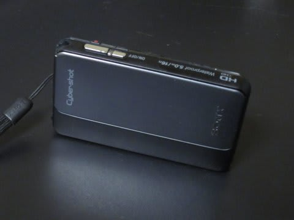
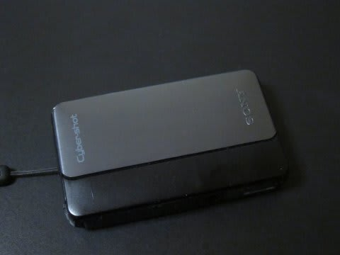
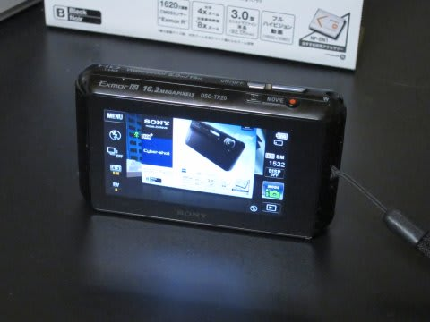

# スキーヤーにお勧めのデジカメ(兼ビデオカメラ)，SONY サイバーショットTX20

📅 投稿日時: 2013-02-21 02:41:24

🏷️ カテゴリ: [スキー雑談](c1f9d2cb7478308da16419928ea3945e9.md)

あー．

実はですね．

ちょっといろいろありまして．

[以前使っていた](edc461a9f1ae90e7a790c71fb3597b618.md)，[スキー用ビデオ兼静止画](e031365507b66f6126431a5fb1065d1cf.md)カメラSONY Cybershot TX10がですね．

使えない状態になってしまったもので．

今シーズン突入前に．

TX10の後継機である，TX20を購入していたんですね～．

＃なんだか，もう生産中止になってしまったようですが．

んでは，

このカメラのインプレッションをば…

まぁ，基本的なところはTX10と同じで．

見てくれによらず，5m防水，耐衝撃ってことで．

吹雪や雨の中でも安心して撮影できます．

んで．

滑りを解析するためのビデオカメラ代わりとして使っているわけですが．

TX10と同じ1080Pフルハイビジョン動画＆光学ズーム4倍，デジタルズーム16倍．

動画撮影中のズームも早く．

ビデオとしても十分利用可能なスペック．

そうそう，TX10だと30フレーム/秒だったのが，TX20では60フレーム/秒に進化してますね～．

＃AVCHDとMP4の2種類のフォーマットで撮れるけど，60フレームはAVCHDに設定したときのみ

デジタルズームは画質が落ちますが，フルHDですので，

画質が落ちても普通のSD画質と同等かそれ以上．

デジタルズーム16倍あれば，

「あんじゃこりは？画面に張り付いてるごみか？」って感じで

スキーヤーが写ってしまうこともなく．

解析用ビデオを撮影して，PC画面などで見る分には十分です．

静止画撮影能力も，基本的に[ここ](e6165f9b8a49463a457f0bd67988f6dae.md)に書いた，TX10の長所をそのまま引き継いでて，文句なし．

で．

このカメラ．

[TX10で最大の不満点](eeaa5caa0b3a71351813c7d734931dc0f.md)だった，レスポンスの遅さが完全に改善されてるのが，うれしいですね～．

動画，静止画ともに，レンズカバーを開いてから撮影可能になるまでの遅れはまったく気にならなく

なりました！

さらに，

静止画モードで「あ，動画撮影しよう！！」

と思って，動画撮影ボタンを押しても．

(中略)いい加減被写体にカメラを向けているのが

飽きてきたころに．思い出したように録画がスタートします．

っていう，動画撮影時の問題も解決！

動画ボタンを押してから，撮影が始まるまで1.5秒程度と，劇的に短縮され．

ほとんど気にならなくなりました．

動画モードなら，動画ボタンを押せば瞬時に撮影開始！

いやー．

TX10の不満点は，ほぼ解決．

…ほぼ解決．

でも．

TX10の欠点，残るひとつが解決されてなかったのだ．

…マイナス10度を下回るような気温で，動画をとる場合．

バッテリーの持ちがかなり悪いのだ…

滑ってる動画，10本も撮ったら電池切れマークが出ちゃう…

電力消費が少ない静止画だと，寒くても結構撮れるんですけどね．

動画撮ってると，すぐ電池切れマークが…

あー．

だけど．

マイナス10度を下回る劇寒コンディションじゃなきゃ，

普通に撮影できますので，ご安心を．

…でもやっぱり，志賀高原のマイナス15度とかで撮影すると．

すぐバッテリー切れになってしまうので．

交換電池は必須ですね～．
