# Amazfit GTRスマートウォッチを買ってみた，その5…スマホアプリを使ってみた

📅 投稿日時: 2019-09-07 04:03:05

ってなことで．

これまで，

その1．[購入レポート，](e07b216ec3b426f7a5a1462a3b6fd1c02.md)

その2．[開封＆試してみた感じ，](edd1205f6bd9cd6dadb50e4fc6316b747.md)

その3．[アクティビティーログ](ecd7317c7980728b41dae1a21fe835803.md)

その4．[スマホアプリのインストール＆設定](eb88e9293dae421d12f27fe8b5b363344.md)

と，Amazfit GTRのレポートを書いてきましたが．

…なぜか，このAmazfit GTRの記事．

意外なことに，アクセス数が

そこそこ多いんですよね…

日本でどこでも買えるFitBitとか，

Garminの製品ならまだしも．

海外通販でしか購入できない

こんなマイナー機種に興味がある人が

そんなにいるのかな？？

と不思議になる今日この頃．

とりあえず，前回はスマホアプリでの

スマートウォッチの設定，操作などを

説明しましたが．

今回はスマホアプリの，フィットネス

トラッカーとしての機能を見てみましょう！！

えー．

まず，その前に．

これまで乗せた写真では，Amazfit GTRの

大きさがイマイチ分かりにくいと思うので．

私がスキーの時に使っている腕時計，

SuuntoのAltimaxと比較してみました～！

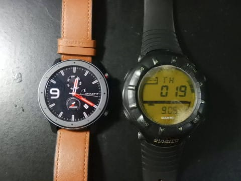

あ，SuuntoのAltimax.

風防ガラスが樹脂製ですぐ傷ついちゃうので，

表面に保護フィルムを貼っているんですが．

ガラスがドーム型のため，すぐにフィルムが

一部浮いて剥がれてきてしまい，

ちょっと見た目が悪くなってます（笑）．

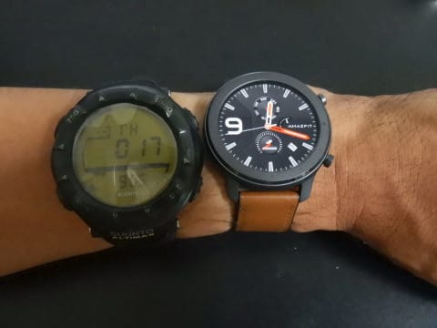

…まぁ，しかし．

やっぱり，SuuntoのAltimaxの

デカさが際立ちますね…

とはいえ．画面サイズはほぼ変わらず．

その周辺のベゼル部分が大きいのが

分かるかと．

そして，厚みも比べてみますが…

Amazfit GTRがすごく薄く見えますね（笑）

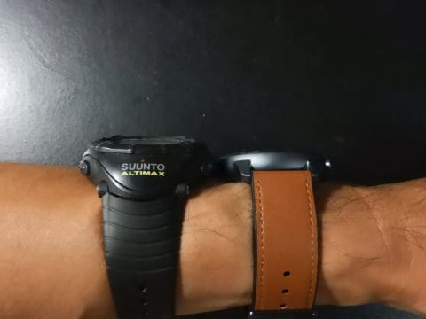

これは，Amazfit GTRが薄いのか，

SuuntoのAltimaxが厚いのか…

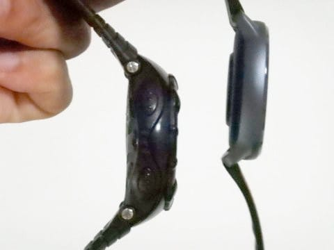

これで，心拍計＆GPS内蔵で，

スマホ着信通知機能やら何やらが着いて，

電池が普段使いで20日以上もつ上に．

お値段は，SuuntoのAltimaxと同じ

くらいなんですから…

時代は変わったもんだ…（老人のたわごとモード）

ってなことで．

本題のスマホアプリの方に移りますが．

スマホアプリのフィットネス機能の

ホーム画面はこんな感じで，

一日の歩数，

睡眠時間，

心拍数，

体重（これは手動で入力する必要あり）

…などが表示されます．

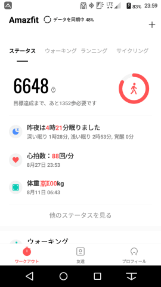

そこで，歩数のところをタップすると…

その日の，何時ころにどのくらい歩いたかを

表す，歩数グラフが確認できます．

左右にフリックすると，違う日の

データを見ることができます．

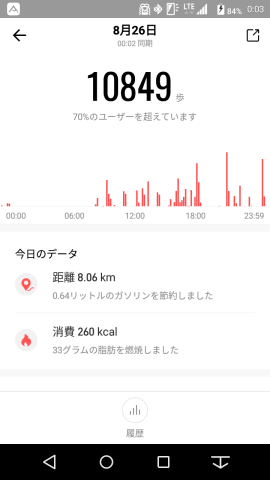

この画面を下にスクロールさせると，

その日の歩いた距離，消費カロリーの

ほか，どのくらい運動したかが

表示されます．

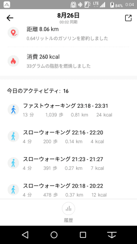

これは，腕時計の動きから，

どのくらい運動しているかを勝手に

推測したものが自動的に記録されたもので．

スローウォーキング，

ファストウォーキング，

軽いアクティビティ…

って感じで記録されますが．

運動が数分間持続しないと記録

されないようで．

残念ながら，数十秒間の全力ダッシュ

などは記録されません…

そして．

ホーム画面の「昨夜は●時間●分眠りました」

のところをタップすると．

今度は，睡眠分析の画面に切り替わり，

こんな感じで，何時に寝て，何時に起きて．

さらに，睡眠時間のうち，深い眠り・浅い眠りが

どのくらいの時間だったかを見ることが

できます…

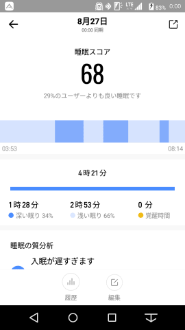

…寝る時間が遅すぎるところは

突っ込まないでください（笑）．

で．

さらに，この画面を下にスクロールさせていくと．

寝るのが遅いよとか，寝る時間が短いよとか，

私の睡眠時間について，本人も良く分かっている

おせっかいなコメント（？）を出してくれた上に．

平均時間との比較を出してくれて．

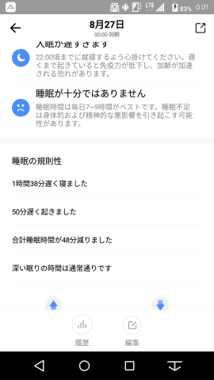

さらに，他の人との比較も見せて

くれます…

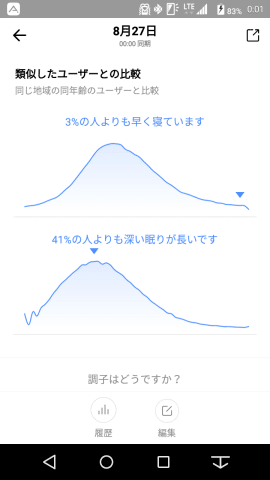

この日の私は，他の97%の人より遅く寝て，

41%の人より深い眠りが長いようですね…

こんな感じで，しばらく記録を

取ってみると．

私は睡眠時間がかなり短いわりに，

深い眠りの時間が平均程度か，

それより長いことがよく分かりました…

深い眠りが長いので，短い睡眠時間

でも耐えられているのかな？？

で．

次に．

ホーム画面の心拍数のところをタップすると…

今度は，一日の心拍数グラフを見ることができます．

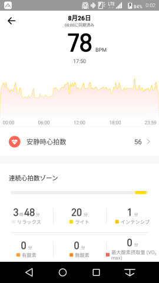

ちなみに，私の安静時心拍は

大体54～56ということが分かりました…

安静時心拍が60を切るのは，

病気か，心臓を鍛えている

アスリートレベルだということなのですが．

意外にも，

私はアスリートレベルの安静時心拍数

だということなのかな…？←いや，病気かも

心肺負荷が高い運動は全然してないし．

心肺機能を鍛えているつもりはないけど…

とはいえ．

冬の間は，標高2000m近い志賀高原で

毎週滑ってるから．

高地トレーニングみたいなもので，

知らぬ間に心肺機能が鍛えられてるの

かも…？？？

まぁ，こんなことが分かるのも．

フィットネストラッカーならではの

楽しみですね．

そして．

そのほかに，消費カロリーグラフ

なんかも確認できます．

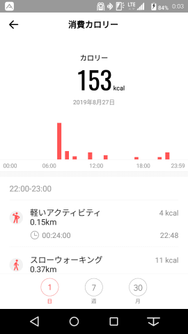

…いやー．

これだけでも，いろいろ楽しめますね…

で．

そのほかの機能として．

大事なのは，アクティビティーログの

詳細を確認できること．

[その3](ecd7317c7980728b41dae1a21fe835803.md)で説明した，

アクティビティーログ．

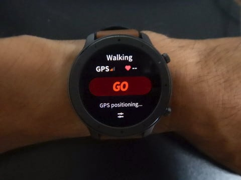

この記録結果を，スマートウォッチ本体で見るより

詳しく見ることができます！

フィットネスのホーム画面に，

スマートウォッチで記録した

アクティビティーログが，

こんな風に表示されるので…

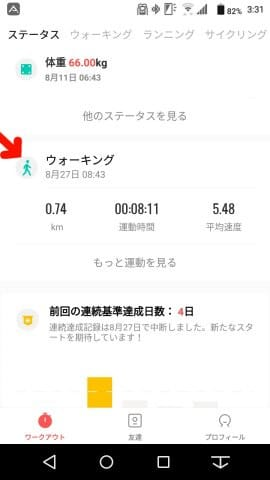

こいつをタップしてやると，

かなり詳細なデータを見ることができます！

ウォーキングの記録の場合．

まず，歩いた奇跡（本来地図上に

表示されますが，今回はプライベート上

地図を消してます（笑）），

歩いた平均速度，消費カロリー，

平均心拍数，トータル歩数，

ケイデンスが見れて…

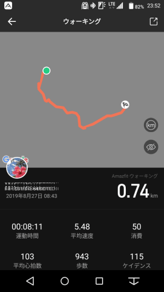

さらにどのくらいのスピードで

歩いたかの経時変化が見れるグラフ，

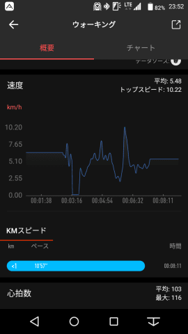

そして，心拍数の推移グラフ＆

何分間，どのくらいの心拍数エリアで

運動したかの割合…

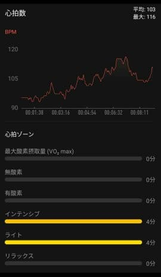

さらには，標高の経時変化グラフまで

確認できます．

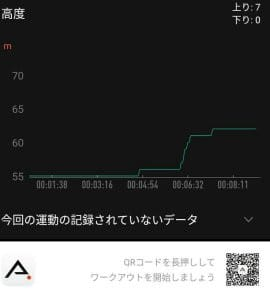

これ，途中で一回階段を登ってるのですが．

それが結構正確に記録されてますね…！

おそらく，スキーモードでも，

高度変化やら速度変化のグラフが

見ることができるはず…！

ってなことで．

スマホでいろいろな記録を見ることができて．

結構楽しめる，Amazfit GTR．

これで1万5000円ちょいは，安いかも…！

しかし．

返す返す，着信メッセージが日本語表示

対応していないのが，惜しい…

PS.本日スマートウォッチ本体のアップデートが

かかりましたが．

本日のアップデートでも，日本語対応しませんでした（涙）

…今日のアップデートでは，機能追加や変更は一切なく，

単なるバグフィックスだったようです…

## 💬 コメント一覧

### 💬 コメント by (あきま)
**タイトル**: Unknown
**投稿日**: 2019-12-02 10:27:38

バッテリー20日くらい持つ製品ってあまりない気がするので私もたどり着いたのはAmazfit系でしたねー！

なのでそこそこ検索する人いると思われます。

### 💬 コメント by (Skier_S)
**タイトル**: ＞あきまさま
**投稿日**: 2019-12-03 01:31:37

そうなんですよね…

そこそこ使える機能があるのに，電池がもつのって

やっぱりAmazfitなんですよね…

日本で販売してないモデルでも，やっぱり買おうと思う人，

多いんですね…

