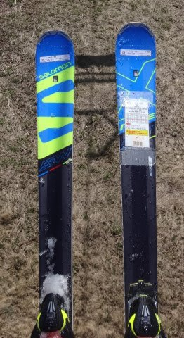
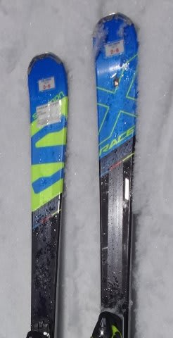

# 2017シーズンモデルのスキー，いっぱい試乗してきました…今シーズンもレポート連載予定！

📅 投稿日時: 2016-05-11 03:16:02

🏷️ カテゴリ: [スキー板試乗](c0bd8048615710cee890e403a36cc9a2b.md)

今シーズン．

[全く予期せぬ転勤＆ご無体引っ越し](d20160401.md)のせいで，

4月第1週の志賀高原での試乗会に行けず．

…もしかすると今シーズン．

このBlogは，

試乗レポート無し

という事態に陥るのか…っ！？？

…と，思っていたところ．

4月23，24日の週末の志賀高原でのアルペン試乗会が，

こんな状況にもかかわらず実施されるという．

ある意味，アルペンさんの英断（強行？）と言える判断で，

何とか来シーズンモデルを試乗することができました～…

…

…

…

…けど．

はっきり言って，こんなゲレンデなので．

とてもスピードが出せる状況ではなく，板のトップスピード耐性や

ハイスピードでの特性はわからず．

急斜面どころか，中斜面での挙動もイマイチよく

分からない…

という状況でした（涙）．

…だもんで．

「あうー！もっといい雪で，固い締まった雪で

　来シーズンモデルを試したいぞっ！！！」

…と，思っていたところ．

なんと，その次の週に行った熊の湯で，飛び込み参加可能な

アスペンさんによる試乗会が実施されてるじゃありませんかっ！！

さらに，この試乗会，完全無料っ！

素晴らしいっ！！

[この日](e53d53cc538b67b728af80a65653feb03.md)は，コース幅は狭いながら，しっかり締まった

スピードが出る，大変ありがたいバーン状況だったので…

いつもの4月上旬の試乗より，板の特性が分かったかも？？

…って感じで．

なんだか，捨てる紙神あれば拾う神あり，みたいな．

ちょっと助かった感がある，今シーズンの試乗だったのでした…

で．

今回も．

たくさんのスキーを，乗りに乗りまくってきましたよ～！

試乗したのは，以下のスキー板です．

まず，4月23，24日の一の瀬では，

以下の20種類．

SALOMON　X-RACE SL LAB 157cm

SALOMON X-RACE GS LAB MASTER 175cm

SALOMON X-RACE SW 170cm

SALOMON X-RACE SC 165cm

SALOMON X-MAX X12 160cm

ATOMIC Bluester D.D SX + X12VAR 165cm　

ATOMIC Bluester D.D LX + X12TL 166cm

ATOMIC Redster MX +X12TL 165cm

OGASAKA TC-SH FL585 160cm

OGASAKA TC-SH GR585 165cm

OGASAKA Keo's LS FL585 165cm

VOLKL PLATINUM SW 166cm

VOLKL PLATINUM GD 175cm

FISCHER RC4 The CURV DTX 164cm

FISCHER RC4 The CURV BOOSTER 164cm

HEAD i SL 165cm 

HEAD i SUPERSHAPE MAGNUM 163cm

ROSSIGNOL DEMO ALPHA R21 167cm

NORDICA DOBERMANN SLR RB EVO 165cm

ELAN AMPHIBIO 16 TI2 Fusion 166cm

以上が，4月23，24日の一の瀬ファミリーでの試乗板で．

4月30日の熊の湯では，以下の14種類を試してきました．

2回目って書いてあるのは，一の瀬で試乗したのと

被っている板です．

SALOMON X-MAX X12 165cm (2回目)

SALOMON X-RACE SW 170cm

SALOMON X-RACE SC 165cm（2回目）

ATOMIC Bluester D.D. SX +X12TL 165cm

ATOMIC Bluester D.D. SC +X12TL 160cm

ATOMIC Bluester D.D. LX +X12TL 166cm（2回目）

ATOMIC VANTAGE90 176cm

VOLKL PLATINUM SD 165cm

VOLKL PLATINUM SW 166cm（2回目）

VOLKL PLATINUM GD　171cm

ROSSIGNOL DEMO ALPHA SOFT 167cm

ROSSIGNOL DEMO BETA 166cm

FISCHER PROGRESSOR F18 167cm

FISCHER RC4 The CURV DTX 164cm（2回目）

ということで．

延べ34台乗ってきたわけですが．

長さ違い・プレート違い・ビンディング違いを別種類と

みなせば，計29種類．

いやー．乗りに乗ってきましたよ．

今シーズンも…

ということで．

毎年恒例の試乗レポートが，これから続きますので．

お楽しみに～！

＃…しかし，こんなド素人の試乗レポート，誰が楽しみにしてるんだろう…？←いつもの心配

## 💬 コメント一覧

### 💬 コメント by (のび太)
**タイトル**: Unknown
**投稿日**: 2016-05-11 21:42:16

はぁ～い。

楽しみにしている一人てす。

僕も試乗会、二回行きましたが、まだレポートのレの字もありません。

今年はこのままなしかなぁ？

### 💬 コメント by (Goku)
**タイトル**: Unknown
**投稿日**: 2016-05-11 21:52:45

しこたま乗りましたね～！

来シーズンは大・小回り２台お買い上げですか。

気が早いけど物欲選手権も楽しみにしていますから(笑)

### 💬 コメント by (Skier_S)
**タイトル**: いっぱい乗りましたよ～
**投稿日**: 2016-05-12 03:26:07

＞のび太さま

今年はレポート無しですか～．

試乗会で気に入った板はあったのでしょうか．

試乗会に参加すると，物欲に火が付くので

困ってます（笑）

＞Gokuさま

乗りましたよ～

ありえないくらい乗りました．

今シーズンは，大回り用板しか買わない！

買わないつもりなんですが…

また，物欲選手権に大敗したら

その限りではありませんので（笑）

