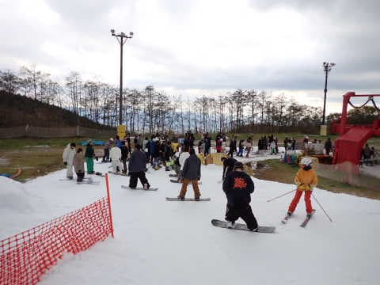

# 2022/10/29(土)のイエティ詳細レポート！…コース幅はちょっと広がったけど人が多め．でもゲレンデはそこまで荒れず

📅 投稿日時: 2022-10-31 04:07:23

🏷️ カテゴリ: [2023スキー滑走日記](cd943df30cfcc3d0896469e2ff98720cd.md)

というわけで．

今日は休日というのに．

やっぱり昨日スキーに行ってる場合じゃ

なかったのか…

仕事を終えて，それからBlogを書くと

こんな時間…（泣）

もう，午前4時を過ぎてるよ（涙）

でも．眠いけど，

土曜のイエティの詳細レポートです！

ってなことで．

まず，朝9時のオープンを狙って，8時40分くらいに

入口に向かいますが…

リフト券売り場の列は無かったけど．

ゲート入り待ちの列が，すでにかなり長くなっていて．

…すでに，今日は混みそうな予感…（ちょい涙）

9時にゲートがオープンして，ゲレンデに

行くと…

あさイチはちょいと雪は柔らかめながら，

圧雪かけたてのいい感じのバーン！

そして，朝のうちは人も少なくて…

コース幅も先週よりは広がって．

朝の30分くらいは「10月でこれだけ滑れれば

上出来！！」

という，かなりの快感バーン！！

朝のうち3本ほどは，こんな感じのガラガラ

バーンを気持ちよく飛ばせて．

この時期にしては上出来の

「あぁ…スキーができてシアワセ！！」

ってバーンでした～！！

けど．

オープンから30分も経つと，リフト待ちも

長くなってきて…

9時半過ぎには，コース上の人口密度が

だんだん上がってきて…

10時近くになると，もうゲレンデの人口

密度はすごいことに（泣）

うん．

ちょっとこれ，快適に滑れる人口密度は

既に突破してるよね（涙）

ただ，10時にはクワッドだけじゃなく，

ペアとの2本体制になったので，

クワッドでのリフト待ちは，だいたい

このくらい．

そして，並行するペアリフトは終日

ほぼ待ちなしで．

最大待ち時間は，せいぜいこんな感じで

搬器2-3台待ち程度．

リフト待ち的には，ペアを使えばそれほど

ストレスな待ち時間ではなかったから，

…まぁ，20分待ちの軽井沢のオープン直後の

週末より，リフト待ちはマシかな？

でも…

リフト待ちは少なくても．

リフト2本分の人間が，ゲレンデにあふれるので…

10時以降は，人口密度的にはかなり

すごいことになってます…（泣）

でも．

先週よりコース幅も広がってくれて．

時折日が射したものの，基本的に曇り空で

日差しで雪が緩まなかったので，

バーンコンディションは悪くなかったし．

時折，運がよければ目の前の人があまり

いないタイミングで滑ることもできたし．

うーん．

まぁ，10月と考えればまだ許されるかな？

…ってか，この時期に滑れるだけでも

ありがたい！

結局，この日は終日リフト待ちはこのくらいが

平均的な感じで．

リフト待ちはそこまでひどくなく．

曇り空で，雪もそこまでひどくならなず．

気温は，昼間は薄手の上着で十分な

くらいだったけど，午後3時近くになると

スキーウェアのジャケットを着たくなる

くらいの冷え込みになったので．

雪はザブザブになることは無く．

最後までコース上に穴が開いたりせず．

一番雪が薄いところでもこのくらいで，

ちょっと下地が透けて見えるかな？

という程度．

コースの人口密度は高かったものの．

比較的良好なバーンコンディションのまま，

16時のコース整備まで滑れたのでした…

そして，16時から17時のコース整備のために

一旦コースクローズとなりますが．

17時のコース整備完了を待って…

オープンと同時にコースへ飛び込む！

うほほほほ～！！！

ナイターの先頭，いただき～！！

前に誰もいない，圧雪かけたての

シマシマを滑れるこのシアワセ！！

10月のこの時期に，シマシマバーンを

独り占めで滑れるなんて…！！

朝の数本と，ナイター開始直後の，

人も少なくてコースもほとんど荒れてない

この時間のために滑りに来ていると

行っても過言ではない！！！

…と，気持ちよかったのもわずかな時間．

ナイター開始から20分，3本目になると…

人口密度が，昼間並みに上がってるんですが（涙）

というか…

もしかすると，昼間より人口密度が高いかも？？

ってなことで．

リフト待ちも，昼間よりすごいことに

なってきたし…

そのせいか，コースも昼間より荒れてきた

感じもあり．

残念ながら，18時にはきりあげることと

したのでした…

いや．

しかし．

今シーズンはまだ雨にやられてないので，

雪の厚みは十分だし．

コース幅も徐々に広がってきてるし．

リフト待ちも，せいぜい5分程度で．

ペアリフトは待ち0で乗れるし…

10月にスキーで滑れるだけシアワセ

と，今日もナイターまで，トータルで45本以上

同じコースをグルグル滑り続けてしまった，

Skier_Sなのでした…

いや．

ホントに．

人口密度が高かろうが何だろうが．

この時期に滑れるだけシアワセ…
