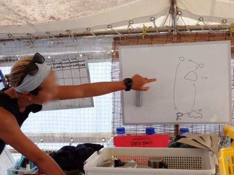
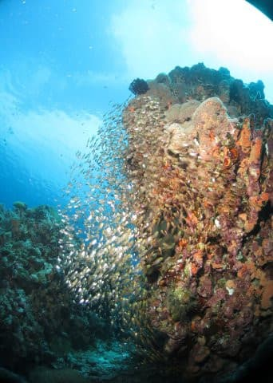
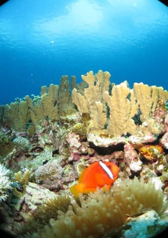
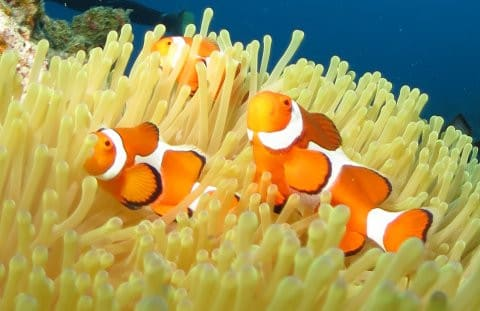
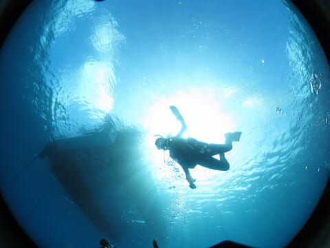
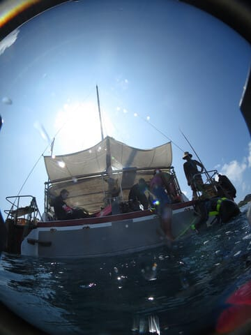

# 2024年8月，今年も座間味で親子ダイビング！その4…座間味ダイビング1本目！

📅 投稿日時: 2024-08-24 01:43:07

徒然山歩き＆ダイビング＆スキー日記という

節操がない感じになる，夏のこのBlog．

今週は夏休み明けの仕事が溜まっていたうえ，

2回にわたる南の島の現実逃避のため，

身体が仕事を拒否するようになり，

仕事が進まず，かなり厳しいBlog更新

で，さらに更新時間もばらばらという，

いろいろカオス状態でしたが…

やっと週末がやってきた…

これで会議やら雑用に中断されず，

落ち着いて家で仕事ができるぞ～！←やっぱり週末に休めないのね…

ってなことで．

週末に宿題ができるため，ちょっと時間に

余裕が戻ってきたため．

いつもの時間に更新！←それでも深夜1時過ぎなのだが…

座間味のダイビングレポートの続きです！

ーーー

（[前回はこちら](eba07e0dd54c297cbf64b2beda7dead4e.md)）

ということで．

我々を乗せた船は，晴天の座間味の海へ

繰り出していきます…

10分も経たないうちに，ボートはポイントの

付近に到着したようです…

場所的には，安慶名敷島の沖合っぽいところ．

ボートの上で，早速ポイントの説明が

始まりますが…

ポイント名は「送電線」

その名の通り，海底に島の間をつなぐ

送電線が走っているポイントです．

ざっくりとポイントの説明をしてくれますが．

ちょい深めのポイントですが，深いところに

行くと，キンメモドキやスカシテンジクダイが

ついている根があるということで…

うん．

私が好きな感じのポイントだよ…！！

海もべた凪．

天気も晴天となれば…

絶好のダイビング日和じゃないですか！

南の島のきれいな海を見て，

アゲアゲテンションのまま，

1本目へエントリー！！！

船の上からも海底が見えるほど

水が澄んでいる感じだったけど…

透明度も高いよ！！

実に1年ぶりのダイビングだけど…

娘も潜り方を忘れてないようだし．

私もフィンを忘れてエントリーしたり，

ウエイトを忘れてエントリーしたり，

バルブを開け忘れてエントリーしたり

しなかったので，大丈夫だな！！←これらすべてをやったことがある人

そしてしばらく深度を下げていくと…

魚がいっぱいついた，いかにも写真写りが

良さげな感じの根が出てきましたよ…！

根の下側に回ってみると…

ブリーフィングで説明があったように，

キンメモドキがごっちゃりいて．

写真映えしますね～！！

いや…

深度30m近いのに，これだけ明るいってのは…

かなり透明度がいいですよ～！！

ひたすらキンメモドキの群れを

撮り続けてしまうけど…

これだけ見事なんだから，撮り続け

ちやうよね．

そして…

この深度から空の雲がみえるこの透明度の

すばらしさ…！

1年ぶりのリハビリダイブ1本目から，

かなり満足度の高いダイビングですよ！

娘もカクレクマノミさんやらを

ながめたりできて楽しいようで…

楽しそうな感じで，

1年ぶりのダイビングとは思えない

安定度で潜っているし．

何の不安もなく安心して見てられます…

うちの娘，まだ40本くらいのくせに

結構潜るの上手いよな…

ってな感じで．いろいろ眺めてたら…

早くもダイブタイム40分を越えてきたので，

ボートの下に戻ってきました…

安全停止の後に，エグジット！

いや…

1本目から，思いっきり満足度の高い

ダイビングでした…

やっぱりダイビングは楽しい！！

（[続く](e280eac36d9247efc32ddbaa524e5de13.md)）

## 💬 コメント一覧

### 💬 コメント by (新米パパ)
**タイトル**: Unknown
**投稿日**: 2024-08-25 15:49:00

これ、やばい透明度。

いーなー、慶良間。

### 💬 コメント by (Skier_S)
**タイトル**: ＞新米パパさま
**投稿日**: 2024-08-26 02:31:25

台風も来てなかったからか，透明度はすごい良かったですよ！！

やっぱり慶良間はいいですね~…

