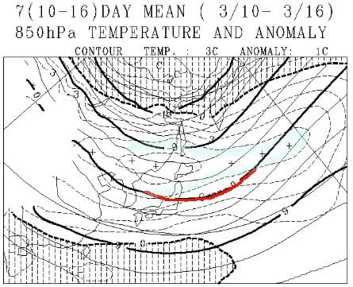

# 3月になったけど…これから一か月間のスキー場は冷えるのか…？一か月予想天気図を読み解いてみたけど（涙）

📅 投稿日時: 2018-03-02 01:56:53

🏷️ カテゴリ: [スキー天気予想](c6554f5c3c106093b511a8daae23757e8.md)

えー．

激烈低気圧が通過した本日．

夜明けごろから雨になったものの，

志賀高原は明け方まで雪のままでいてくれて．

さらに予想通りに，雨はそれほどはひどくは

降らなかったようですね…

リフトも全滅とまでは行かなかったみたいですね．

（かなりの数のリフトが止まったけど）

とはいえ．

昼まで結構気温が高く．

そのあと，夜になって冷えたので．

やっぱりゲレンデはガリガリに

なってそうです…（激涙）．

なんてこった…

あぁ…今週末はダメか…

そして．

最新の土曜の予想天気図を見てみたところ．

ほぼ昨日と同じで．

積雪はなく，晴天＆高温になりそう…

という天気図のまま．

で．

今日出た，4日日曜の詳細予想図を見ると．

日曜の地上天気図は…

うむ．

水色に塗った降水域は日本の西側にとどまっているので．

志賀は予想通り，朝は晴れそうですね…

で．

850hpa気温図を見ると…

やっぱりダメだ～っ！！！

3月上旬の朝9時で，赤い0℃線は津軽海峡付近まで

北上してて…

志賀には+6℃線が！

…これは，朝イチですでにプラス気温か…

放射冷却で朝イチの一瞬だけは固いかもしれないけど．

日曜は朝早くから，柔らかいシャーベット状の

春の雪でスタートしそう…（泣）．

そして，日曜昼間は気温がぐんぐん上がり．

雪の表面は，4月下旬並みのグサグサの

重い雪になること確実…（泣）．

ああ…なぜ…

3月になったばかりだというのに…

でも．

きっと…

きっと，この3月は．

5，6日ごろまで気温が高いけど，それ以降は

激冷えになるはず…っ！！！

と，信じて．一か月予想図をみてみるのだ…っ！！

が．

え？？

なにこれ？？なに？？

矢印で示した，3月の850hpa予想気温．

平年より2℃～5℃高い日が続きそうなんですけど！？

…この図の中心より左部分，2月の気温は

平年より-1～2℃低かったですが．

あれだけの例年にない寒さでも，平年比-2℃ですから…

平年より4℃高いってのは，かなりヤバいですよ…（涙）

3月3日から9日までの850hpaの平均気温予想図を見てみると．

…3月上旬というのに，赤く印した0℃線が，志賀高原に

ぎりぎりかかる程度とは…！

普段なら余裕で志賀より南にある時期なのに！！

そして，水色で示したのは，平年より4℃高いと

予想されているエリア．

志賀高原はこのエリアに入っているので…

平年比+4℃ですか…！

一週間の平均で+4℃って，異常高温なんですけど（涙）

普段はありえない，おかしいレベルです…（泣）．

そして今度は．

3月10日から3月16日までの一週間の

850hpa平均気温図ですが．

…こちらも，0℃線がぎりぎり志賀に掛かる程度．

…降れば雨か雪か微妙な気温…

普通，3月はもう少し冷えるものですけど！？？

そして，水色で塗った平年比4℃高いエリアは

志賀から外れたものの．

それでも，志賀高原は平年比+3度高いエリアに

入ってます．

この週も，異常高温レベルです…（涙）．

で．

最後に．

3月17日から3月30日までの2週間の850hpa気温ですが．

…うーむ．

0℃線が志賀より北に行っちゃってます…

3月下旬，降れば雨になる確率がかなり高いです…（激烈涙）．

そして，水色で塗ったのは平年比+2度のエリア．

志賀高原は+2℃以上のエリアにすっぽり

入っちゃってるので．

うーん．3月後半もかなりの高温…（残念）

ってな感じなので．

大変残念なことに．

この3月．

2シーズン前の雪不足の年と同じレベルの異常高温

となりそうです…

あぁ…

なんてこった…

1月2月は意味もなく冷えたのに雪は降らず．

そして，3月は異常高温…

どうしたことだ…

このままだと，春営業がかなりヤバい感じ…（涙）．

これは…

みんなで

「布団がふっとんだ」

「猫が寝こんだ」

「ストーブがすっ飛ぶ」

レベルの寒いギャグを言い続けて，

日本中を凍り付かせる計画でも発動

すればよいのでは…！？？

…

…などと，

正気を失う提案をしてしまうほど，

この長期予想図を見て．

激しく動揺しているSkier_Sなのだった…

## 💬 コメント一覧

### 💬 コメント by (FCAMEL)
**タイトル**: うーん
**投稿日**: 2018-03-02 02:19:56

Sさん・・・

＞＞レベルの寒いギャグを言い続けて，

＞＞日本中を凍り付かせる計画

ついにここまで来ましたか。。。

でも踊るより楽か・・・

では、早速ひとつ

「スキー、大スキー！」

凍れ、日本。

### 💬 コメント by (Skier_S)
**タイトル**: FCAMELさま
**投稿日**: 2018-03-02 20:36:27

寒い…寒すぎます…！！

あらゆるものが凍り付きました（笑）．

気温低下に協力ありがとうございます．

