# 4月30日の志賀高原は…今日も暑かったよ（涙）．雪が解けていく…

📅 投稿日時: 2015-04-30 20:59:51

えー．

本日も志賀高原に滞在中なわけで．

で．今日は（も？）行ってきました早朝スキー！

だけど．

今日も早朝から気温は高いよ…

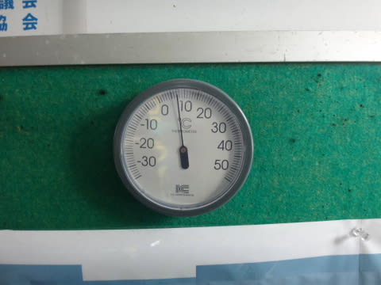

なぜ，早朝6時半からプラス7度もあるの…（涙）

で．天気は今日もぴかぴか晴天だったので．

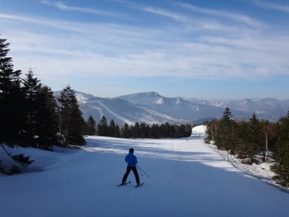

滑り出してから数本は，放射冷却のおかげで

冷えて締まったバーンを滑れたわけですが…

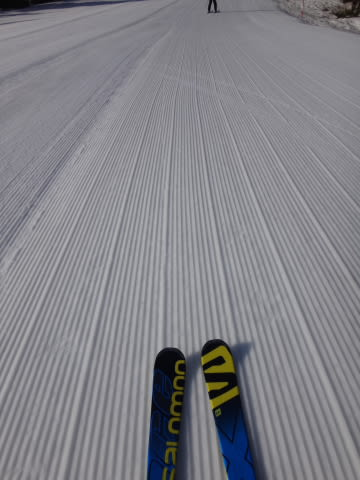

気持ちいいのも8時前まで．

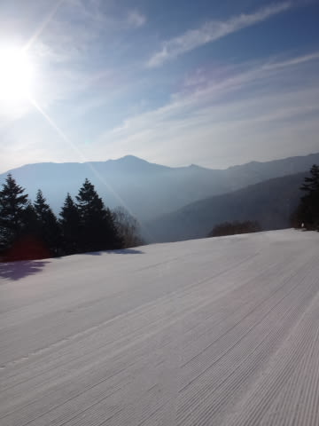

今日は，8時半の通常営業開始時にはもう

ザブザブでした…（涙）

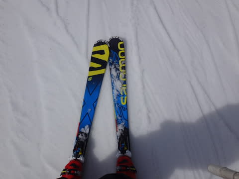

この．

この日差しが憎い…っ！←トップシーズンはあれだけ晴れて欲しい，といっておきながら…

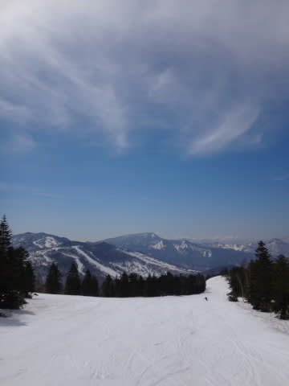

もう．

今日は平日というのもあり．

ホントにゲレンデは終日がらがらで．

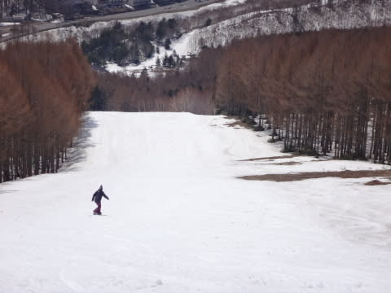

早朝が一番人が多かったかも？？

やっぱり，みんな早朝が一番いいって知ってるのね…

9時過ぎには，雪はねっとりと張り付く感じになっちゃったし（泣）

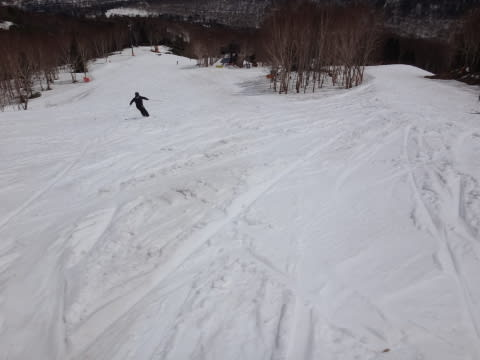

この強烈な日差しのおかげで．

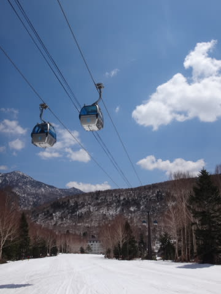

あらーーー．

第2高速沿い，唐松コースも

コースの真ん中に一気に穴が開き始めちゃってるし…

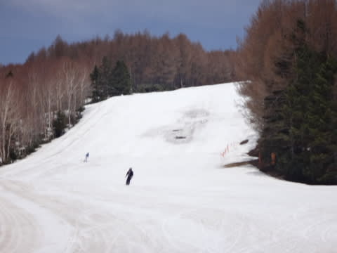

焼額から見た高天が原は，かなり土が出ちゃってて．

もうモーグルバーンは終了って感じかな～

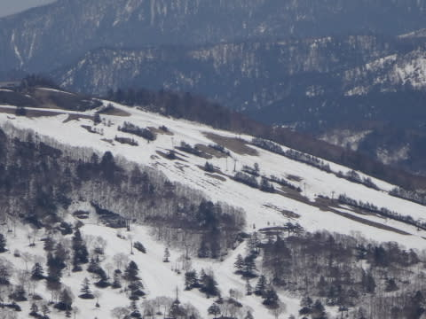

なんにしろ，プラス15度を超える昼間の気温と

強い日差しで，今日一日で，またかなり雪が解けました…

今はまだこれだけ雪があるけど，

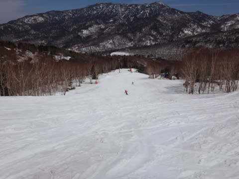

うーん．

この気温のままだと，5連休最後のころは

結構やばいかも…

午後はまたまた奥志賀のコブをすべりに行ったけど．

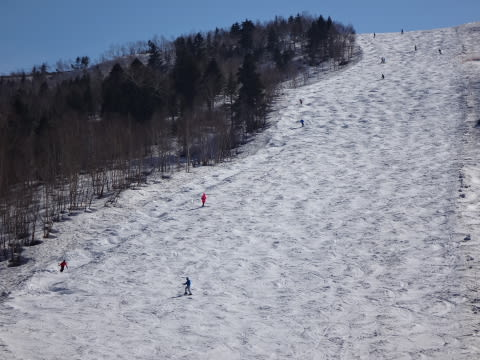

雪は汚れちゃってて，板のすべりはあまりよくなく…（涙）

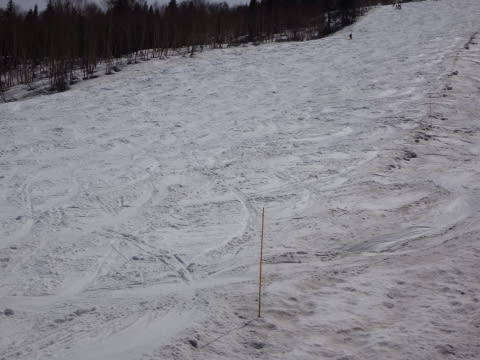

うぎゃーーーっ！

なんだか，そろそろコブ溝に，ちょっと危険な感じが…

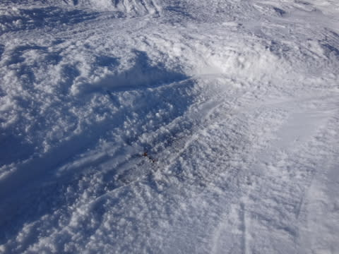

今日は，この一箇所だけだったけど．

…この勢いで雪が解けたら，2-3日後にはかなり

土が出始めるかも…

うーむ．

奥志賀の一番下は，まだこんなに雪があるので．

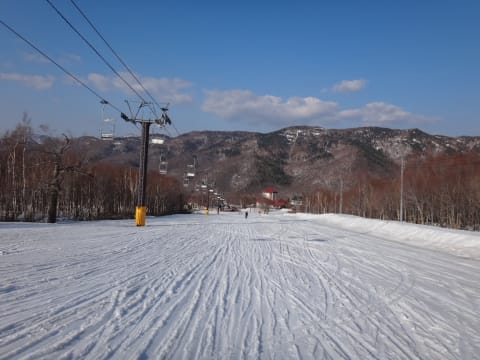

まぁ，GW5連休中に滑れなくなっちゃう，ってことは

ないだろうけど．

うーん．

そろそろ，コース上のいろんなところに穴が開き始めるかも…

ってことで．

今日もリフトストップまで滑り続けたわけですが．

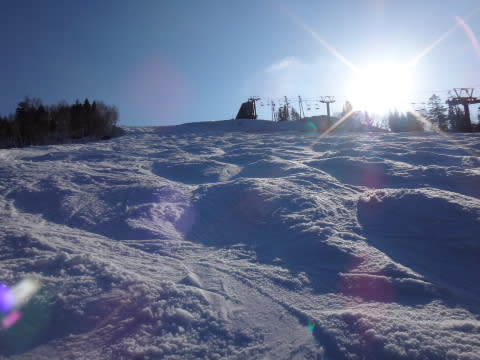

しかし．

…晴れてくれるのはいいんだけど．

暑すぎ．

Tシャツで汗だくになる気温って．

…GWの志賀ではなく，夏スキーって感じなんですけど…

あまりにもすごい勢いで雪が解けるので．

もう，晴れはいいから曇って欲しいなぁ～

＃雨は勘弁です～
