# 3月3日の志賀高原は…予想ほどではなかったけど，かなり良いコンディション！

📅 投稿日時: 2013-03-03 22:53:58

えー．

この週末．土曜の昼ごろには

「スキーに行くのは無理でふ…（涙)」

って仕事の状況でしたが．

昨日の記事を書いて2時間後．

「何とかなりそう…かも」

（なんとかなってないけど，必殺の呪文「できたことにしてしまえ！」を発動した，という説もあり）

ということで．

日曜日，強引に日帰りで志賀まで行ってきました．

ってことで．

この日曜の志賀高原の状況をば…

朝は…うっすら日がさしてるけど，予想通り，雪がそこそこ降ってましたね～

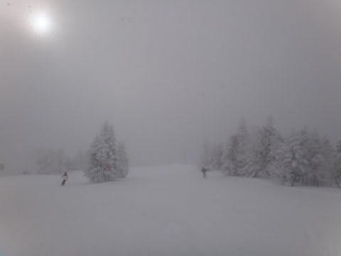

そして，気温はマイナス12度．

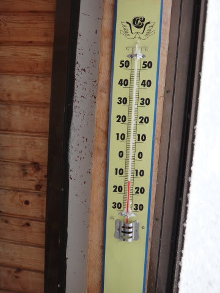

予想通り，結構冷えてます！

昨日からの雪は…

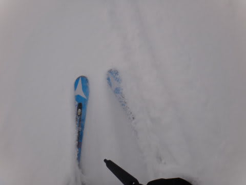

整地バーンでこの程度積もってます．

うーん．

朝イチはそんなに降らないで，ピカピカ圧雪バーンかと思ったけど，

圧雪をかけた後の，明け方の積雪が思ったよりあったみたいだなぁ．

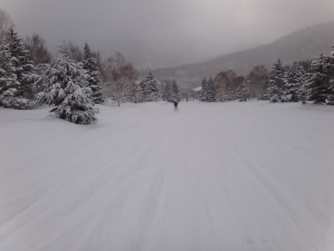

だったら，オリンピックコースに行ったらパフパフかも…？

と，行ってみたところ…

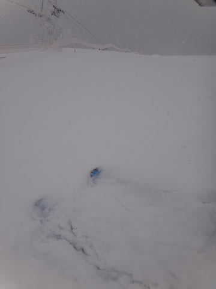

うーん…

…そんなに深くなかった．残念っ！

10cm～20cm，ブーツパフってところ．

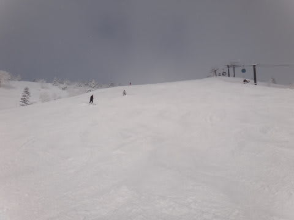

でも．

やわらかいトップシーズンの雪なので，快適！！

昨日のアイスバーン(私は滑ってないけど…)に比べたら，天国でしょう！

予想通り，10時半ごろから薄日も射し始め，

圧雪バーンでも5～10cmほど積もった新雪を蹴散らしながら気持ちよく滑れますね～．

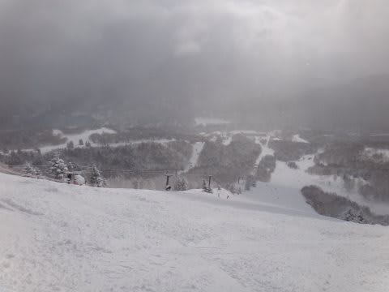

とりあえず．

昨日スキーで滑れなかった憂さをはらすのだっ！！！！

と，ひたすらガツガツ滑っていたところ…

あり？

3月になったけど．

やっぱりゴンドラ混むのね…

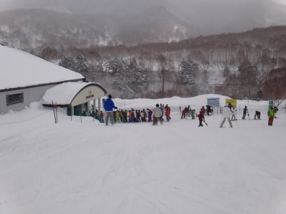

10時ごろには，焼額第1ゴンドラ5分待ちに．

そして…ゲレンデにも．

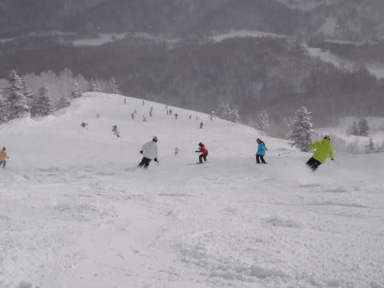

…こりは…

…ひ，人が多い…（涙）．

快適度が低いよ（悲）．

ちょっと残念な感じだけど．

まぁ，雪質自体はいいし．

5分程度のゴンドラ待ちがあったのはわずか1回．

あとはほとんど待ちがなかったし．

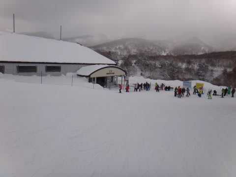

…なによりかにより，今日は．

本来，滑れないかと思っていたので．

滑れるだけで幸せ！

（ということにしておこう）

…でも．

ゲレンデの人口密度は11時半ごろまで高かったよ～

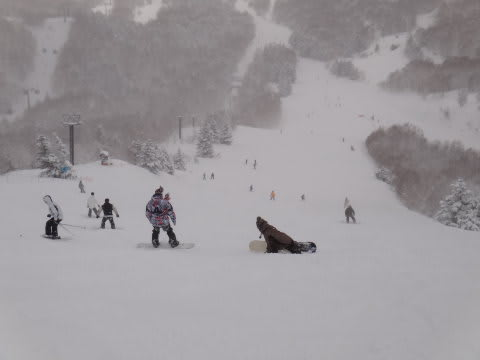

んで．天気はというと．

午前中も時々雪が激しく降ることがあったけど…

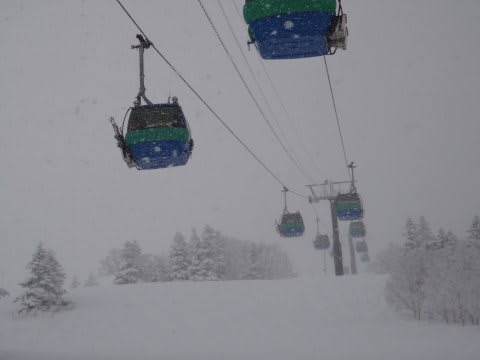

基本的には，薄曇りか，日が射す一日で．

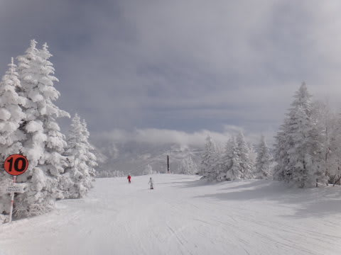

天気にも雪にも，比較的恵まれてましたね～．

あー．

でも．

昼近くになってくると．

急斜面でところどころアイスバーンがコンニチハしてくるところが…

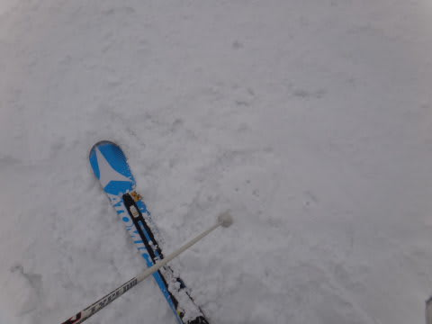

そして，オリンピックコースにはこんなコロコロが出現(泣）．

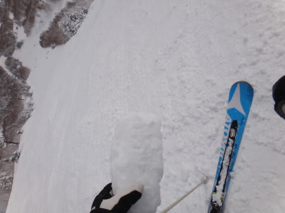

…まぁ，とは言っても．

固いのはゲレンデの一部だけで．ほとんどはやわらかいんですけどね～．

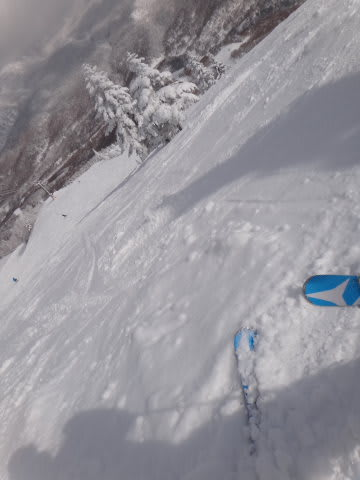

昼間の最高気温もマイナス5度ほどまでしか上がらなかったので．

終日雪質は良かったですよ～

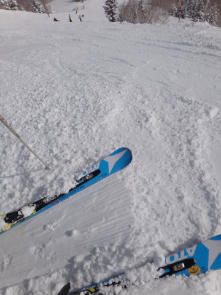

ごく一部のアイスバーンエリアを除けば，昼間でもこんな雪．

ああ…幸せ…

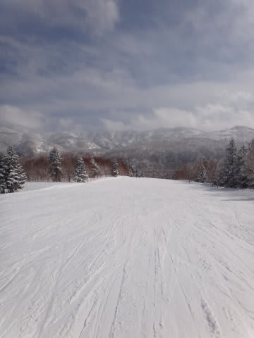

いつもどおり，午後になると人もいなくなり，こんなゲレンデを滑り放題…

生きてて良かった…(感泣）．

って感じで．

土曜はアイスバーン＆吹雪＆強風で最悪のコンディションだったらしいけど．

土曜にスキーに行けなかった私のことを神様が哀れんでくれたに違いなく．

この日曜は，かなり良いコンディションのゲレンデを楽しめたのでした…

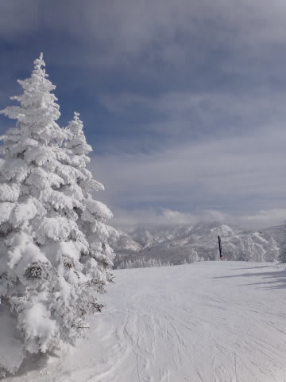

## 💬 コメント一覧

### 💬 コメント by (ひろりん)
**タイトル**: Unknown
**投稿日**: 2013-03-04 00:07:21

やっぱり志賀に行けば良かったです（TT)

だって、、、

硬い上に11時には気温がプラスでしたし・・・

志賀は、上林におっちゃん居るけどバス乗ればいいし。。。

4月の第1土日は試乗会があるのでサンバレー決定みたいです＞会社のスキー部（汗）

部員じゃないんですけど、なぜか呼ばれる（滝汗）

あ、今日ブランシュで八方の赤服目撃！

なぜかドキドキします。。。

### 💬 コメント by (Skier_S)
**タイトル**: 志賀は良かったです…
**投稿日**: 2013-03-04 00:44:47

今日はなぜか上林チェーンベースに，

チェーンチェックの人いなかったんです…

例年なら3月いっぱいの週末はいるはずなんですけどねぇ？

ブランシュ，気温がプラスに上がったんですか…

志賀はいい感じで冷えてました．

でも，明日からまた暖まるようで…

次の週末はかなり春スキーな感じです．

4月の第一週，私はダイヤモンドで試乗会に参加していますので…

### 💬 コメント by (gokuraku skier)
**タイトル**: Unknown
**投稿日**: 2013-03-04 19:49:03

こんばんは

昨日ですが、私も朝一からヤケビに居ました。

午後は一の瀬に移動しましたが。

ゴンドラ乗り場で何回かお見かけしましたが、中々声を掛けるまでには至らずでした。

それと、ミドルコースは滑りましたか？

なぜかあそこだけ膝下パウで先週より良かったですよ。

### 💬 コメント by (Skier_S)
**タイトル**: gokuraku skierさま
**投稿日**: 2013-03-05 01:47:52

ありゃ．

gokuraku skierさんにも発見されてましたか…

ミドルコースは滑ってないんですよ…

普段第3高速は乗らないので，

エキスパートコースが開いてる日には

滑り込むんですけど．

この日は朝のうちはエキスパートコースが

クローズだったんで…

そうだったんですか．

ミドルコースがパウダーだったなんて，

ノーマークでした…

