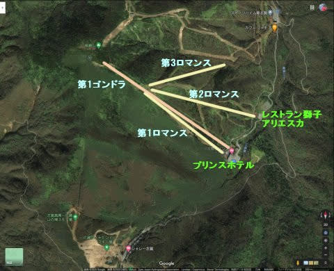

# 焼額山スキー場の歴史を振り返ってみる…1984シーズン，志賀高原にオープンした時のリフト・コースはどんなだったか？

📅 投稿日時: 2020-09-19 06:08:45

🏷️ カテゴリ: [スキー雑談](c1f9d2cb7478308da16419928ea3945e9.md)

えー．

なんだか，[以前記事にした焼額山マニアッククイズ](e652a8e591d583bd1347c87c3bba85845.md)．

このネタで，私の予想以上に焼額山の

歴史を懐かしがってくれる人が多かったので．

今回．

焼額山スキー場のリフト・ゴンドラが

オープン以来，どのように変遷していったか

というあたり．

…ちょっと歴史を振り返ってみましょう…

ただ．

Webをひっくり返しても，過去のスキー場マップは

出てきません（涙）

というか，スキー場オープンから20年ほどは

焼額もホームページが無かったと思うので，

そもそも電子版のマップなんて存在してないし．

だもんで．

限りなく不正確だという自信がある，私の記憶

をたどって再現してみたので．

間違いはいっぱいあると思います．

間違ってたら，「こうだったよ！」というツッコミを

コメントしてください！

…でも，それが正しいか検証する方法が私には無いので，

「そうだったかなぁ…」

というあいまいな返事でスルーするしか

ないのですが（笑）．

ってなことで．

まずは現在の焼額山スキー場の復習からですが．

焼額山常連さんにとっては，おそらく親の顔より

見ているであろう，2020シーズンのマップがこいつ．

（[焼額山ホームページ，ゲレンデマップ](https://www.princehotels.co.jp/ski/shiga/winter/coursemap/)より引用）

Google mapで見ると，焼額があるエリアは

こんな感じ．

赤く括った部分が焼額山エリア．

リフト・ゴンドラをこの上に重ねると

こんな感じで．

オレンジがゴンドラ，緑が高速リフト，

黄色がペアリフト．

現在は，計5本のリフト・ゴンドラがあります…

で．

焼額山オープンは，1983年12月．

1984シーズンにオープンしていますが．

その時の焼額山スキー場のゲレンデに，

ワーーーープ！

…焼額山スキー場．

なんと．

この赤色部分で囲った部分だけでした！

このエリアに，

第1ゴンドラ（4人乗りタマゴゴンドラ）

第1ロマンス

第2ロマンス

第3ロマンス

の4本のリフトが架かってました…

第2ゴンドラ，第2高速，第3高速，

第4ロマンスは影も形もありません．

今とオープン当時のゲレンデを比べてみると，

こんな感じですね…

（現在）

　

（オープン当時になかったコースを塗りつぶしてみた）

今より全然エリアが狭いし．

一の瀬から，すごく離れて見えますね…

っていうか．

この時．

まだ，一の瀬から焼額にまっすぐつながる

道路は造られてなく．

水色の道に沿って，奥志賀からぐるっと

回っていくしかなかったんですね～…！！

感覚的には，完全に奥志賀より奥の

スキー場なので．

完全穴場，ガラガラ．

一の瀬が激込みでも，焼額は誰も滑って

ませんでしたね～．

…そして．

焼額から一の瀬まで，沢が1本，

尾根を一つ越えなくてはならないので．

まさかこの数年後，焼額と一の瀬が

繋がるとは．

ゆめゆめ思ってませんでした…

（遠い過去を振り返る目）

とりあえず．

オープン当時の焼額山スキー場．

まだ，高速リフトが無かった時代で，

リフトも300mとか500mの長さが普通だったころ．

ゴンドラが約2km，

リフトも3本すべてが約1km．

どちらも乗車時間10分近くという，

当時の基準としてはおかしいほどの

超ロングコースなスキー場だったのが

印象的でした…

あ，コース幅は

今よりずっと狭く．

全てのコースが林間コース程度の

幅しかなかった思い出が

あります…

そうそう，レストランは，第2ロマンス

乗り場にあったんですよね．

確か，2階が獅子，

1階がアリエスカだったかな？

焼額はコース幅が狭く，奥志賀のダウンヒルの

方が圧倒的に広く滑り良かったので，

1ゴン→奥志賀ダウンヒル→焼額3ロマ→1ゴン

と回して，奥志賀ばかり滑っていた思い出が…

あ，この当時，奥志賀ゴンドラは無く．

ダウンヒルの一番下から山頂まで，

リフト4本乗り継がないといけませんでした…

…そうそう，この時は公式にはまだ

奥志賀と焼額はつながって無く，

ふみ跡のある草むらを数m突っ切って

焼額に抜けてましたね…

今じゃ，奥志賀ダウンヒルより

焼額GSコースの方が’圧倒的に広いので．

今だと，なんでそんな無駄なことをするのか…

と思ってしまうでしょうが（笑）．

ってなことで．

今回は，オープン当時の

焼額を振り返りましたが，

次回以降，現在までの変遷を

綴っていきます…！

子供の頃の記憶なので，一部間違ってるかも．

確か，1歳か2歳のときだったかな…？←嘘

（[次回](ecbab91b3def3f225ca2f665143d0d3fc.md)へ続く）

## 💬 コメント一覧

### 💬 コメント by (はなげ親分)
**タイトル**: Unknown
**投稿日**: 2020-09-19 08:30:23

〉1ゴン→奥志賀ダウンヒル→焼額3ロマ→1ゴン

開業当初からヤケビのリフトが大好きだったんですね！

1984年は私がスキーを始めた年です。それから9年たって恐る恐る志賀高原デビューしました。

その頃の私にとって志賀高原は神様スキーヤー達の住むところと思っていましたから・・・（汗）

まさか毎週通うことになるとは夢にも思ってなかったな～

### 💬 コメント by (Goku)
**タイトル**: 確かに・・・
**投稿日**: 2020-09-19 08:38:04

確かに遠かったですね。

新しいのが出来たって喜んで行ったら、林間コースの狭いスキー場ってイメージが強くて、その後はほとんど行きませんでした。

頻繁に行くようになったのは、２ゴンができて一の瀬と完全に繋がってからですかね～。

いつの間にかコースも徐々に広くなって、ＧＳコースは志賀で一番好きなコースになりました。

### 💬 コメント by (naoちゃんねる)
**タイトル**: Unknown
**投稿日**: 2020-09-19 17:02:08

オープン当時の焼額山はそんなんだったんですね！(驚)

その当時、私は白馬方面に連れて行かれてたので、志賀高原の様子は全然知りませんでした…

とても面白いです！続編が楽しみです！！

### 💬 コメント by (ほっぽ)
**タイトル**: Unknown
**投稿日**: 2020-09-19 18:48:04

Sさん

私が志賀高原デビューしたのは1988年、しかしヤケビにはたどり着けず、

多分夜景デビューは1991年だったと思います。

その頃には１高、２高、２ゴンもありました。

とことん志賀高原という雑誌で混んでるヤケビの穴場ランチ処は２ロマ下の獅子とアリエスカと書いてあり、

暫くは獅子ばかりに寄ってた気がします。

何もかも全て懐かしいです😅

http://www2.tokai.or.jp/nana_hoppo/

### 💬 コメント by (Skier_S)
**タイトル**: Unknown
**投稿日**: 2020-09-20 03:02:40

>はなげ親分さま

当時，奥志賀のリフトは全て低速シングルかペアで，

焼額のゴンドラの速さ，防寒性は驚きだったんです…

でも，私も毎週通うようになるとは思ってませんでしたね～…！

＞Gokuさま

ホントに，一の瀬から30分以上．

蓮池から横手より遠いイメージだった気がします．

最初は奥志賀のダウンヒルが広く感じるスキー場だったのに，

知らぬ間にすごいコース幅になっていきましたね…！

＞naoちゃんねるさま

そうだったんです…オープン当時の焼額は，今と全く違います．

ゴンドラも架けかわったので，オープン当時のリフトは今は一本も残ってません．

続編をお楽しみに！

＞ほっぽさま

1991年だと，2ゴンができてしばらく，スキー場も激込み

だったころですね…

それから30年．

こんなに志賀高原がガラガラになるとは…

### 💬 コメント by (いちと)
**タイトル**: Unknown
**投稿日**: 2020-09-20 07:06:18

いいネタ提供ありがとうございます

当初は奥志賀から焼額に行くルートだったとは、嫁に少し知ったかぶり出来そうです

私の初めての志賀高原は、1991年のプリンス南館オープンの時だった気がします　その時は、ノーマルタイヤのゴムチェーンで豊科から永遠下道で行ってました　それから段々道がよくなり、私も四駆に乗り換え上林の4×4ステッカーを貰ったのを覚えています

### 💬 コメント by (ゆーき)
**タイトル**: Unknown
**投稿日**: 2020-09-20 08:14:49

なるほど、

ということは、

一の瀬、焼額山の接続が、

中央エリア、特に、

ほっぽ、西館から、サンバレーの衰退につながったのかな、、、

### 💬 コメント by (通りすがりの)
**タイトル**: Unknown
**投稿日**: 2020-09-20 09:30:37

答え合わせみたいで空気読んでないかもしれませんかが、1987年のマップを掲載されていらっしゃる方を見つけましたよ！

やはり第2ロマンスB線というのが存在していたようです。

https://4.bp.blogspot.com/-eHEDoV_lgfQ/VKFLIwJn6lI/AAAAAAAADHo/5VUtrRciPfE/s1600/87%E5%BF%97%E8%B3%80%E9%AB%98%E5%8E%9F%E3%83%BB%E7%84%BC%E9%A1%8D%E5%B1%B1%E3%83%91%E3%83%B3%E3%83%95.jpg

### 💬 コメント by (yumi)
**タイトル**: Unknown
**投稿日**: 2020-09-20 14:01:38

Ｓさぁ～ん🏔️⛷️💨

やっぱり😁

獅子の下は 和食の🍑ななかまど🍑だったのね☺️✌️

私も Ｓさん同様 子供👧の頃←ドスッ‼️

だったので、記憶に自信が無くて・・・

でも、焼額山オープンの頃は まだスキー⛷️💨は 始めて無かったです✨✨✨

### 💬 コメント by (Goku)
**タイトル**: Unknown
**投稿日**: 2020-09-20 21:03:30

２ロマＢ線は見たことも聞いたこともありませんでした。

今も痕跡は残っているのか、今シーズン気にしてみます。

まさに幻のリフトですね。

### 💬 コメント by (Skier_S)
**タイトル**: 意外とコメント欄が盛り上がる…
**投稿日**: 2020-09-20 23:18:02

＞いちとさま

2ゴンができてからの焼額デビューだったんですね．

その時は，1ゴンがタマゴゴンドラだった以外，

今ともうあんまり変わらない感じですよね…

道路はオリンピックの前にむちゃくちゃよくなりましたよね！

うちの親も，4x4のステッカーもらってました…

懐かしい…

＞ゆーきさま

うーむ．

どうでしょう…これは歴史のIfかもしれなくて．

焼額が無くて，中央エリアと奥志賀が独立した，

それぞれ中規模スキー場になっていたら，

これだけ志賀高原にお客さんが来なかったのかも…

という思いもあります．

ゴンドラ計4本，高速リフト16本という巨大な機動力のエリアが

板を履いたまま全て移動できるスキー場じゃなかったら，

少なくとも私は志賀に通ってませんでしたから(笑)．

＞通りすがりのさま

いやいや，貴重な情報ありがとうございます～！

そうか…

私の来てない時に，第2ロマンスB線がやっぱりあったんですね．

私が焼額で唯一乗ってないリフトだと思います…

＞yumiさま

そうなんですよ…

昔，獅子は2ロマ下にあり，和食ななかまどと一緒でした．

そんなに広くなく，結構混んだ思い出があります．

でも，ヤケビオープンの頃って，yumiさんも赤ちゃんの頃ですよね（噓）

＞Gokuさま

私も2ロマB線は実物見たことないです…

2ロマがフルスペックの時は何度も乗ったんですが．

降り場は，確か3ロマ横というより，

1ロマB線降り場の真横くらいにあった感じです…

