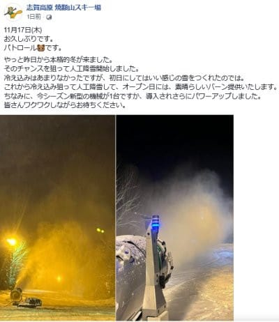

# 読者の皆さんは，今週末も私がイエティに滑りに行くと思ってるでしょうが…残念（泣）

📅 投稿日時: 2022-11-19 01:13:03

🏷️ カテゴリ: [日記](cc4b5682fb7b8b144980957a978653fb0.md)

えー．

17，18日もそこそこ冷え込み．

わがホームゲレンデ，焼額でも

ついに人工降雪が始まったようです！！！

（[焼額山スキー場Facebook](https://www.facebook.com/yakebitaiyama/posts/pfbid02x8WBBRizSy9Ja9FoTCeHqurEjC68g4aBTMHPqGreqox9CyuYjVSsjRVa3GsyWbmNl)より）

ただ…やはり冷えたのが遅すぎたのか．

熊の湯の19日オープンは無理だった

ようです（涙）

そして，人工降雪が打てるのも，19日朝まで．

そのあとはしばらく気温が高い日が続き

ます…

ただ，20日の雨はそれほどひどい降りでは

なさそうで，気温も上がるけど，

そこまで激烈高温の予想ではなくなったのが

救いかな．

とはいえ．

次に雪が降りそうなのは24日．

それまでは，人工降雪も無理っぽい

気温なので…

熊の湯は，23日の祭日もオープン

できない可能性が高そうです（泣）

あ，23日オープン予定のかぐらも，

多分23日のオープンは無理ですね（涙）

ダメだ…

今シーズンも，11月下旬のオープンが

軒並み遅れそう…（激涙）

でも．

昨シーズンもそうだったのだ．

23日の勤労感謝の日になっても高温が

続いて，スキー場オープンが軒並み

遅れて．

23日オープン予定のスキー場オープンが

軒並み延期．

野沢も27日のオープン予定日を

遅らせるくらいだったのに…

24日ごろから一気に冷え込み．

一気にスキー場がオープン！

そして，12月第1週には，焼額の

ゴンドラが動くくらいに積もったので．

今シーズンもそうなってほしい…

…いや．そうなるはず！！！（強い信念）

ってなことで．

今週末も残念ながら，滑れるのは

Yeti，軽井沢，横手，ウイングヒルズ．

そして，アイスクラッシュで19日にオープン

する白鳥高原のみですか…

ということなので．

選択肢が広がらなかった今週．

当然これまでと同じように，今週末も

Skier_Sはイエティに滑りに行くよね…と，

読者の皆さんはお思いでしょうが．

…いや．

私も今日の昼ごろまでは，滑りに行く気

マンマンでいたんですが．

…どうやら．

私はコロナ感染者の濃厚接触者になって

しまったらしく．

現在，家にこもってます（涙）

これから数日，外出を控えくては

なりません…（泣）

残念…

滑りに行けなくて残念だ…

というか．

明日朝，発症しないかどうか心配するほうが

先のはずなのに．

なぜかそれよりも，週末に滑りに行けない

悔しさの方が先に立つ，

Skier_Sだったのでした…

今のところ体調はなんともないのに，

これで滑りに行けないのが悲しい…

どうせ濃厚接触するなら，

冬将軍と濃厚接触したかった…

## 💬 コメント一覧

### 💬 コメント by (オオスギ)
**タイトル**: Unknown
**投稿日**: 2022-11-19 10:51:12

S様、濃厚接触者お気の毒です・・・

という、わたくしも先日濃厚接触者だったのですが・・・

なんか、休む期間が非常に短くなり3日目に、キット検査陽性でなければ即出社！！したのですが・・・

コレってもしかして「ブラック企業の典型でしたでしょうか・・・」

違反行為でしたら、皆様よきアドバイスをお願い申し上げます・・・

（といっても、労使に入ってないので立場は極弱なんですが（涙）

### 💬 コメント by (Skier_S)
**タイトル**: ＞オオスギさま
**投稿日**: 2022-11-20 02:02:29

あら．濃厚接触者になっちゃいましたか…

まぁ，3日後にキットの検査が陰性だったらほぼセーフでしょうけど．

一応厚生労働省は，接触日を0日目とカウントして，5日目までは

感染予防の行動をしましょう…

と推奨しています．

あくまでお願いであって強制ではないので，違反とかいうわけではないのですが．

私は火曜までは出社を控えて在宅勤務することになっています．

私の場合，濃厚接触者は出社の際は抗原検査しなくてOKなので，オオスギさんの職場の方が

その点ではしっかりしているのかも…

### 💬 コメント by (musi)
**タイトル**: Unknown
**投稿日**: 2022-11-21 14:42:58

結構自費で抗原検査する人多いですよね。

因みに、濃厚接触者について埼玉県のHPには、

2日目及び3日目に抗原定性検査キットによる検査を行い、陰性であれば3日目から待機解除が可能　

と書いてあるので、本当は2回検査するのを推奨してるのですかね。

私はただでさえ加齢で体力落ちてる所に、コロナ感染して、三週間経ちましたが、なんかスッキリしないくて、今シーズンのスキーが心配です。やはりかからないに越した事は無いです。Ｓさんの無事を祈ります。

### 💬 コメント by (Skier_S)
**タイトル**: ＞musiさま
**投稿日**: 2022-11-21 23:52:01

あら．抗原検査キットで検査すれば，3日目から待機解除可能なんですね…！

私はどうせ在宅勤務メインなので5日間家で待機します．

しかし，コロナ感染から3週間たっても後遺症が残るんですか…お大事にお過ごし下さい．

私は幸い4日目も発熱無しで乗り切ったので，このまま発症無しで行けそうな感じです！

