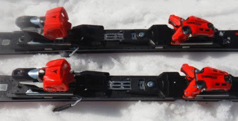

# 2023シーズンモデルのスキー板，試乗レポートその26…ATOMIC S9i PRO

📅 投稿日時: 2022-07-12 02:53:21

🏷️ カテゴリ: [スキー板試乗](c0bd8048615710cee890e403a36cc9a2b.md)

ってなことで．

昨日の記事の冒頭に書いたように，

我がLEVORGも4年目の12か月点検．

とりあえず，10万km近くになったので，

プラグを交換してきました…

水平対向じゃなきゃ，点火プラグくらい

自分で換えたいところだけど．

水平対向エンジンのの点火プラグの交換は

めんどくさいので，12か月点検の

ついでにお願いしてきたのだ！

あとは，エアクリーナーエレメントと

オイルとオイルフィルター交換．

10万kmで交換推奨の燃料フィルタは，

6万km走行を超えたくらいで

リコールで燃料ポンプ交換してて，

その際にフィルタごとAssy交換してるはず

なので，おそらく今後変えなくても大丈夫だな…

次は12万kmを過ぎたあたりで，

F/RのデフオイルとCVTオイルを換えておけば，

その後しばらくはエンジンオイル交換だけで

15万kmくらいまで行けそうな感じかな…

うん．

このペースでいけば，7年乗っても

せいぜい走行距離17万kmくらい．

我が車として珍しく7年は乗れそうだから，

2.4LのLEVORGはいい車だったけど，

当分は買わなくて済むな！←なんかすごくフラグっぽい発言

ってなことで．

本日もスキーBlogらしくスキーネタ．

2023シーズンモデルのスキー板試乗レポート．

今回はアトミック編です．

では，どうぞ～！

○ATOMIC S9i PRO 165cm

基礎小回り

S9iと比べると，REVOSHOCKが入って無くて

さらに板自体も強くなる，このS9i 「PRO」

ですが．

S9iと違い，ビンディングも足元のフレックスが

強くなるVARビンディングが入ってます．

滑ってみると…

やっぱり，かなり硬さというか，張りの強さを

感じますね～．

板が結構固く，かつ重いので．

春の雪の荒れた凸凹が深くなった，

コブっぽい斜面は厳しい感じ…

荒れた斜面でガツンと衝撃を食らうと，

ちょっと板が硬めな分，しなやかに

乗り越えるというよりは，板がガタガタ

叩かれる感じ．

柔らかい春雪では，板をたわませるのも

難しく，板なりに進んでいく感じで，

ちょっとこの板の本領が発揮できて

ないかな～…．

ただ，ごくわずかに残っていた

荒れてない斜面では，重さと硬さで

雪面に吸い付くようにガッツリ張り付いて

切れていく感じがあったので，

完全フラットなしっかり締まった

硬めのバーンで，板をしっかり雪面に

張りつかせて滑れるような斜面なら，

コアの硬さもあってスピード耐性も

すごい高そうだし．

硬い斜面のグリップも強そうだし．

すごい本領を発揮しそう…

どんな雪でも滑れるオールラウンド性は

諦めて，整地のハイスピード小回りに

特化した感じを受けました…

昨シーズンより，フレックスが強くなったのかな？

多分，私レベルではこの板でコブ斜面を

滑るのはちょっと厳しいかも．

春の雪では，この板の真価が分からなかった

のが残念．

この板も，春のザブザブ雪じゃなく，

トップシーズンの硬い斜面で滑ってみたい

と思わせる板でした…

## 💬 コメント一覧

### 💬 コメント by (りやまやり)
**タイトル**: Unknown
**投稿日**: 2022-07-12 05:41:38

スキー、レヴォーグの記事楽しみにしています!

CVTオイルはどのくらい走行したら交換してますか？

### 💬 コメント by (NONAME)
**タイトル**: Unknown
**投稿日**: 2022-07-12 21:56:51

FX確定おめでとうございます

今は納期が予想以上にかかるので早く注文確定しないと車検に間に合いませんよ♡

### 💬 コメント by (Skier_S)
**タイトル**: LEVORGあと400kmで10万km
**投稿日**: 2022-07-13 04:07:51

＞りやまやりさま

CVTオイルは大体6万kmくらいで換えてます…

スバルに行くと無交換でOKって言われるんですけど，

かつてメンテフリーと言われたトヨタ車のCVTのオイル流路詰まりで修理費40万の

見積もりをもらった自分としては，ある程度では換えておきたいところです…

＞NONAMEさま

スバルでは1年近い待ちと言われました．

今からの納車はまだB型の価格で受注しているようですが…

1年後だとC型が出てるはず！？？

