# 2019年8月，座間味で小6の娘と親子ダイビング！その11 …ダイビング3日目スタート

📅 投稿日時: 2020-07-02 00:56:24

🏷️ カテゴリ: [ダイビング日記](ce3a7a8d424d112fce83ee85c81a0e344.md)

えー．

やはり，このBlog．

ダイビング日記は著しく人気が無いらしく．

先日のダイビング日記を掲載した日には，

一気にアクセス数が減ったのですが…

昨日，スキーネタに戻すとまたアクセス数が

復活して．

…とりあえず，このBlog.

車ブログでも，ガジェットブログでもなく．

まだ，スキーブログだと認識されているらしい

ということに，ちょっと安心している

今日この頃．←いや，でも，スキーネタより車ネタの方が，アクセス数が圧倒的に多いんですけど！？？

皆様いかがお過ごしでしょうか．

ってなことで．

車ブログでもガジェットブログでもない

スキーブログである，このBlog．

本日はダイビング日記です！！←だから，なぜいつもそんな矛盾した自己主張をするんだ…？？

---

…ということで．

夜が明けて，座間味ダイビング3日目の朝…

うむ．

今日もいい天気になりそうですね…！

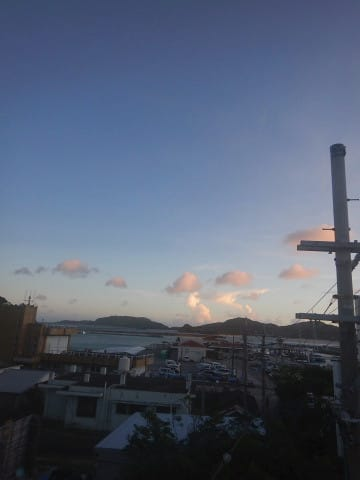

…しかし．

今日がダイビング最終日か…（涙）

楽しい時間が経つのは早いもの…

ってか，時間が過ぎるの，早すぎるんですが．

…座間味って，時空歪んでないか？？

と．

時空のゆがみを疑いながらの朝ごはんタイム．

1日おきに和食・洋食が交互に出る，

ペンション星砂さん．

今日は和食の日ですね…

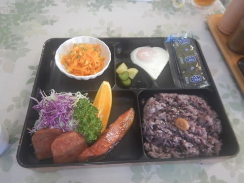

朝ごはんからボリュームたっぷりです．

んで．

ご飯を食べたら，

8時半のボート集合に合わせて，

宿を出ますが…

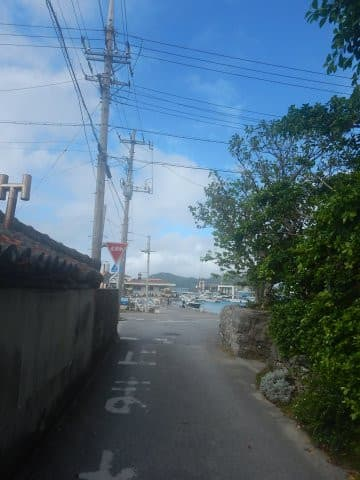

うーむ．

なんだか，陸上撮影にも使っている，

30m防水カメラのAW-130．

カメラ内部が結露したのか，レンズの中に

曇りが出て，写真がぼけて来てるんですけど…

これ，ヤバい…

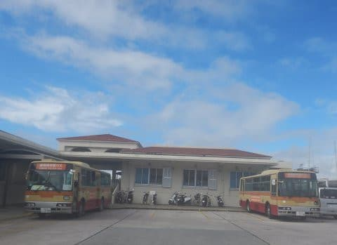

（相変わらず，K奈川県民が反応しそうなバス)

とりあえず，

まだ動くから大丈夫かな…？

と．

いつものティンガーラ号に乗船．

キャビン前部の絵，前回の記事に書きましたが，

やっぱりわが一家が愛用しているTシャツと

同じテイストですね…！

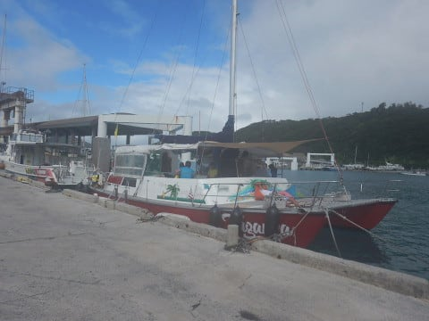

ってなことで．

乗船したら，まずは器材のセッティング．

3日目なので，娘もちゃんと器材セッティングを

思い出して，一人できちんとセッティング

できるようになったようです…

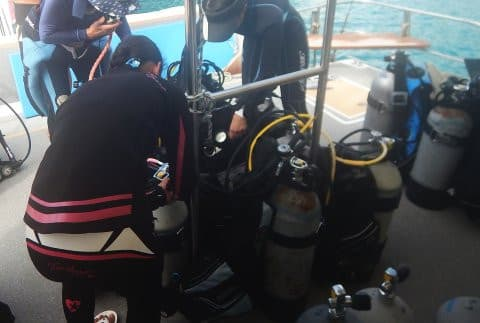

…でも．

また次に潜りに行く頃には忘れてるんじゃ

ないかな～？

そして．

器材セッティングが終わったら，晴天の中出航！

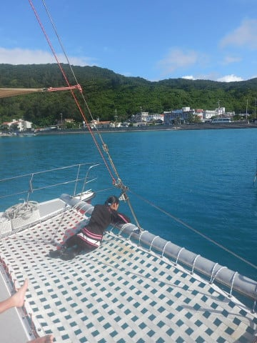

…娘はいつもの特等席です…

で．

ボートで走ること15分．

今日の1本目のポイントに到着したようです…

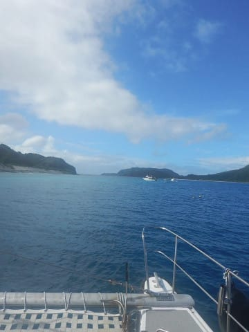

カメラが結露して，ちょっと写真がうっすら

かすんでますが．

やってきたのは，座間味の目の前の無人島，

安慶名敷島の目の前のポイント，

「アゲナシク」

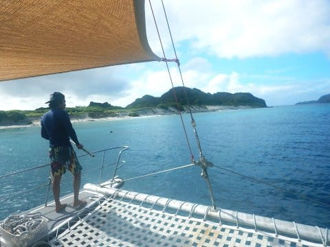

ダイビング前のブリーフィングが始まりますが…

今日は他のダイバーとは別に，

我が家で1チームとしてくれて．

オーナーがガイドをしてくれるようです…

最大深度12mの制限がある娘を連れていくので，

我が家だけで1チームはありがたい…！

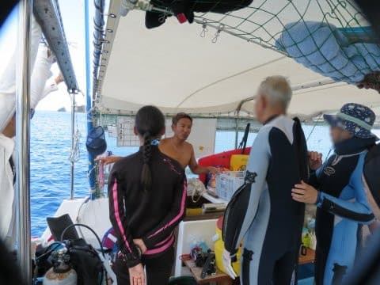

ってなことで．

ダイビングラストデーの

1本目，いざエントリー！

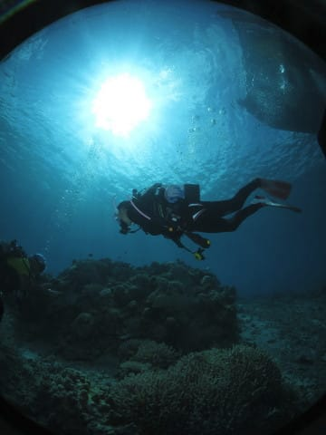

## 💬 コメント一覧

### 💬 コメント by (西館)
**タイトル**: お嬢様、もっと大きくなっていらっしゃるのでしょうね。
**投稿日**: 2020-07-02 01:31:14

板も買ったし気がつけば2週間後にアドバンスに挑戦だしで、Sさんのダイビング記事をせっせと読んでいるところです。

で、三宅島、良いですね。うん、かなり良い。

帰宅当日も潜れるから拍数少なくても行けちゃうところも良い。

伊豆大島って、熱海からも船出てるんですね。知らなかった。

私たち愛知県民にもぐぐっと近くなりましたよ♪

### 💬 コメント by (Skier_S)
**タイトル**: ＞西館さま
**投稿日**: 2020-07-03 00:36:07

をを！

もう2週間後にアドバンス講習ですか！

頑張ってきてください…

そして，三宅島．

いいところです…

ドルフィンスイムも楽しかったですよ～！

