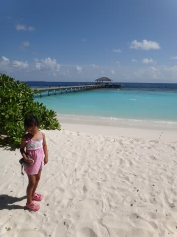
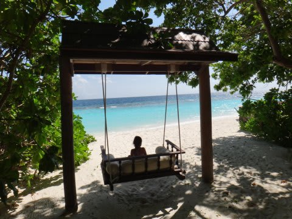
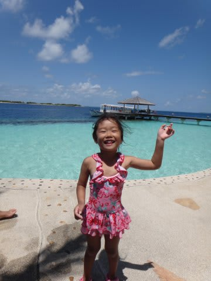
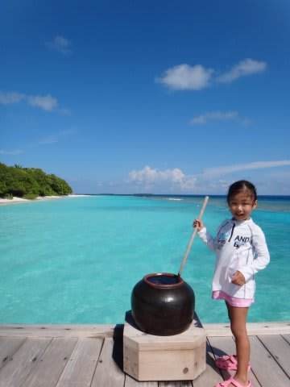
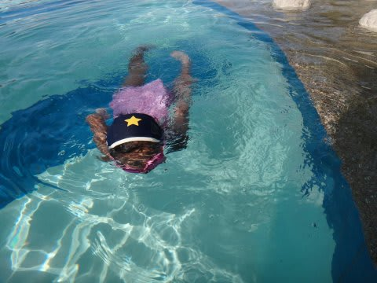

# 2012年　子連れモルジブ　ダイビング旅行記　エピローグ

📅 投稿日時: 2013-01-30 00:32:01

今回．

子連れ海外も4回目ということで．

もう，出発に際して，子連れ旅行に関する心配は全く無かったわけだけど．

旅行から帰ってきたとき．

これまでの旅行とは，ちょっと違った印象が残ったことに，

娘の成長を強く感じさせられたのでした…

これまでの旅行は．

「親のダイビング旅行に，子供を連れて行く」

って感じで．

いつもの遊び道具もTV番組も無い旅行先で，

子供にどうやって過ごさせようかな…

って．子供に飽きさせないよういろいろ気を使って．

その結果，旅行中に娘が機嫌よく過ごしてくれたことで．

「娘が無事旅行を乗り切ったので，自分たちもダイビングとか楽しめたなぁ」

って感想をもったんだけど．

今度の旅行では．

なんだか．

純粋に．

「娘と旅行，楽しかったなぁ～」

…って思った自分がいたことに気づいたのでした…．

今回．

親がいろいろ準備して気遣わなくても．

これまで，自分の主張があまりなかったので聞くことがなかった

「娘ー．何して遊ぶ？」

って質問をして．娘の好きなことをやってもらえば．

娘もしっかり成長したので．

旅行先でしかできないことを自分で選んで，めいっぱい

楽しんでくれるようになったし．

そんな感じで，親と一緒にプールや海で遊んだり，

一緒にお散歩して，きれいな景色に感動したり…と．

親と同じ時間や感動を共有できるようになって．

…子連れ旅行の楽しみが，また一段グレードアップしたなぁ…と．

しみじみと思った今回の旅行だったのでした．

これからも．

娘と一緒に．

いろんな感動を共有できれば．

人生楽しいんじゃないかな．と．

娘が何歳になるまで，親と一緒に遊んでくれるのかは分からないけど．

とりあえず．

一緒に遊んでくれる間は．

娘に．こう問いかけて．

一緒に喜びを共有して．

私も娘も幸せな時間を過ごそうと思う．

「娘ー．何して遊ぶ～？」

（おしまい）

## 💬 コメント一覧

### 💬 コメント by (komu)
**タイトル**: Unknown
**投稿日**: 2013-01-30 00:44:59

子供が成長すると小さい頃は遊んであげている気がしてましたが、実は遊んでもらっていた事に気付きました。

今では…スキーに遊んでもらってます…

### 💬 コメント by (KENKEN)
**タイトル**: モルディブレポートお疲れ様でした。
**投稿日**: 2013-01-30 22:29:21

長い？レポートお疲れ様でした。

(正直モルディブレポートは忘れてるものだと思ってました）

最後のエピローグは同年代の娘を持つ親としてしみじみと読ませて頂きました。

お互い娘がいつまで遊んでくれるか分かりませんが、今この時間を大切に過ごしていきましょう。

話変わって、今年は我が家の娘も本格的にスキーを始めました。

トライスキーを付けるとすぐに滑れるようになりましたが、ターンやブレーキがまだまだです。

（娘を担いで上げて、滑らしてで自分は毎回ヘトヘトですが・・・・）

今年もう少し練習して、来年は一緒にリフトに乗れるといいなと考えてます。

娘さんの今シーズンの上達のほどはいかがでしょうか？機会があればレポートをお願いします。

### 💬 コメント by (Skier_S)
**タイトル**: komuさま
**投稿日**: 2013-01-30 23:19:59

いやー．

おっしゃる通り．

なんだか，親が遊んでもらってるのかもしれません…

子供が親離れしてしまうと，遊び相手がいなくなって

さみしい思いをするんでしょうね…

でも，ホントに今回は，娘の成長を感じた旅行でした．

…何歳まで一緒に遊んでくれるのかなぁ．

### 💬 コメント by (Skier_S)
**タイトル**: KENKENさま
**投稿日**: 2013-01-30 23:28:19

いやーーー．

忘れてなかったんですが，予定外にスキー板を購入したり，

いろいろネタが続出したので，モルジブレポートはついつい

後回しに…

とりあえず．私も．

今，娘と過ごすこの時間を，大切にしていきたいなぁ…

と思います．

…人に聞くと，娘はすぐに親離れしていくようですから（笑）．

うちの娘は，3年間背負われて滑っていた経験からか，

スキーをはかせてすぐ（1-2時間?）でプルークで静止が

できるようになりました…

次の日には，志賀一の瀬のクワッドリフト滑ってましたから．

今シーズンも，近々娘のスキーレポート予定です．

いやー．上達しましたよ…

お楽しみに！

