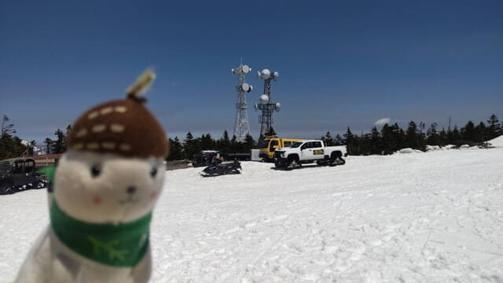
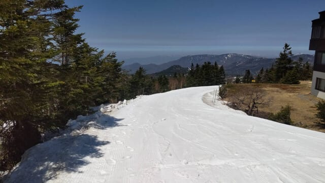
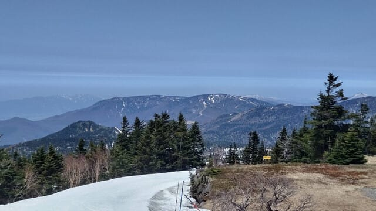
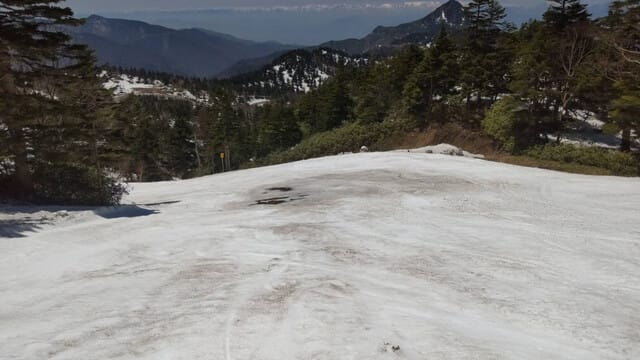
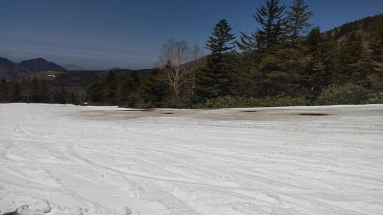

# 5月13日(火)の志賀高原スキー場，特派員情報！…そしていろいろクリティカル(泣)

📅 投稿日時: 2025-05-14 09:34:38

🏷️ カテゴリ: [日記](cc4b5682fb7b8b144980957a978653fb0.md)

えー．

GWに休んだ反動か，いろいろ仕事がクリティカル

です…(泣)

だもんで，昨日もBlog更新する時間も取れず，

気づいたらまた床で寝てる始末（涙）

どうせ寝るなら布団で寝たかった…

ということで．今日も朝に更新のわけですが．

そして，長い記事を書いている時間が無いので，

いつもの特派員情報のみでなんとか

乗り切るわけですが．

今日もおこみん特派員から，横手・渋の写真が

送られてきました～！

今日は渋峠からスタートしたようですが…

渋峠はまだほぼ全面雪が着いてるようです！！

で．

横手山から渋峠方面は，第3リフトが観光

専用で，スキーヤーやボーダーは専用

シャトルバスか車で渋峠まで移動しないと

行けないようですが…

渋から横手方面は滑っていけるようです！

まだ，第3の連絡コースは雪が十分

ついているようですね…

ただ，雪の滑りは悪かったようです（泣）

そして，横手山第2ゲレンデの着くと…

うーん．第2リフト降りてから，第2ゲレンデの

メインバーンに出るまでのところ，

ちょっと土が出始めていて…

そして，第2のメインバーンも結構土が出始めて

来てますね（泣）

…確かにこれは，今週末くらいで終わっても

不思議じゃないかも…

ちょっと残念…

ってなことで．

渋峠はまだ滑れそうですが．

横手山は今週末で終了．

朝7時から営業ですよ～！！

…しかし．

この時期にもまだスキー行っているというと

異常な人扱いされるし．

こんな時期にスキー場情報を求めている人は

かなり少ないんだろうなぁ…
