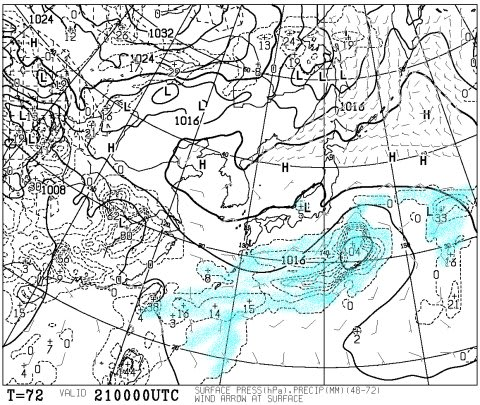
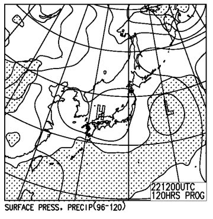
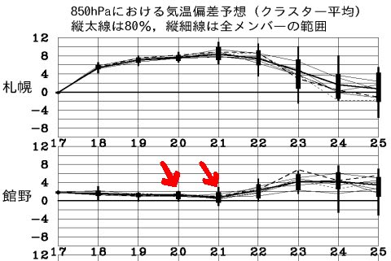

# 今週末のかぐらスキー場の天気は…って，気にする人いるのかな．まぁ，晴れでしょう…

📅 投稿日時: 2016-05-19 01:21:57

🏷️ カテゴリ: [スキー天気予想](c6554f5c3c106093b511a8daae23757e8.md)

さてさて．

今週末，まだかぐらが営業する予定なわけですが．

…だとすると．

やはり，天気予想をやらないわけにはいくまい…

ということで．

はっきり言って，今週末のかぐらの天気を気にする人が

どれだけいるのか？？？

…と，疑問を抱かざるを得ないのですが…

まず．

この土曜の地上天気図は，こんな感じで．

水色で塗った降水域は，日本海側にかかっていないので．

まぁ，時折雲が流れてくるものの．

かぐらはおおむね終日晴れるでしょう．

で．

日曜の地上天気図は，こんな感じで．

降水が予想される網掛け部分．

…この日も，日本海側にかかっていないので．

日曜も晴れそうですね～．

で．

この週末の気温ですが，

こんな感じで，大体平年並みの気温になりそう．

…まぁ，この時期．

平年並みの気温で晴天ってことは…

春スキーというより，夏スキーに近いレベルですね（笑）

ということで．

まとめると．

土曜：終日晴れ．暖かい一日．昼間はTシャツでも行けるか．

　朝から雪はザブザブ．時折曇るものの，しっかり紫外線

　対策が必要でしょう…

日曜：終日晴れ．この日も朝から暖かい一日…

　強烈な日差しで朝から雪はものすごい勢いで融け続け，

　かぐらゲレンデはおそらく末期的症状．

　まぁ，夏スキーのような感じでしょうか…

ということで．

今週末のかぐらファイナル．

いい天気で滑れそうですよ～っ！！

＃私はまだ行けるかどうか，微妙な感じですが…
