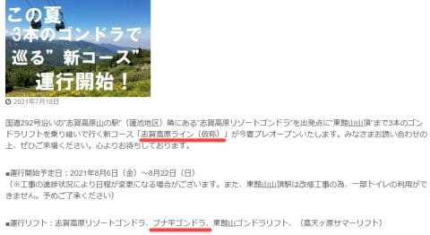
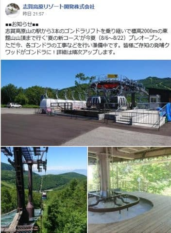
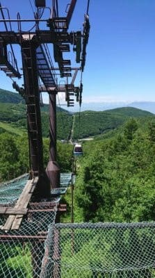
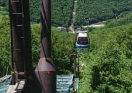
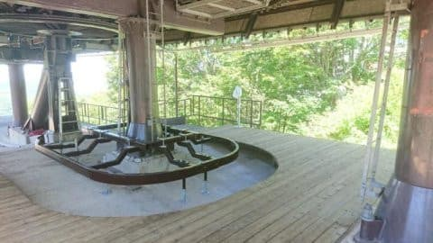
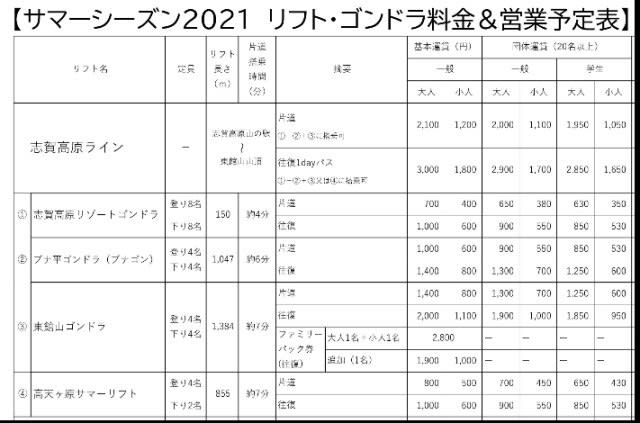

# え？なに？発哺クワッドがゴンドラに変更？それも8月6日から営業開始！？？

📅 投稿日時: 2021-07-20 05:12:00

えー．

かねてより噂には聞いてたのですが．

パルスゴンドラと東館ゴンドラを繋ぐため，

発哺クワッドをゴンドラにする

という話．

この発哺ゴンドラにより，山の駅から

東館山頂まで，ゴンドラ3本を

乗り継いで移動できるようになる

ということだったのですが…

なんと．

早くも8月6日から

この新しいゴンドラがプレオープン

という情報が，志賀高原中央エリアの

ホームページに載ってました…！

（[志賀高原中央エリアホームページ](http://shigakogen.co.jp/archives/10785)より）

発哺クワッドを掛け替えたゴンドラは，

発哺ゴンドラならぬ，「ブナ平ゴンドラ」という

名前になるみたいですね…

これで，蓮池の道の駅から，

パルスゴンドラ⇒ブナ平ゴンドラ⇒東館山ゴンドラ

と3本乗り継いで東館山の上まで行けるように

なりますが．

この3本のゴンドラ合わせて，

「志賀高原ライン（仮称）」

って名前になるみたいですね…

…しかし，3月末まで発哺クワッドリフトは

普通に営業していて．

それ以降，クワッドをゴンドラに架け

替える工事をしているなんて話，全く

聞いてないんだけど…！？？？

いつの間に，発哺クワッドを

ゴンドラに架け換えたのか？

…と思ったら．

どうやら，クワッドの支柱やケーブルを

そのままに．

搬器だけをゴンドラ搬器に替え，

乗り場・降り場のみゴンドラ用に

整備しなおした，というのが

正解のようです．

志賀高原リゾート開発のFacebookを見ると…

（[志賀高原リゾート開発Facebook](https://www.facebook.com/ShigaKogen.Ski/)より．以下写真も同じ）

これ，支柱は発哺クワッドそのまま

ですよね！

…搬器のみ，東館ゴンドラと

同じタイプのがくっついている

ように見えます…

なるほど．

支柱やワイヤー，原動機の工事は

せずに，搬器だけゴンドラに付け替え

したのか！！

…でも，支柱やワイヤーの耐荷重，

大丈夫なのか？

降り場も，吹きさらしの発哺クワッド

降り場そのままで，床だけゴンドラ

乗り降り用にちょっと作り変えて

いるようです…

営業時間外のゴンドラ搬器収容用の

建物はさすがに作ったのかな？？

…まさか，1シーズン搬器屋外に

ぶら下げっぱなしじゃないよね？？

ってことで．

まぁ，冬のスキーシーズン．

天気が悪い吹雪の日は，クワッドより

ゴンドラの方がいいだろうし．

寒さもしのげるから，リフトが

ゴンドラになるのは，いいことですね！

…でも，パルスゴンドラから発哺

ゴンドラに乗り継ぐには，かなり

登らないといけないので…

発哺グルグルにはいいけど，

パルスゴンドラとの乗り継ぎは微妙…

ここも改善してくれると良かったん

だけど…

まぁ，スキーシーズンにとって，

リフトがゴンドラになってくれるのは

良いことですが．

問題なのは，夏の間．

夏山の料金表を見ると．

3本のゴンドラ乗り継ぎ往復には

3000円かかるみたいです…

というか，3000円払えば，

3本のゴンドラ＋高天ヶ原リフトに乗り放題

になるみたいですね…

（[志賀高原中央エリアホームページ](http://shigakogen.co.jp/archives/10785)より）

発哺まで車かバスで行けば，

そこから東館ゴンドラに乗れて，

往復2000円で東館山頂まで

行けるわけだし．

わざわざブナ平ゴンドラに乗っても，

ブナ平ゴンドラから見えるのは，

ブナ平のゲレンデの風景だけで，

景色もそんなにいいわけじゃないし…

わざわざ手前の蓮池で車かバスを

下りて，+1000円払って，

山の駅からのゴンドラ3本乗り継いで

東館まで行こう…って人いるかな？？

とりあえず．

冬の間，志賀高原のシーズン券を買って，

ゴンドラやリフト1回あたり

数10円で乗っていることになる

[20000mな方々](e648ee90de610cd6c07365e4f17dfc9a4.md)にとっては．

ゴンドラ3本往復で3000円となると

普段の100倍のコストになっちゃうから

「スゲー高い…」

と思っちゃうだけで．

実は世間的には，

ゴンドラ3往復3000円というのは

受け入れられる金額なのかな？

まぁ．とにかく．

発哺クワッドが廃止にならず，

ゴンドラ化したのはスキーシーズンには

いいニュースのような気がするので．

（あまりブナ平に行かない私には影響がほとんどないけど）

夏の間もいっぱいお客さんが乗ると

いいなぁ…

と願っておく，Skier_Sだったのでした…

## 💬 コメント一覧

### 💬 コメント by (m&t m)
**タイトル**: Unknown
**投稿日**: 2021-07-20 12:33:44

最近の志賀高原は変な所にお金をかけますね

搬器に投資も良いですが、先ずはコース整備にお金をかけて欲しいです

長野オリンピックの頃の東館〜ブナ平の整備は素晴らしかったです(GSコースは最高でした)

今の整備では搬器が良くなっても行く気になりません

### 💬 コメント by (ゴン太＠SALLOT CLUB)
**タイトル**: ヤケビの設備投資は？
**投稿日**: 2021-07-20 21:18:11

17日付の日経新聞ほかで、西武HDがプリンスホテルやレジャー施設など40施設程度を売却するべく、投資ファンドから提案を募っているとの報道がありました。

ヤケビが対象となっているかは不明で、引き続き西武HDは、運営を受託するとのことですが、今後のリフト改修を含めた設備投資は、オーナーたるファンドの意向次第で、また、コースメンテを含めた支出もシビアになるのではと危惧しています。

### 💬 コメント by (Skier_S)
**タイトル**: 誰か私に100億円くれれば，志賀高原すごく良くするんだけど…
**投稿日**: 2021-07-21 02:40:49

＞m&t mさま

滑る側としては，コース整備もお金をかけてほしいところですよね…

私は西舘中級コースが復活してほしいです…

＞ゴン太さま

え？プリンス，さらに設備売却するんですか…！

焼額はどうなるのやら…

焼額クオリティが落ちないことを願うばかりです．

### 💬 コメント by (みや)
**タイトル**: Unknown
**投稿日**: 2021-10-06 07:31:56

先日車で現地行きました。

パルスゴンドラ見に行ったらそのゴンドラ見つけて調べてここに辿り着きました。

ゴンドラは野ざらしでした。

東館山のゴンドラをなんかの理由でここに吊るしてるのかなと思っていました。

パルスゴンドラは3機1セットが2セットと思っていましたが、4セット有りました。

予備なのかな？

### 💬 コメント by (Skier_S)
**タイトル**: ＞みやさま
**投稿日**: 2021-10-07 01:25:53

コメントありがとうございます～！

ブナ平ゴンドラは，ゴンドラ収容スペースに壁がなく野ざらしのままみたいですね．

搬器自体は，東館ゴンドラと同じPOMA社製の搬器で，おそらくどこかの中古を

買ったものかと…

パルスゴンドラは，この夏から搬器が3機2セットから3機4セットに強化されてます！

### 💬 コメント by (Unknown)
**タイトル**: Unknown
**投稿日**: 2022-01-09 11:52:33

人それぞれだとは思いますが、「スキー板をいちいち脱いでゴンドラに乗るか、面倒臭いなぁ···」ってのが本音なとこです。

### 💬 コメント by (Skier_S)
**タイトル**: ＞Unknownさま
**投稿日**: 2022-01-09 22:37:57

私も今日初めてブナ平ゴンドラに乗りましたが，

全く同じことを思いました…

### 💬 コメント by (Unknown)
**タイトル**: Unknown
**投稿日**: 2022-01-26 09:57:13

休日のブナ平ゴンドラで30分以上並びました。

クワッドの時は大して混む事は無かったのになぁ

### 💬 コメント by (Skier_S)
**タイトル**: ＞Unknownさま
**投稿日**: 2022-01-27 01:10:41

そうなんですよ…

ブナ平，ゴンドラになってから輸送力が下がったのか

（搬器間隔がリフトの時より広がった気が…)

輸送力が下がりましたよね（涙）

### 💬 コメント by (Unknown)
**タイトル**: Unknown
**投稿日**: 2022-10-06 10:04:13

そうですよね。いちいち板脱ぐの面倒ですよね。

輸送力下がった感じですか。ブナ平で何十分も並ぶのいやですね。

志賀高原、頑張っているのかもしれないけど正しくユーザー調査できていない気がします

### 💬 コメント by (Skier_S)
**タイトル**: Unknown
**投稿日**: 2022-10-07 07:50:19

›unknownさま　

コメントありがとうございます～！

ブナ平、輸送力落ちましたね…残念ながら。

私も志賀高原中央エリアはお客さんのニーズが拾えてなくて残念と思うことが多いです…

焼額、奥志賀や熊の湯、横手はすごい頑張ってるんですが…

残念な感じです（涙）

