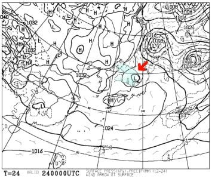
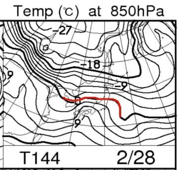
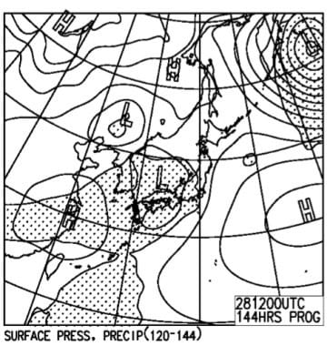

# 今週末も，いつも通り志賀高原！

📅 投稿日時: 2018-02-23 22:38:40

ってことで．

今日も，志賀高原はすっきり晴天だったみたいで．

…全く積雪の積みましがなかったようですね…（ちょっと残念）

で．

この土日ですが，

土曜の天気図が，また変わってる…（涙）．

昨日段階では予想されていなかった，矢印で

示す低気圧．

こんなものが発生しそうです（泣）．

だもんで．

すっきり晴れとは行かないかも…

土曜は朝は日が射す天気で始まりそうだけど．

この低気圧が通過するとき，雲が出てきて．

雪がちらつきそう…

ヘタするとガスるかも．

低気圧の通過時間はおそらく昼ごろかな…

雪は本降りにならず，ぱらつく程度だと

思いますが．

予想通りにこの低気圧が発生すれば，

朝は晴れてても昼に一時雪になります…

午後また日が射すかな？

この低気圧が発生しなければ，

一日中晴れ…

という感じです．

日曜は，うーむ．

今のところ，朝は晴れそうな気配ですね．

…でも，昼ごろから雲が増えて，午後は

曇り空かな～．

概ね水曜の予想通りです．

ってことで．

今週末は土日とも，朝イチはトップシーズンらしい，

いい雪質の雪が圧雪された，締まったいいバーンで滑れそうかな．

…土日とも，午後が曇りそうなのが惜しいけど．

で．

それで，だ．

今週末はいいのだが．

28日の水曜日が…

うむ！？？？

うむむむむむっ！！！

…また，2月に雨か！？？（涙）．

また，冷え冷え踊りを踊らないと

いけないのか…！！（泣）

とりあえず．

来週雨が降らないように．

踊るのだっ！！！

## 💬 コメント一覧

### 💬 コメント by (なちちゃん)
**タイトル**: 予想的中ですね
**投稿日**: 2018-02-24 13:34:19

ただいま13時30分、高天原です。

日が差してきました、このまま天候回復しますよね？

### 💬 コメント by (Skier_S)
**タイトル**: なちちゃんさま
**投稿日**: 2018-02-24 17:25:10

残念ながら、晴れませんでした(;_;)

むしろ、ガスがでるかも…という昨日の

予想が当たっちゃったみたいで(涙)

### 💬 コメント by (ほっぽ)
**タイトル**: Unknown
**投稿日**: 2018-02-24 22:52:45

Ｓさん

今日は友人連れで一の瀬からヤケビに移動し、１ゴン乗り場で遠目に見かけましたが追いつけず、残念ながら擦れ違いでした。

今日は１１時過ぎにはサンバレーに旅立ってしまったので、明日またヤケビに出直します。

### 💬 コメント by (Skier_S)
**タイトル**: ほっぽさま
**投稿日**: 2018-02-25 00:17:02

あら…今日もすれ違いだったのですね…

明日はヤケビスタートの予定です．

また明日お会いしましょう～！

