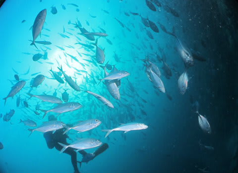

# 2012年　子連れモルジブ　ダイビング旅行記　その4

📅 投稿日時: 2012-10-12 00:17:51

🏷️ カテゴリ: [ダイビング日記](ce3a7a8d424d112fce83ee85c81a0e344.md)

で．

到着した直後の1本目は，チェックダイブなわけですが．

このチェックダイブ．

このリゾートでは，ボートダイブに連れて行って

もらうためには必ず参加しておかなくてはならない…

ってルールです．

(ガイドのトシコさんからダイビングの説明を聞く参加者＆娘)

しかし，このチェックダイブは一日一回のみ．

…となると．

今日のチェックダイブに夫婦そろっていかないと，

明日は夫婦のどちらかだけしかボートダイブに行けないわけで．

私「…我が家は．子供を預かってくれる人がいないと，

二人そろって潜りにいけないんですが…

今日行けなかった人は，明日のチェックダイブ終わるまで，

ボートダイブ行けないってことでしょうか？？」

と．相談してみると．

私が400本，妻が300本と，経験本数が結構多かったので．

「まぁ，特にチェックダイブやらなくてもいいですよ…」

と，特別の計らいをしてもらえることに．

…感謝っ！

とりあえず，このチェックダイブ．

私が潜りに行き．妻は娘とお留守番となりました．

チェックダイブが行われるのは，ロイヤルアイランドのハウスリーフ．

…つまり，ロイヤルアイランドの島の周りを潜ります．

ということで．

ダイビングショップ前の桟橋に集合して．

いざ，6年ぶりの，モルジブの海へ！

あー．

ここしばらく，コモドに潜りなれちゃったからかな～．

1998年の白化で珊瑚が壊滅してしまったモルジブの海．

珊瑚のきれいさという点で，やっぱりコモドの方が上だなぁ…

あと．ハウスリーフってのもあるけど．

あんまり魚いないなぁ…

…と思っていたら．

20分ほど行くと，ギンガメの渦が．

6年前に来たときは，確か桟橋の真下近くで群れてたけど．

ちょっと遠くに移動したのかな…？

しばしギンガメの渦を見て…

桟橋に戻ります．

…って感じで．約1時間．

チェックダイブにしてはロングタイムのダイビングでした…

ダイビング開始が遅かったので，ダイビング終了後，いろいろ片付けて

部屋に帰るころには，もう夕暮れ．

部屋に帰ると．

私がダイビング中，プールで遊んでいたらしい娘も．

もう部屋に帰ってシャワーを浴びてました．

私のダイビング中．

プールに連れて行ってもらった娘は．

目をキラキラさせて「プール！プール！」と叫びながら

泳いでいたようで…

プールに漬けておけば，何時間でも何日でも，最高のテンションで遊んでいて

くれるわが娘．

これから毎日毎日，午前も午後もプールという日々が続くんだけど．

それでも何の不満も無く楽しんでくれることでしょう．

楽な子供に育ってくれたことよ…．

＃毎日プールの日々が楽しかったらしく，帰国後未だに

＃「プールにつれてけ！」といい続ける娘だった…
