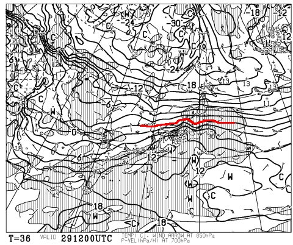
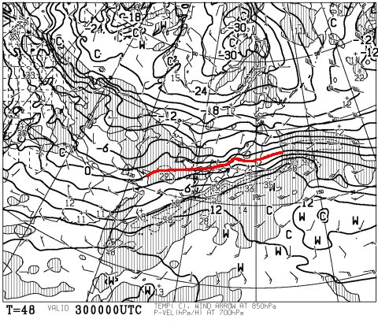
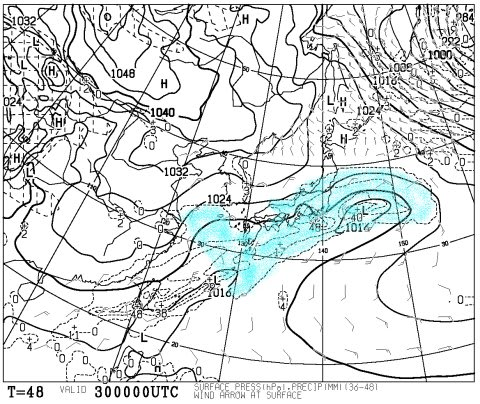
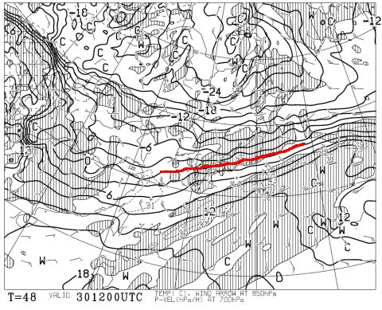
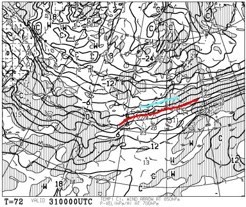

# 1月30日の週末は…雨じゃなく雪になりそう！冷え冷え踊りが効いたよっ！！！

📅 投稿日時: 2016-01-29 01:33:45

🏷️ カテゴリ: [スキー天気予想](c6554f5c3c106093b511a8daae23757e8.md)

えー．

一の瀬の[ホテルジャパン志賀がニュースになっていた](http://www.asahi.com/articles/ASJ1W7SBCJ1WUOOB012.html)

今日このごろ．

皆様いかがお過ごしでしょうか．

…28日の昼になっても燃え続けてたようなんですが…

うーむ．

このホテルにあるカレーバイキングで有名なお店

「かもしか」は行きつけのお店なので，

この日曜も行ったばかりなんですけど…

…

営業できる状態なのかな？？

今年の志賀高原，いろいろあるなぁ…（涙）．

ってことで．

ちょっと悲しいニュースのあとは．

少し期待が持てるニュースに行きましょう．

…そうです．

タイトルにある通り．

30日は雨にならずに済みそうな予感…

どうやら，みなさんが踊り続けた．

気温が冷える踊りが効いたようですっ！！！！←んなわきゃない

本日，最新の天気図を見てみると．

29日，夜9時の850hpa気温図は…

うむ．0℃線はぎりぎり志賀高原より南．

29日の夜は，雨にならずに済みそう…

そして，問題の土曜日，30日の朝9時の850hpa気温図は…

をををををっ！！！！

0℃線が．

0℃線が，志賀高原より南に下がっただけじゃなく．

-3℃線が志賀高原にかかってるよ！！！

そして．

地上天気図はこんな感じで，

志賀高原には水色の降水域がかかっており．

一日チラチラと雪が降りそうな感じ…

雪ですよ！雨じゃないよっ！！！！

で．土曜日30日の，夜9時には…

0℃線は，東海地方までさがって，志賀高原には

-6℃線が近づいてきているレベル！

30日は，夜に向かって冷えていきますよ～．

31日の日曜になったら，こんな感じで．

赤く印した0℃線は日本の南岸，

青く印した-6℃線も志賀高原の南側まで下がります！

31日は，もう平年並みに戻ります！

ということで．

昨日の予想をちょっと修正．

土曜：朝から雪降り．この時期としては重めの雪．

　朝の気温は-5度程度かな？前の夜からの積雪は5～10cm．

　朝イチは，圧雪の上に，ちょっと重めの雪が積もった

　コンディション．

　この日は一日中雲に覆われ，雪がちらつく．

　午後に向かって冷えていく．

日曜：朝は意外と冷えてそう．土曜夜から一晩中チラチラ雪がふり，

　朝の積雪は5～10cm．朝の気温は-10℃程度，昼間も-5度程度．

　標準的な1月の気温に．

　朝イチはうっすらと新雪が積もってるかもしれないけど，

　結構いい圧雪バーンになってるかも．

　天気は午前中は雪雲が残るものの，午後は晴れていく．

　午後も意外とコンディションいいかも？？

って感じの予想になりました…！

いやーーー．

一安心…

…

…するのは，まだ早い．

明日，いきなり天気図が悪化する可能性も，まだ残っています．

そうです．

まだ，気を抜いてはいけません．

これから土曜日まで，まだまだ休むことなく

気温が冷える踊りを踊り続けてくださいっ！！！←そもそも，どんな踊りなんだろう…

## 💬 コメント一覧

### 💬 コメント by (はなげ親分)
**タイトル**: ヨカッタ～！
**投稿日**: 2016-01-29 12:29:59

筋肉痛になりましたが、踊り続けた甲斐がありました♪

週末は楽しみます。

### 💬 コメント by (ゆうこ)
**タイトル**: 嬉しいです
**投稿日**: 2016-01-29 20:51:16

雪になって嬉しいです。

息子に踊りを躍らせた甲斐がありました。

久しぶりのゲレンデ楽しみです。

### 💬 コメント by (Skier_S)
**タイトル**: また明日，志賀高原で！
**投稿日**: 2016-01-29 21:49:16

＞はなげ親分さま

いやーーー．

効きましたよ！強烈に効きましたよ！

冷え冷え踊り…

効きすぎたくらいです．

ちょっと今日はみぞれっぽい感じだったようですが…

明日の朝，ちょっと雪が重いと思うのでご注意を！

＞ゆうこさま

をを！

息子さん，踊りましたか（笑）．

いろんな意味での英才教育（？）ですね～．

今週末は，久しぶりのゲレンデですね！

私はいつも通り焼額グルグルしてますので，

もしお会いできれば…

では，良い週末を！

