# 4月1日（日）の志賀高原，速報モード…晴天．暑いよ．ザブザブ春雪の一日

📅 投稿日時: 2018-04-02 02:38:58

次の週末の7，8日は，

久しぶりに冷えそうな天気図で．

このままなら，土曜は雪が降りそうな

今日この頃．

皆様いかがお過ごしでしょうか．

ってなわけで．

今日も志賀高原で滑ってたわけですが．

…そうです．

日曜の帰宅は，また深夜です（涙）．

板の手入れをしているとこんな時間…（泣）．

だもんで．

いつもの速報モードで，Go！

えー．

実は昨晩も，夜に飲みに行ってしまっていたと

いうのに←ほぼ徹夜状態だったのに，夜飲みに行ってたらダメでしょ！

気づいたら…

あら不思議！！

なぜか朝日が射す，早朝のゴンドラに

乗っているではありませんか！！

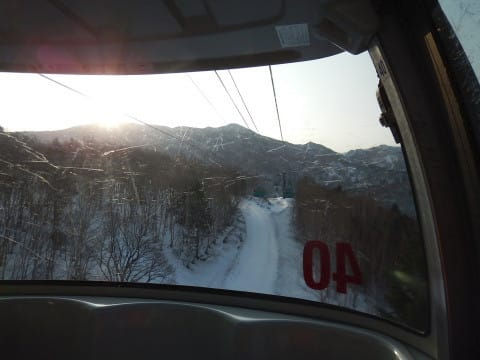

もう，私の体には早朝スキーが

プログラミングされているようです…

しかし，今日の早朝は意外と人が多くて．

…100人以上は並んでいたかな～．

で．

早朝のゲレンデに飛び出すと…

いや，結構固いよ！

シマシマバーンだけど，固いっ！！

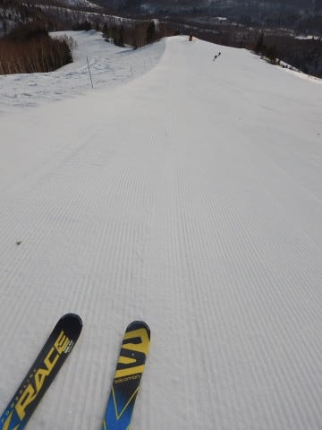

でも，晴天ピカピカで，早朝から0℃近く，

昼間はウェアのジャケット着ていると

「暑いよ！！」って感じだった本日．

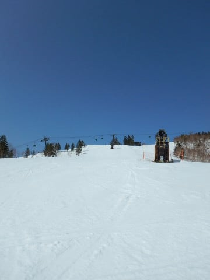

通常営業が始まるころには，雪がかなり

緩みだして…

うーむ．

朝9時で，もうこんなに緩み始めてきたんですが（涙）

朝10時ごろになると．

場所によっては汚れも浮き出すような

雪になってしまい．

滑りが悪くなってくる始末…（泣）．

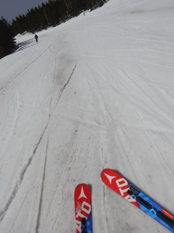

そして，ブナコースは…

うげげげげ！！

コース半分，土が出てるよ…（涙）．

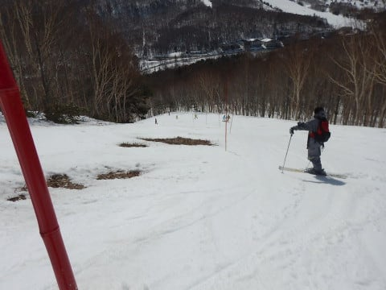

ブナコース，来週まで持ってくれるか

きわどいくらいの雪の量だな…

ってな感じで．

焼額の雪の状態がかなり残念な感じに

なってしまったので．

先週に引き続き，一の瀬へ脱出！

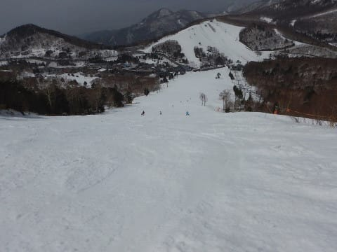

一の瀬ファミリーは，12時過ぎくらいまで

割とフラットで滑りいい状態をキープ

してましたね…

そして，この日で営業終了の西館～ジャイアント

方面へ足を延ばしてみますが…

西館の中級コースはもう終わってますね（涙）

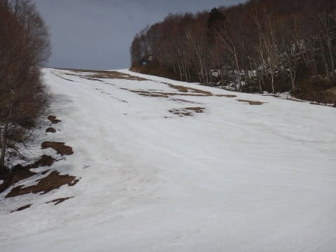

西館下部は．

コースはオープンしているものの．

かなりきわどい感じ…

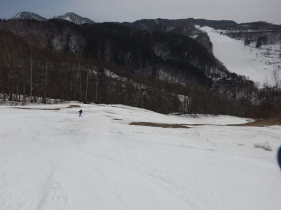

うーむ．

4月1日でこの状態って…

例年より2週間ほど雪が消えるのが

速い気がする…

この日，意外と良かったのがジャイアント．

雪は重かったけど．

人が少なく，午後になってもかなりフラットのまま！

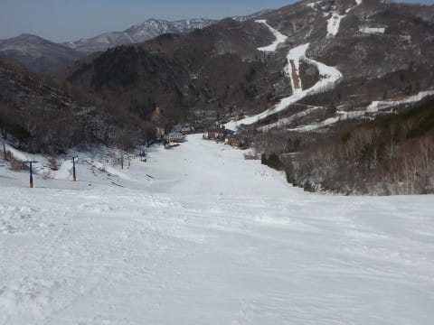

ジャイアントはあと1週間は余裕で営業

できるんじゃないかな？

今日で終わりとは，もったいない！

…しかし，向こう側に見える西館スキー場が，

かなり終わり感を漂わせてますね…

でも．

昼まで良かった一の瀬ファミリーも，

午後は重くて疲れる雪だったし…

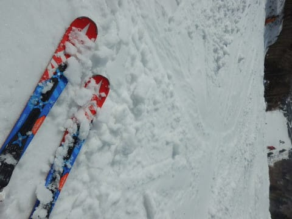

焼額のラストも，土曜ほど凸凹じゃなかったけど．

荒れ気味で，板がそれほど滑らない雪（涙）．

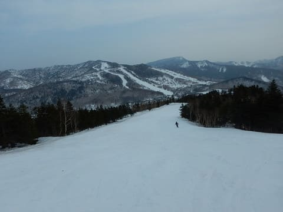

ってな感じで．

4月に入ったばかりというのに．

なんだかGWのようなザブザブ雪質の，

疲れる一日だったのでした…

まだ雨が降ってないから，雪がそれほど

ひどく解けてないのが救いだけど．

でも，例年より2週間ほど速いペースで

雪が消えてる気が…

今のままの天気図なら，土日は冷えて，

土曜は雪になりそうなので，

そこに期待かな！

## 💬 コメント一覧

### 💬 コメント by (michi)
**タイトル**: お疲れ様でした〜
**投稿日**: 2018-04-02 10:41:47

昨日はなぜかお話し出来ませんでしたね。

ゴンドラからは何回かお見かけしました。

いやぁ、2連荘で早朝からラスリフまでとはさすがです。

自分は早朝参加しカリカリのバーンを休みなく滑り続け、午前中だけでかなり消耗してました（汗）

しかし一緒に滑ったチビ達は午後も衰えることなく、終いにはコブに入りまくってました。スピードも早いのでかなり疲れました。春スキーは体力消耗度が激しいですね（笑）

### 💬 コメント by (Goku)
**タイトル**: Unknown
**投稿日**: 2018-04-02 22:17:29

昨日はお疲れ様でした。

今年のＧＳコースでの早朝営業は大当たりですね！

このままＧＷまで雪が残ることを祈りましょう。

ＰＳ：昨日の駐車場終礼楽しかったです♪

### 💬 コメント by (いさ)
**タイトル**: お疲れ様です
**投稿日**: 2018-04-02 22:34:21

ヤケビ以外でお見かけするのは大変めずらしく。

しかも休憩なさっていたとは！

なにかの聞き間違いか、、、よほどうまい物でもあるのか！？

またお会いできたらよろしくお願いいたします。

### 💬 コメント by (もりや)
**タイトル**: Unknown
**投稿日**: 2018-04-03 01:42:10

先日は早朝よりお疲れ様でした。子供達もSさんや他のみなさんと会い一緒に滑ったり、話す事をすごく楽しみにしています。今シーズン知り合いの方も増えてスキー場に来るのが楽しみで仕方がないです。(笑)駐車場で、みなさんとの終礼も楽しかったですね。今週末は参戦出来ませんが、また来週末お会いしましょう。

### 💬 コメント by (Skier_S)
**タイトル**: あれ？コメントが…
**投稿日**: 2018-04-03 10:02:57

すみません。昨晩書いたコメントが反映されてないようです…(;_;)

昨日いただいた皆さんへのコメント返事は今晩まで

お待ちください…

### 💬 コメント by (Skier_S)
**タイトル**: コメント回答遅れてすみません
**投稿日**: 2018-04-04 03:35:00

＞michiさま

日曜は全くタイミングが合いませんでしたね～．

子供たちがかっ飛んでいたのは，ゴンドラ上から

何度も見かけたのですが…

しかし，早朝～ラスリフ2連チャンは効きました（笑）

さすがの私も，日曜午後はヘロヘロでした…

＞Gokuさま

やっぱり，早朝はいいですね～．

それも，GSコースの方がやっぱりいいですよね．

1ゴン早朝，大正解だと思います．

そして…夕方の駐車場が楽しすぎました．

あのまま帰らずにずっとダベッていたかった…

＞いささま

いやーーー．

さすがの早朝～ラストまで２連チャンで．

日曜は早朝から朝ごはん休憩もとっておらず．

さすがに昼はすごい久しぶりにレストランで

座ってご飯を食べました…

アスペンの名物アップルパイを食べに行ってました（笑）．

ジャイアントに滑って行けるのがシーズン最後なので…

アップルパイ，おいしかったですよ～！

＞もりやさま

いやー．

日曜の駐車場終礼，楽しかったですよね…

あのままいつまでもダベッていたかったです．

私もお子さんたちと滑ったり，お話したりするのを

楽しませてもらってます．

っていうか，二人とも滑りがすごすぎますから

見てて感心するというか，今後が楽しみです…

また来週末お会いしましょう！

