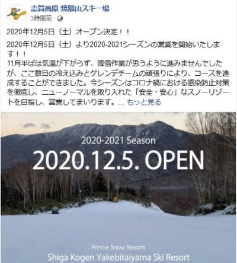
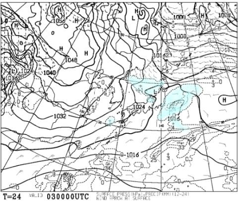

# 12月5，6日の週末の志賀高原スキー場の天気は？…土日とも晴れそう(降ってほしいのに…)気温は平年並みかちょい高め

📅 投稿日時: 2020-12-03 01:54:47

えー．

この週末．

我がホームゲレンデの焼額スキー場．

公式にオープンの案内が出ました…！

([焼額山スキー場Facebook](https://ja-jp.facebook.com/yakebitaiyama/posts/3468660379895950)より）

…って．

動くのは第4ロマンス1本のみですか…（涙）

第2高速は動かないんですね…（泣）

とはいえ．

横手山は今週末にあわよくば第1ペアの

運転をもくろんで，第1ゲレンデに

人工降雪機を移動したようですし…

（[横手山スキー場ホームページ](https://yokoteyama2307.com/news/12421/)より）

さらに，

かぐらスキー場も本日オープンしたし．

([かぐらスキー場Facebook](https://www.facebook.com/snowkagura/posts/3327459247381372?__tn__=-R)より）

とりあえず，今週末は，

滑れるゲレンデが増えそうですね…！

ってなことで．

今週末からは，ホームゲレンデの焼額へ

通い始めるわけですが．

はてさて．

今週末の志賀高原の天気は…？

と．

まずは木曜3日，朝9時の850hPa気温図を見ると…

うーむ．

きわどいところですが，赤い0℃線は

志賀高原にギリギリかかっている程度．

ただ，気温は夕方に向けて下がる

方向なので，標高の高い志賀高原は，

木曜も一日人工雪を打てる気温ですね．

そして，3日朝9時の地上天気図は…

日本海側に降水域がかかっていますが，

志賀には降水域がかかってません…

志賀は残念ながら朝は積雪は

なさそうですが．

午後は雪が降ってきそうな感じ…

で，翌4日の木曜は．

をを！赤い0℃線は太平洋岸まで

下がってます！

いい感じで冷えそうです！

4日の地上天気図は，志賀高原近辺まで

水色の降水域が伸びているので…

3日午後から4日朝にかけて，ちょっと

積雪がありそう…！

そして，肝心な5日の土曜日．

850hpa気温図を見ると，赤い0℃線，

ギリギリ志賀高原にかかってます…

標高が高い志賀高原は，この日も朝まで

問題なく人工降雪機が動かせそうですね！

そして，地上天気図は．

水色の降水域は日本海に留まり，

志賀まで伸びてませんね…

この日は朝は雲が多いかもしれないけど，

午後は晴れそうかな．

次は，6日日曜日．

850hpa気温図は…うぐぐ．

赤い0℃線，志賀高原より北に

行っちゃってます…

うーむ．

この感じだと，昼間，日が射すと

人工降雪機は動かせないかな…

地上天気図を見ると，網掛けの降水域が

かかっていないので，この日も晴れそう

かな…

ということで．

まとめると．

3日（木）：志賀高原は終日人工雪が打てるよ！

　午後に向かって気温が下がっていき，夕方から

　夜にかけて天然雪が降りそう…！

4日（金）：3日夜から4日朝にかけての積雪は10cmほど

　あるかも…

　朝は-7~-8℃程度の冷え冷え！終日冷えるが，

　雪は朝のうちに止んでしまい，それほど積もらず．

　でも，人工雪はガンガン打てるよ！

5日（土）：朝は冷え込んで人工雪が打てそう．

　前日の夜からの積雪は無し．あっても数ミリ程度．

　朝のうち雲が多いけど，じきに晴れてくる．

　あさイチは冷えてしっかり締まったいい雪！

　…でも，ちょっと滑るとコロコロが出て

　くるかも…

　昼間の気温は0℃を超えてきそうで，

　昼からは日差しもあり，暖かく感じるほど…

　午後の雪はちょいと緩み気味かも．

　ちょうどコロコロが消えていいかな？

6日（日）：朝から晴れ！時折雲が覆うかも…

　朝は放射冷却が入って冷えて，

　人工雪が打てそう．

　朝1本目はかなり締まった感じのいいバーン．

　でも，すぐに下地の硬いのがところどころ

　顔を出すかも？

　昼間は気温が上がってちょいと緩むかな…

という感じかな～．

…残念ながら，天然雪が期待できるのは

3日から4日の朝にかけてだけだけど．

志賀高原なら3日木曜から6日の日曜朝まで，

人工降雪機はずっと動かせそうな気温が続くし，

まぁ，この週末は，人工降雪のおかげで

何とかぎりぎり滑ることが出来そうな

感じですね…

いや．

しかし．

来週こそ，天然雪がドサドサと積もるに

違いない…っ！！

…って，ええ！？？

なに？　

来週，6日からずっと気温が上がるの…？（涙）

な，なんということか…！

冷え冷え期間，わずか1週間で終わって，

また気温が上がるのか…っ！（泣）

神は，まだ我々の冷え冷え踊りが足りない

と言っているのか…（涙）

このBlog読者のみなさん．

分かってますね．

これから来週にかけて，

超冷え冷え雪よ降れ降れ積もれ積もれ踊りを，

ひたすら休まず踊るのです！！

## 💬 コメント一覧

### 💬 コメント by (かず)
**タイトル**: Unknown
**投稿日**: 2020-12-03 18:13:49

かなり不安ですが ギリギリシーズン券購入しました オリンピックのライブカメラ  Sさんいても分かりませんね笑

### 💬 コメント by (レインボー73)
**タイトル**: Unknown
**投稿日**: 2020-12-03 18:56:43

大丈夫。かずさんなら瞬時に元がとれます。志賀を捨てないで！

またお会いしましょう。今年もよろしくお願いいたします。

### 💬 コメント by (かず)
**タイトル**: Unknown
**投稿日**: 2020-12-03 20:01:13

大きな声では言えませんが志賀の良さを知ってしまうと抜け出せませんね…笑  今シーズンSさん予報の西風パターンの時に初アライ予定してます こちらのリポートもしますヨ！よろしくお願いします

### 💬 コメント by (Skier_S)
**タイトル**: 明日朝の志賀は10~20cmの積雪！
**投稿日**: 2020-12-04 01:13:20

＞かずさま

オリンピックのライブカメラ，かなり遠くからのショットですね…

でも，過去を振り返れて，気温が分かるのもいいですね！

…そして．

やっぱり志賀がいいですよね…！

### 💬 コメント by (ikkun)
**タイトル**: Unknown
**投稿日**: 2020-12-10 15:07:46

２日「熊の湯行きませんか？」とスキー学校先輩お二人？がしかし、健康診断引っ掛かり数字頂き日に‼️ お断りした後 「下だけでしたが良かったです」と と三season前 ダルベロを買うきっかけを頂いた もう一人の指導員様もいたと知り(笑)がまんならず者  TCとダルベロにて三時間でした✨ 先立つものも少ないのに( *´艸｀) しかし改めてスキーは楽しいですね

### 💬 コメント by (Skier_S)
**タイトル**: ＞ikkunさま
**投稿日**: 2020-12-11 08:03:12

熊の湯行ってらしたんですか．

人工雪を打つようになってから雨が降ってないので，

雪の状況はいいから楽しめたかと思います…！

やっぱりスキーは楽しいですよ．

