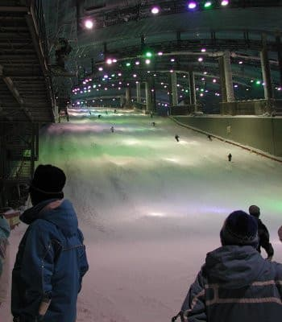
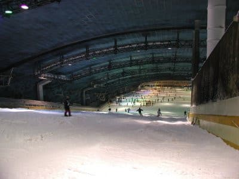

# むかーし昔，スキードームSSAWS(ザウス)という建物があってな…

📅 投稿日時: 2021-08-19 02:09:26

🏷️ カテゴリ: [スキー雑談](c1f9d2cb7478308da16419928ea3945e9.md)

ということで．

定期的にスキーネタを挟まないといけない

という義務を負ったこのBlog．

先日，昔の写真をひっくり返していた

ところ，懐かしのザウスで撮った

写真が出てきたので．

…今回は，ザウスの思い出でも語って

みましょうか…

スキードームSSAWS.

営業終了したのは2002年のこと．

消え去ってから，早20年近く…

JR京葉線に乗っていると．突如

南船橋駅前に現れる巨大建築物．

高さは30階建てビルと同程度の100m，

大手町フィナンシャルセンターや

天王洲ビュータワーなどの

高層オフィスビルやタワマンクラスの

高さがあり．

さらに長さが500m．

東京駅のホームの端っこから

有楽町駅のホームの端っこまで，

一駅分の距離に相当する長さがある

わけで．

…初めて見た時は，そのデカさに

圧倒されたものでした…

この距離で見ると，スケール感が

分かりませんが．

近づいていくと，

「高い！」

と思う，かなりの高層建築です．

そして，この巨大建物のスロープの下から

横に飛び出したような部分に

エントランスがあり…

(この写真の一番奥にみえるのがエントランス）

エントランス前に入場券売り場が

ありました．

…この写真，夏に取った写真ですが．

半袖とスキーウェア(ボードウェア)の人が

混ざっているのに，謎のシュールさが

ありますね…

中には巨大ロッカールームがあり，

そこで着替えてゲレンデに出ます．

昔は中にショップやレストランがいっぱい

あったみたいですが．

私がザウスに行くようになった営業最後の

2年ほどは，建物中のテナントスペースは

空きばかりで寂しかったのを覚えてます…

で．

ゲレンデに出ると…

すごいデカい！

アホほどでかい！

建物の中にこんなゲレンデを作って

しまって，そして夏でも冷房でこの巨大

空間を氷点下に冷やし続けるなんて．

今から考えると，「そんなことするか？？」

と思えてしまうような，バブルな建物

でしたね…

雪質は，氷点下の室内に降雪させた，

ちょっと砂っぽい感じの雪質でしたが．

春の張り付き雪の天然ゲレンデよりは

よっぽどよく．

夏の間もずっと，この雪質で滑れるのは

すごい！

だもんで．

GWを過ぎたひどい状況の天然ゲレンデより，

ザウスの方がずっとマシ

でした．

だもんで．GWを過ぎたらもう普通の

スキー場には行こうと思わず．

6月や7月の月山にまで交通費と時間を

かけて行くようになるなんて．

当時はこれっぽっちも思いません

でしたね…

…ってか．

そもそもザウスで滑るようになるまでは．

スキーシーズンはGWには終わるものだ

という極めて健全な思考を持っていたし．

シーズンインも12月に志賀高原が本格オープン

してからだ…

という思いがあったので．

ザウスで通年滑れるようになってから，

私のスキーシーズン感が破壊された

と言えますね…

いや．

このころの自分に，

「お前はザウスで年中スキーをすることを

覚えてしまったがために，

リフトが滑れる7月ギリギリまで月山で滑り，

Yetiオープンを待ちかねて10月から

滑りに行くようになるんだぞ…」

と教えてあげたい…

で．

リフトは，下から見た左側にクワッドリフトと…

右側にもクワッドリフト，

そしてムービングベルトがあって．

今から考えると，クワッドリフト2基って，

かなりの規模のスキー場並みですね…

コースも最大斜度20度のレッドコースと

15度程度のイエローコースの2本があって．

長さ490mは，志賀高原で言えば

タンネの森の第8クワッドより長い！

大体，一の瀬ダイヤのクワッドと

同じ長さ．

…要するに．

一の瀬ダイヤモンドのクワッド横の

バーンがそのまま屋内につっこまれ，

クワッドが2本かかってるくらいの

規模ですね．

こんな屋内施設を作るとは…

バカとしか思えないすばらしい！

ぜひまた復活してほしいところ！

レッドコースは，下から見ても結構

急でしたが．

スキーとボードの滑る時間が曜日によって

午前・午後に分けられていて．

スキーヤーが滑る時間は雪を均してくれる

ボーダーが全くいないので．

急斜面のレッドコースは，すぐに全面

コブ斜面になってましたね…

フラットバーンなのは最初のわずかの

時間だけ．

緩めのイエローコースも，じきに全面

コブ斜面になっていき．

ザウスはコブばっかり滑ったイメージが

ありますね…

コブとコブの谷間は硬いアイスバーンで，

結構手ごわかったのを覚えています…

しかしまぁ．

建物の中でクワッドリフトが動いている

という，今から考えると信じられん

光景だな…

ってなことで．

私が通っていた頃は，すでにバブルも弾け．

オープン当時のような，

「2時間券6000円，2時間以内に退場」

というような料金体系が許されるはずもなく，

「滑った後，ゲレンデが見えるレストランで

　お酒を飲んで，ショップでいろいろ

　グッズを買う」

などという，バブル期の行動パターンの人

もおらず．

（この上のガラス張りスペースがレストランで，

　レストランからゲレンデが見えた）

オフシーズンでも真面目なトレーニング目的の，

一日券5400円以外のお金を全く使う気配はない

マニアックなスキーヤーばかりが集まり，

「一体いつまでこんな巨大設備が

もつんだろうか…」

と心配していたけど．

やっぱり，私が通い始めてわずか3年ほどで，

営業終了してしまいました…(涙）

どうやら，もともと10年限定の施設で

計画されていたらしく．

買い手がいなければ，2002年に営業終了，

解体は既定路線だったらしいのですが…

営業終了後，巨大な建築物が解体されていく

のを，京葉線から寂しく見ていた思い出が

残っています…

建物内の雪が全部溶けるまで数か月かかるので，

営業終了から半年ほど解体できなかった…

というまことしやかな説があるのですが．

ホントにコース上の雪が全部解けるまで，

数か月かかったようですね．

まぁ，こんな巨大な設備ですからね！

　

今もザウスがあれば，

高い交通費を払って月山に行ったり，

Yetiの混雑する廊下を滑りに行かなくて

済むのに…

と思うことが時々ありますね．

でも．

もう日本では二度とこんな施設は

作れないだろうな…

今，20歳以下の人にとっては，

生まれたころにはすでにこの世から

消え去ってしまっていた，こんなバカな

施設が世の中にあったということは，

都市伝説クラスに信じられないこと

なんじゃないかと思うけど．

この私を，夏までスキーをしないと

耐えられない身体にしてしまった，

このバブル期の施設を，後世まで正しく

語り継いでいかねばならない…

と．

懐かしのザウスの写真を見ながら，

謎の義務感に駆られて，長い記事を

書いてしまった，Skier_Sだったのでした…

## 💬 コメント一覧

### 💬 コメント by (ホンダ)
**タイトル**: Unknown
**投稿日**: 2021-08-19 05:36:06

超懐かしい写真ですね。いい時代でしたね

### 💬 コメント by (nyansy0120)
**タイトル**: Unknown
**投稿日**: 2021-08-19 08:54:38

懐かしい〜!当初物凄い混雑で、千葉県民なのに結局数える位しか行きませんでしたが(^_^;)たまたま最近聞いたのですが、ザウスは構造上の問題で10年って決まってたと言う話を聞きました。某スケート場も遠くないうちに壊す予定のようです。真偽はわかりませんが。やはり写真は撮っておくべきですね。懐かしい写真ありがとうございます。

### 💬 コメント by (はなげ親分)
**タイトル**: Unknown
**投稿日**: 2021-08-19 12:30:30

夏になると涼みによく行きました。

あの独特な匂いも懐かしいです～

ザウスバーガーを食べたり、ドライバーがいるときはバーカウンターでカクテルを飲んだりといろんなことを思い出します。

そうそう、再入場できたので午前と午後でスキーとボードを両方楽しんだりしました。

帰りにシャワールームも利用できたのがありがたかったです。

こんなバブリーな施設、伝説になっちゃうんだろうな～

### 💬 コメント by (Skier_S)
**タイトル**: ザウス復活してほしい
**投稿日**: 2021-08-20 04:59:07

＞ホンダさま

良い時代でしたよね…

意外とWebでザウスの写真って残ってないんですよね．

私も久しぶりに見て，「こんなにでっかかったんだ…」と懐かしく思いました．

＞nyansy0120さま

コメントありがとうございます～！

そうですよね．ザウス，混みましたよね…

リフト待ち30分とかあったのを思い出します．

私は最後の1年ほどは，5月～10月は月2回ほど通ってました．

10月，11月のシーズンイン直前が一番混むんですよね…

記録マニアなので，写真が残ってましたが，ザウスの中の

写真を撮ってた人って少ないと思います…（笑）

＞はなげ親分さま

そうそう！独特なにおいありましたよね…

空調の機械の臭いっていうか，ずっと使ってたエアコン的なにおいが…

懐かしい．

しかし，バーカウンターでカクテルってオシャレ＆バブルな感じですね（笑）．

私は中のレストランすら一度しか使ったことがありません…

（最後はそんな人ばっかりだからつぶれたんだろうな）

いやー．間違いなく伝説になる建物ですよ…

### 💬 コメント by (ikkun)
**タイトル**: Unknown
**投稿日**: 2021-08-22 13:20:10

懐かしいなあ😆まだ携帯持っていなかったかも(笑)  お盆休み前仕事先のテレビで見て行くのを決めたなあ😆

### 💬 コメント by (Hide)
**タイトル**: 懐かしい・・・
**投稿日**: 2021-08-22 23:05:56

S 様

お久しぶりです。

なつかしいなぁ～

バブル期なつかしい。

なんだかんだで良い時代でした。

今はIKEAですもんね。懐かしい。

### 💬 コメント by (Skier_S)
**タイトル**: 懐かしいですよね…
**投稿日**: 2021-08-23 03:09:51

＞ikkunさま

ザウスが営業した1992～2002年，特に前半は確かにまだ携帯を持ってない人も

いる時代でしたね…

カメラ付携帯も2000年に初めて出て，普及したのは2003年とか2004年ごろから

ですから，写真も少ないわけですよね．

それもまた懐かしい…

＞Hideさま

お久しぶりです～！

Hideさんもザウス通ったんですか？？

いやー．

あれはもう二度と日本では作れない施設ですよね…

でも，また復活してほしい…

### 💬 コメント by (U・M)
**タイトル**: SSAWS
**投稿日**: 2023-04-10 11:11:57

初めまして。懐かしいですねーSSAWS！

自分は、滑った事は無かったですが、中の見学は

1度だけさせて貰った事が有りました。

（確か100円か300円位の見物用チケットが売られてました）

中に入ってまず、かなり本格的に作られててビックリ！

又、ゲレンデだけでなく、お風呂（スパ）やゲームコーナーも

あった様な？

因みにその時貰ったパンフレットは今でも大切にとってあります。

しかし、SSAWSのこの鋼鉄製の巨大な恐竜の様なフォルム！

今見ても圧倒されると言うかワクワクして来ますね！

### 💬 コメント by (Skier_S)
**タイトル**: ＞U・Mさま
**投稿日**: 2023-04-11 00:43:39

いやーー．ホントに巨大な建物でしたね…

ゲームコーナーはあった気がしますが，お風呂はあったかな…？

覚えてないけど，あっても不思議じゃないですよね．

それ以外にも，スポーツショップなど，何件かお店が並んだ

ショッピングモール的なところもあったり（最後の方はクローズしてたけど…）

なかなかバブルな建物でしたよね…！

もう2度と日本ではこんなバブリーなもの作れないでしょうねぇ…

### 💬 コメント by (☆Ｋ☆)
**タイトル**: 始まりと終わり
**投稿日**: 2023-08-08 11:03:14

こんにちは！

自分、実は、営業開始日と、営業最終日、どちらにも訪問しました！（もちろんその間も何回も訪問しましたが）

◆営業開始日

・開始時間よりも1時間くらい前に到着。

・すでに500人くらいチケット売り場に並んでいて、開始時間までには列は1000人くらいになっていました。

・開始時間になり、当時対面販売だったチケット売り場のシャッターが開きはじめると、並んている人々から自然と拍手が沸き起こったのをよく覚えています。

◆営業最終日

・月日は流れ、営業終了となることを知り、かつて開門を見届けた縁もあり、「最後も見届ける！」という気持ちで訪問。

・最終リフトが止まるまでおり、最後の１本しみじみした気持ちで滑りました。

・緩斜面まで下りて来て、場内を見渡しながら最後ゆっくり滑っていると、場内放送で「当施設はこの時間をもちまして営業を終了とさせていただきます。これまでのご利用まことにありがとうございました。」と最後の放送がありましてジーンときました。

始まりと終わりを見届けたのは、自分だけではないかと思いますが、

実際何人くらいいたのかな～と、ふと思います。

### 💬 コメント by (Skier_S)
**タイトル**: ＞☆Ｋ☆さま
**投稿日**: 2023-08-09 04:21:00

ををを！

初日と最終日に行きましたか…！

すごい！！！そんな方がいたんですね…

私はザウスオープン時はまだ自前でスキーに行ける大人ではなかったので，

ザウスに通ったのは最後の3-4年くらいでしたが…

最終日は行かなかったですね～．

最終日はやっぱり混んだんでしょうか？

でも，あんな壮大な建築物をつぶすのは惜しかった…

できれば営業継続してほしかった，といまだに思います…

