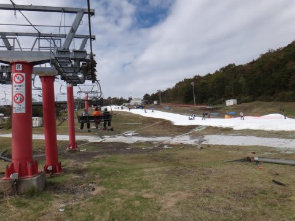

# 2013/2014シーズン開始っ！ついにイエティオープン！…10月19日のイエティのレポート

📅 投稿日時: 2013-10-19 23:54:15

ふはははははっ！

うははは！

ついに．

ついに，始まったのだ．

待ちに待った，2013/14シーズンがっ！

いやーーー．

台風でどうなることか，心配したけど．

無事予定通り，金曜日にオープンしたようで．

…で，オープン翌日の土曜日となる本日．

行ってまいりましたよ～イエティーに．

(営業開始8時時点でのチケット売り場．10分くらいの待ち…)

…3ヵ月半の長きに渡り．

耐え難きを耐えたシーズンオフ．

何度も禁断症状に悩まされ，白昼に雪山の幻覚を見たり

したものですが．

ついに来ましたよ～！

本物のシーズンがっ！

…これで禁断症状に苦しまずに済みます…(感激の涙)．

台風で心配された造雪でしたけど．

こんな感じで，リフト降り場までもしっかり雪が付いており．

そして，今日は天気予報が悪かったせいか．

人も意外と少なく．

…朝のうちは，こんながらがらなバーンを滑れましたよ～っ！！！

幸せだ．

幸せすぎるっ！

シーズン一発目，イエティでこんなクリアラップが取れるなんて！！！！！！(感動の嵐)

1時間ほどは，リフト待ちもそれほど無く…

(営業開始1時間でもこの程度の待ち時間)

初冠雪の富士山も，9時ごろからすっきり見えて．

早朝にぱらついていた雨も，営業開始時は見事に上がり．

午前中は，一瞬日が射すタイミングも…

初日からこんな快適でいいのかっ！？

…って幸せを噛みしめていたら

やっぱり，10時過ぎには混み始めてきました．

ゲレンデの人口密度も上がってきて…

昼ごろには，リフトも5分待ち程度に．

しかし，午後になると人が増えていく，このスキー場．

午後2時過ぎには，リフト待ちが10分ほどになり，コース上の人口密度も

だいたい例年通りの感じになってきたかな～．

でも．

心配していた天気は，時折「あれ？降ってる？」

って程度の降りでおさまって．

午後2時ごろにちょっとぽつぽつ来たけど．

びしょぬれになるほどの雨にはならなかったので，ラッキ～！！！

気温はそこそこ寒かったかな～．

寒がりな人は，ウェアのジャケットを着ていってもいいくらい．

日が射さなかったので，トレーナーとか普通のパーカーとかだとちと寒いよ！

おかげで，雪はドボドボにならずにすみ，

結構締まって板が良くすべってGood！

さすがに夕方になると，所々土が出始めてきたところもあったけど…

まぁ，午後4時の段階でこんな感じだから，まだ結構マシですねぇ…

って感じで．

例年より空いていて，気温も低く雪の状態もいい感じで．

まぁ，Yetiのシーズン初日としては上出来で．

シアワセな一日でした～っ！

＃というより，3ヶ月半ぶりに滑れた感動で

＃それ以外のなにもかも許してしまっているのかも

ということで．

無事，2013/14シーズンインですっ！！

## 💬 コメント一覧

### 💬 コメント by (komu)
**タイトル**: 始まりましたね
**投稿日**: 2013-10-20 00:26:06

今日意外と空いていたしよく滑る雪で比較的良いシーズンインでしたね

今シーズンもよろしくお願いします。

### 💬 コメント by (Skier_Ｓ)
**タイトル**: お疲れさまでした
**投稿日**: 2013-10-20 14:31:17

きのうは一緒に滑っていただきありがとうございました。

また、これから７月までの長いシーズンが始まりました。

来週もイエティですか？

またお会いしましょう！

### 💬 コメント by (千春)
**タイトル**: おめでとうございます！
**投稿日**: 2013-10-21 12:03:17

シーズンインおめでとうございます！

日記、楽しみにしていました。

今シーズンも愛読させていただきます。

### 💬 コメント by (Skier_S)
**タイトル**: 千春さま
**投稿日**: 2013-10-22 00:01:01

待ちに待ったシーズンが始まりました～！

千春さんはYetiには行かないのですか？

私は来週以降，他のスキー場がオープンするまでは

Yeti通いが続きそうです…

また今週もレポートしますので，

今シーズンもよろしくです～

